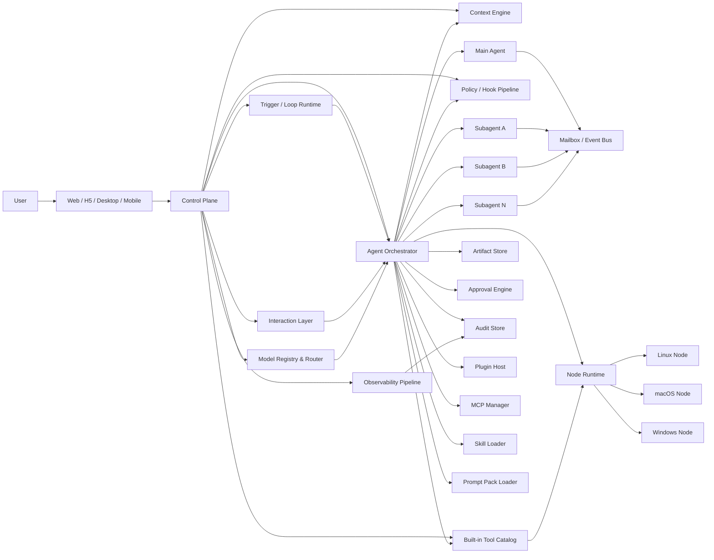

# octopus 产品需求文档（PRD）v1.1

更新时间：2026-03-24  
文档状态：修订版  
产品定位：单租户自托管 Agent OS

## 1. 文档目的

本文档定义 `octopus` 首版产品的目标、范围、核心设计、关键对象、约束与验收标准，用于统一产品、设计、架构和工程实现方向。

本文档不包含阶段计划、排期或人力分工。

## 2. 产品摘要

`octopus` 是一个面向个人、团队和企业的单租户自托管 Agent OS。它以 Rust 控制平面和运行时内核为基础，统一承载多 agent 编排、节点执行、认证与权限、Built-in Tools / 插件 / 技能 / MCP 能力扩展、跨端控制面，以及 agent blueprint 导入导出能力。

与 `OpenClaw` 相比，`octopus` 不把“全渠道聊天入口”作为首版重点，而是优先做自有入口和企业级运行治理。[R1][R2]  
与 `Claude Code` 相比，`octopus` 不只面向 coding 场景，而是把 subagent、权限隔离、MCP 接入、技能按需加载等设计扩展为通用 agent 平台能力。[R6][R7]

## 3. 产品定位

### 3.1 一句话定位

面向个人、团队和企业的自托管 Agent OS，用统一的控制平面管理 agent、节点、Built-in Tools、插件、技能、MCP、权限和可移植 blueprint。

### 3.2 核心价值

1. 把“能跑 agent”升级为“可治理、可扩展、可迁移、可审计”的生产平台。
2. 让多 agent 协作成为系统能力，而不是 prompt 拼接技巧。[R8][R9]
3. 让 `Prompt Packs`、`Skills`、`Built-in Tools`、`MCP Servers`、`Plugins` 成为结构化能力层，而不是散落的配置或脚本。[R3][R5][R10]
4. 让 agent 可以作为“可复现实例包”在个人、团队、企业部署之间导入导出，而不会带出会话过程、结果物和凭据。

### 3.3 设计原则

1. 先做简单可组合的 agent loop，再增加多 agent 复杂度。[R8]
2. 权限、审批、沙箱、审计必须由系统硬约束实施，不能依赖 prompt 软约束。[R3]
3. `Built-in Tools`、`Skills`、`MCP`、`Plugins` 都必须有显式声明、作用域和命名边界，避免能力冲突。[R11]
4. 多端统一体验，但不追求所有端同权；移动端控制优先，执行面以桌面和服务器节点为主。[R14]
5. 任何可分享的 agent 都应该可导入、可复现、可审查，但默认不携带历史数据。
6. 上下文必须按需加载；working memory、compaction、外部引用和摘要回传是正式运行时能力，而不是临时 prompt 技巧。[R15][R16]
7. `Prompt Packs`、`Skills`、`Memory` 属于软行为层；`Policy`、`Sandbox`、`Hooks`、`Approval` 属于硬控制层，前者不得绕过后者。[R15][R18][R21]
8. 新能力默认先通过 eval 和 transcript review 证明有效，再进入正式治理面和广泛开放范围。[R17][R19]

## 4. 目标用户与场景

### 4.1 用户分层

| 用户类型 | 典型角色 | 核心诉求 |
| --- | --- | --- |
| 个人 | 独立开发者、研究者、个人自动化用户 | 本地部署、桌面控制、本机工具、可复用 agent |
| 团队 | 小团队负责人、Builder、Reviewer | 共享工作区、审批流、共享技能与插件、协作运行 |
| 企业 | 平台管理员、安全团队、业务系统 owner | SSO、角色权限、审计、策略管控、节点治理、插件白名单 |

### 4.2 首版核心场景

1. 个人用户在 macOS/Windows 上安装 `octopus`，在同一 `workspace` 内创建多个私有 agent，分别作为研究、运营、开发、客服等不同数字员工使用。
2. 团队成员在共享工作区中创建或授权使用多个 agent，由 Reviewer 审批高风险执行，并复用统一的 prompt packs、skills、plugins 和模型注册表。
3. 企业管理员配置 SSO、角色、策略、节点和插件白名单，对运行、导入导出、触发器、审批和模型接入进行审计。
4. Builder 将一个 agent 导出为 blueprint，另一台实例导入后完成依赖检查、权限映射、密钥重绑和 trigger 激活确认，再投入运行。
5. 主 agent 在复杂任务中并行调度多个子 agent，通过 mailbox、event 和 artifact 协作，不共享上下文窗口。
6. agent 在运行中向用户发起确认或补充信息请求，支持单选、多选和文本回复；用户答复后原 run 或后续 run 自动恢复。
7. agent 基于 webhook、HTTP 端点监控、定时循环、固定间隔和等待回复触发器持续运行，执行“感知 -> 判断 -> 提案 -> 动作/等待确认”的闭环。
8. 同一个 agent 在主对话、推理规划、工具调用、子 agent、长任务循环和总结压缩等位点使用不同 provider/model，平台按摘要推理、调用链和执行时间线完整展示运行过程。

## 5. 目标与非目标

### 5.1 产品目标

1. 提供统一控制平面，管理会话、运行、节点、扩展、审批、审计和通知。
2. 提供用户在每个 `workspace` 内创建多个私有 agent 的能力，并支持授权、发布或 blueprint 方式复用。
3. 提供可隔离、可并发、可审计的多 agent 运行时。
4. 提供一等 `Trigger / Loop / Wait Runtime`，支持单次定时、固定间隔、周期循环、HTTP 端点监控、webhook、等待特定人回复、等待特定 agent 回复和条件满足恢复。
5. 提供一等 `Ask User` 交互层，支持单选、多选和自定义文本回复，并与运行恢复机制打通。
6. 提供主动感知、判断和动作能力，但必须受 `autonomy policy`、审批和速率限制约束。
7. 提供结构化五层能力体系：`Prompt Packs`、`Skills`、`Built-in Tools`、`MCP Servers`、`Plugins`。
8. 提供 `Model Registry & Routing`，按厂商加模型注册云模型与本地模型，并允许 agent 在不同功能位点绑定不同模型。
9. 提供自有入口：`Web`、`H5/PWA`、跨平台桌面端、移动端。
10. 提供 `Blueprint Export / Import`，支持 agent 能力在不同实例间迁移。
11. 提供个人、团队、企业三种运营模式下统一的认证、权限和审批模型。
12. 提供一等 `Memory & Context Engineering`，覆盖 session context、working memory、auto memory、context budget、compaction 和子 agent 摘要回传。[R15][R16]
13. 提供正式 `Evaluation Harness` 与发布门禁，对工具、技能、插件、MCP、模型路由和多 agent 行为做持续回归评测。[R17][R19]

### 5.2 非目标

1. 首版不把 Slack、Telegram、Discord、企业微信等第三方聊天渠道列为正式交付范围。
2. 首版不支持将对话过程、推理过程、执行日志、结果物作为 agent 导出内容。
3. 首版不做多租户 SaaS 优先控制平面。
4. 首版不把移动端定义为完整重型执行节点。
5. 首版不承诺无代码工作流搭建器。
6. 首版不把 artifact 定义为通用、长生命周期、可自持久化的应用运行时；artifact 仅作为结果展示与受控交互面。
7. 首版不承诺自适应通信拓扑、自由 agent mesh 或无上限自治协作；首版多 agent 以 bounded orchestrator-worker 为准。

## 6. 产品范围

### 6.1 正式交付的 6 条能力主线

1. 多 agent 编排
2. 节点执行
3. 认证、权限与审批
4. 扩展体系
5. 跨端控制面
6. 导入导出

### 6.2 多端策略

| 端 | 角色定义 | 说明 |
| --- | --- | --- |
| Web | 主控制面 | 管理后台、会话、运行、插件、工作区、审计 |
| H5 / PWA | 轻控制面 | 移动浏览器访问、通知跳转、审批和状态查看 |
| Desktop | 强控制面 + 本机节点 | 使用 Tauri 2 外壳承载统一 Web UI，提供本机节点、文件系统桥接、系统通知和 OS 集成能力 |
| Mobile | 控制优先 | 会话、审批、通知、监控、轻操作、远程接管；不承担重型执行 |

说明：Tauri 2 官方已经支持 iOS/Android，并提供插件、权限、capabilities 和移动端系统接入能力；但其官方文档也明确指出移动端并非所有插件都适用。[R14]  
设计推断：因此 `octopus` 应将移动端限定为控制优先，而不是与桌面/服务器同权的完整执行节点。[R14]

## 7. 产品架构总览

### 7.1 架构组成

1. `Control Plane`
   - 统一 API、鉴权、工作区管理、agent 管理、trigger 管理、模型注册、Built-in Tool 目录管理、插件管理、审批、审计、通知。
2. `Agent Orchestrator`
   - 任务拆解、子 agent 调度、状态汇总、超时控制、失败传播、人工接管升级。
3. `Trigger / Loop Runtime`
   - 管理定时、循环、等待、webhook、HTTP monitor、条件恢复和持续运营任务。
4. `Interaction Layer`
   - 管理 ask-user 请求、答复收集、挂起恢复、异步回调和多端交互分发。
5. `Model Registry & Router`
   - 管理 provider、模型注册、密钥绑定、功能位点绑定、路由策略和 fallback。
6. `Observability Pipeline`
   - 生成 `ReasoningSummary`、`ToolCallTrace` 和 `ExecutionTimeline`。
7. `Built-in Tool Catalog`
   - 管理平台内置工具目录、加载策略、tool discovery、平台 profile、fallback 和治理状态。
8. `Node Runtime`
   - 执行工具调用、命令执行、文件访问、网络访问、模型调用代理、artifact 产出。
9. `Mailbox / Event Bus`
   - agent 间通信、状态广播、artifact 引用、取消、订阅、审批回调。
10. `Artifact Store`
   - 结果物、结构化中间产物、可共享引用；不作为 blueprint 导出内容。
11. `Plugin Host`
   - 隔离运行后端插件，提供受控扩展点。
12. `MCP Manager`
   - 管理本地 `stdio` 和远程 `Streamable HTTP/SSE` MCP 连接。[R10]
13. `Skill Loader`
   - 按 progressive disclosure 策略发现、筛选、注入和激活 skills。[R5]
14. `Prompt Pack Loader`
   - 按作用域和优先级组装系统提示词、组织规范和 agent profile。
15. `Context Engine`
   - 管理 session context、working memory、context budget、compaction、结构化笔记、外部引用和子 agent 摘要回传。[R15][R16]
16. `Policy / Hook Pipeline`
   - 管理 pre-tool、post-tool、permission、outbound、managed-only hooks 和集中托管指令层，将软指导与硬约束明确分层。[R18][R21]

## 8. 多 Agent 设计

### 8.1 用户多 Agent 与数字员工模型

`octopus` 将 agent 定义为 `workspace` 内的持久对象。用户在每个 `workspace` 内可以拥有多个长期 agent。

设计要求：

1. 同一用户在同一 `workspace` 内可以创建多个 agent。
2. 这些 agent 默认是用户私有数字员工，团队复用需要显式授权、发布或 blueprint 导入导出。
3. agent 默认仅创建者可见可用；团队复用通过授权、发布或 blueprint 导入导出完成。
4. agent 不跨 `workspace` 直接漫游；跨 `workspace` 复用通过 `Blueprint Export / Import` 完成。
5. 一个持久 agent 不等于一个用户；同一用户可拥有多个 agent，不同 agent 可承担不同职责、人格、工具面和模型绑定。

### 8.2 编排模式

`octopus` 首版采用 bounded `orchestrator-worker` 模式：主 agent 负责规划、拆解、聚合、审批触发和策略决策；子 agent 负责独立任务执行。[R9]

Anthropic 官方在多 agent 研究系统中明确采用了 orchestrator-worker 模式，并指出同步执行会形成瓶颈。[R9]  
设计推断：`octopus` 首版必须支持并行子 agent 调度，并在运行时层面为异步扩展预留机制；但为了降低控制复杂度，首版仍以“可控的协调式并发”为主，而不是完全自由自治的 agent mesh。[R8][R9][R12]

设计要求：

1. 首版多 agent 编排固定为 `MainAgent -> TaskDag -> Subagents` 的 bounded orchestration，不承诺自由拓扑自演化。
2. 主 agent 只能把可独立执行、输入输出边界清晰的任务切分为子任务；存在共享写入目标、强顺序依赖或全局一致性约束的任务必须串行执行。
3. 每个 run 必须具备并发预算、token 预算、时间预算和失败预算；超出预算后必须降级为串行、缩减并发或升级人工接管。
4. 子 agent 之间的协作载体固定为 `MailboxMessage`、`AgentEvent`、`ArtifactReference` 和 task status，不共享完整上下文转储。
5. 后续版本可以引入 adaptive topology / graph pruning，但首版只要求为其预留对象模型和观测字段，不将其列为正式承诺。[P1][P2][P4]

### 8.3 Trigger、Wait 与 Loop Runtime

`octopus` 将 trigger 定义为一等 runtime，而不是附属自动化脚本。持续运营、定时、轮询、等待答复和外部事件恢复都通过统一 trigger runtime 管理。

首版支持的 trigger 类型：

1. 单次定时
2. 固定间隔
3. 周期循环
4. HTTP 端点监控
5. webhook
6. 等待特定人回复
7. 等待特定 agent 回复
8. 条件满足后恢复

设计要求：

1. “等待特定(agent/人)回复”是正式 trigger 类型，而不是仅写成 run 的内部注释。
2. trigger 底层运行时必须支持挂起、恢复、取消、重试和超时。
3. “持续运营”必须被定义为 loop task/runtime profile，而不是无限 while-loop。
4. agent 可以根据上下文提出 `TriggerProposal`，但启用前必须经用户确认或策略审批。
5. 导入后的 trigger 默认不激活，必须完成依赖校验、权限映射、密钥绑定和激活确认。

### 8.4 Ask-User 交互与确认机制

`octopus` 必须提供一等 `Ask User` 交互层，使 agent 能在运行过程中向用户发起确认、补充信息请求或选项决策。

支持的答复类型：

1. 单选
2. 多选
3. 自定义文本回复

设计要求：

1. ask-user 请求必须可异步返回。
2. 用户答复后，系统必须恢复原 run 或触发后续 run。
3. 未答复状态必须能与 wait trigger 打通，形成等待类 trigger。
4. 交互请求必须被纳入审批、通知和审计链路。

### 8.5 主动感知、判断与动作

`octopus` 必须支持 agent 的主动感知、判断和动作，但主动行为必须来自显式事件源，而不是无边界常驻扫描。

主动感知来源包括：

1. trigger
2. `Built-in Tools`
3. MCP
4. 插件
5. 节点事件
6. 外部 webhook
7. HTTP 端点监控

设计要求：

1. 主动动作受 `autonomy policy`、审批策略、速率限制和观察窗口约束。
2. agent 可执行“感知 -> 判断 -> 提案 -> 动作/等待确认”的闭环。
3. 高风险主动动作仍需进入审批和审计。

### 8.6 子 Agent 隔离

每个子 agent 必须具备：

1. 独立上下文窗口
2. 独立系统提示词
3. 独立工具面
4. 独立权限
5. 独立运行日志
6. 独立超时与取消控制

这一设计直接参考 Claude Code 对 subagent 的做法：每个 subagent 运行在自己的 context window 中，拥有自定义 system prompt、特定 tool access 和独立权限。[R6]

需要明确区分两类 agent：

1. 用户创建的多个数字员工是持久 agent。
2. 子 agent 是运行态临时执行体，不是持久对象，也不参与用户的“多个数字员工”数量统计。

### 8.7 Agent 间通信

agent 默认不共享上下文窗口。协作只能通过显式机制完成：

1. `MailboxMessage`
   - 请求、回应、补充说明、协商、失败通知。
2. `AgentEvent`
   - 状态更新、开始、进行中、完成、取消、审批挂起。
3. `ArtifactReference`
   - 结构化产物或文件引用，不直接复制大块上下文。
4. `HumanEscalation`
   - 升级人工审批或人工接管。

### 8.8 运行观测与过程展示

`octopus` 必须支持展示 agent 的推理过程、调用过程和执行过程，但不展示原始 chain-of-thought。

平台展示三层观测面：

1. `ReasoningSummary`
   - 结构化计划、决策依据、变更原因、阶段性总结。
2. `ToolCallTrace`
   - 模型调用、Built-in Tool 调用、MCP 调用、插件调用链。
3. `ExecutionTimeline`
   - 触发、等待、恢复、审批、重试、完成、失败时间线，以及 deferred tool discovered / loaded / fallback executed 事件。

设计要求：

1. “推理过程展示”在 PRD 中固定为摘要推理，而不是完整原始推理文本。
2. “调用过程”必须覆盖模型、Built-in Tools、MCP 和插件调用。
3. “执行过程”必须覆盖 trigger、loop、wait、resume 和 approval 生命周期。
4. 推理展示不改变导出限制；导出内容仍不包含推理过程和运行日志。

### 8.9 与 A2A 的关系

官方 A2A 文档将 Agent2Agent 定义为“让不同框架、不同组织、不同厂商的 agent 能可靠安全协作的开放标准”，并明确区分了 A2A 与 MCP 的职责边界：A2A 负责 agent 之间协作，MCP 负责 agent 与工具/资源连接。[R12]

设计要求：

1. `octopus` 首版内部通信先实现站内协议，不强制对外暴露 A2A 网关。
2. 内部 `Mailbox / Event` 数据模型应与 A2A 的 `task`、`artifact update`、`stream` 语义兼容。
3. 后续可增加对外 A2A Server，支持跨实例或跨组织 agent 互联。

### 8.10 统一运行时事件模型与状态机

`octopus` 首版将 `Run`、`AgentTrigger`、`AskUserRequest`、`ApprovalRequest` 统一纳入同一个事件驱动状态机，而不是各自维护独立、互不兼容的生命周期。

统一要求：

1. 所有运行时对象都必须基于不可变 `EventEnvelope` 追加事件生成状态快照。
2. 所有外部恢复入口都必须携带 `resume_token` 和 `idempotency_key`，保证重复投递安全。
3. 所有恢复都必须通过事件回放和状态重建完成，不允许依赖内存态隐式恢复。

`Run` 的规范状态至少包括：

1. `queued`
2. `running`
3. `waiting_input`
4. `waiting_approval`
5. `waiting_trigger`
6. `suspended`
7. `resuming`
8. `completed`
9. `failed`
10. `canceled`
11. `handoff`

设计要求：

1. `timeout`、`retry`、`cancel`、`handoff` 语义在 `Run`、`TriggerExecution`、`AskUserRequest` 和 `ApprovalRequest` 上保持一致。
2. crash recovery 后系统必须根据事件日志重放并恢复到最近一致状态。
3. 用户答复、审批答复、trigger 恢复、webhook 回调都必须先做 freshness check，再决定继续执行、重新规划或升级人工接管。
4. 如果等待期间共享世界已变化，或者用户目标发生变化，run 不能直接沿用旧计划，必须进入 `resuming` 并重新验证关键假设。
5. 所有 side effect 在执行前都必须再次校验策略、权限、预算和上下文新鲜度。
6. `ExecutionTimeline` 必须显式记录状态跃迁，而不是只记录工具调用结果。

## 9. Memory & Context Engineering

### 9.1 上下文层次

`octopus` 将上下文管理拆分为 6 层：

1. `SessionContext`
   - 当前会话显式加载的指令、最近交互、当前目标和短期运行事实；会话结束后不保证保留。
2. `WorkingMemory`
   - agent 在任务执行中写入的短期结构化笔记、开放问题、约束和中间判断；默认不跨 `workspace` 共享，也不随 blueprint 导出。
3. `AutoMemory`
   - 实例内持续积累的长期偏好、架构约定和高价值经验；按工作区或实例作用域受策略控制。[R15]
4. `Artifact / App State`
   - 与结果展示或受控交互相关的状态；首版不将其定义为通用、跨会话持久的应用运行时。
5. `ExternalReferences`
   - 文件路径、URL、搜索查询、数据库主键、artifact 引用、节点资源定位等按需载入的外部引用。
6. `ContextSnapshot`
   - 跨上下文窗口延续时使用的结构化摘要快照，承载目标、决策、待办、风险、未完成 side effect 和最近关键引用。[R16]

### 9.2 上下文加载、预算与压缩

设计要求：

1. 初始上下文只加载高信号信息，包括 agent profile、必要 `Prompt Packs`、技能元数据、策略边界和当前活动 run 的关键状态。
2. 大体量信息必须优先以 `ExternalReferences` 形式保留，并通过工具在运行时按需加载，而不是一次性塞满上下文窗口。[R16]
3. 每个 run 和子 agent 都必须有显式 `ContextBudgetPolicy`，按模型窗口、端能力和任务类型约束上下文占用。
4. 当上下文压力接近阈值时，系统必须执行 compaction，将已完成细节压缩为 `ContextSnapshot`，保留未决策事项、活动预算、待恢复事件、最近关键引用和风险说明。[R16][R17]
5. `WorkingMemory` 和 `ContextSnapshot` 必须与聊天正文分离存储，以便在不重放全部对话的情况下恢复长任务。

### 9.3 子 Agent 上下文交换

设计要求：

1. 子 agent 启动时只接收任务包、必要 profile、最小上下文摘要和权限边界，不继承父 agent 的完整会话历史。[R6][R15]
2. 子 agent 返回主 agent 的内容默认应为 `TaskSummary`、`DecisionSummary`、`ArtifactReference`、`RiskNote` 和 `NextActionProposal`，而不是全文转储。
3. 冗长工具输出和详细分析应留在子 agent 自己的 trace 中，需要时由主 agent 按需提取。
4. 当多个子 agent 结果同时回流时，主 agent 必须支持聚合摘要与二次 compaction，避免结果回传本身压垮主上下文窗口。[R6][R16]

### 9.4 记忆治理与边界

设计要求：

1. `Prompt Packs`、`Skills`、`Memory` 只影响行为倾向和上下文可见性，不构成绕过权限、审批、沙箱和 hooks 的手段。[R15][R18]
2. memory 的写入、删除、回忆和压缩必须可审计，并遵守工作区、实例和组织策略边界。
3. memories 默认不跨 `workspace` 共享；跨实例迁移只允许导出 memory policy，不允许导出 memory entries。
4. artifact/app state 不能在首版中直接持有 secrets、MCP 会话、模型凭据或后台自治任务。
5. 集中托管指令层可以补充行为指导，但不得替代技术 enforcement；当软指导与硬策略冲突时，以硬策略为准。[R15][R21]

## 10. 认证、权限与审批

### 10.1 使用模式

| 模式 | 认证方式 | 典型能力 |
| --- | --- | --- |
| 个人 | 本地管理员、邮箱/密码或设备信任、PAT | 本机安装、个人工作区、本地节点 |
| 团队 | 成员邀请、OIDC/OAuth2 | 共享工作区、协作审批、共享扩展 |
| 企业 | SAML / OIDC SSO、域名绑定、服务账号 | 角色治理、集中策略、审计导出 |

Claude Code 团队文档明确将 Teams/Enterprise 的能力区分为集中 billing/管理与更强的企业治理，其中 Enterprise 增加 SSO、domain capture、role-based permissions、managed policy settings 和 compliance API。[R7]  
设计要求：`octopus` 企业模式至少应覆盖这一级别的身份与治理能力。

### 10.2 权限模型

`octopus` 权限模型固定为 `RBAC + ABAC/Policy + Approval` 三层并行：

1. `RBAC`
   - `Owner`
   - `Admin`
   - `Operator`
   - `Builder`
   - `Reviewer/Approver`
   - `Viewer`
2. `ABAC/Policy`
   - 按资源、环境、节点标签、工作区、Built-in Tool、插件 capability、MCP server、风险等级进行策略控制。
3. `Approval`
   - 对高风险动作进行预执行审批或事后追认。

### 10.3 受保护资源

| 资源 | 说明 |
| --- | --- |
| `workspace` | 工作区、知识边界、共享资产 |
| `agent` | agent profile、默认模型、能力配置 |
| `session` | 用户与 agent 的持续会话 |
| `run` | 一次执行的可审计实体 |
| `trigger` | agent 的触发器、等待条件、循环运行配置 |
| `interaction` | ask-user 请求、答复和等待恢复状态 |
| `model_registration` | 注册到平台的模型配置与 provider 绑定 |
| `built_in_tool` | 平台内置工具目录、启用状态、加载策略和 fallback 策略 |
| `node` | 执行节点 |
| `plugin` | 插件包、配置、capability grant |
| `skill` | 技能目录与激活权限 |
| `prompt_pack` | 组织或工作区级提示词包 |
| `memory` | working memory、auto memory、memory policy 与压缩快照 |
| `mcp_server` | 外部上下文服务器 |
| `secret` | 外部凭据和绑定引用 |
| `artifact` | 结果物与共享中间产物 |
| `policy_hook` | pre-tool / post-tool / outbound / managed-only hooks 与其配置 |

### 10.4 高风险动作

以下动作必须支持审批、告警和事后审计：

1. 命令执行
2. 外网访问
3. 敏感文件读写
4. 凭据读取
5. 插件安装与启用
6. blueprint 导入激活
7. 高权限 MCP 授权
8. 内置工具启用、禁用、风险级别调整和高权限调用
9. trigger 激活与修改
10. 持续运营 loop 启动
11. 模型凭据绑定与高成本模型路由变更

OpenClaw 官方文档明确指出，prompt 里的 safety guardrails 只是 advisory，真正的硬约束必须依赖 tool policy、exec approvals、sandboxing 和 allowlists。[R3]  
因此 `octopus` 必须将审批、沙箱和策略实现为运行时硬控制，而不是提示词约定。

### 10.5 策略矩阵与托管钩子

`octopus` 企业治理以 `subject × capability × surface × environment × risk` 作为统一策略判定维度，而不是只依赖单一角色表。

设计要求：

1. 同一 capability 可以因角色、工作区、节点标签、Web/Desktop/Mobile/Server surface、生产/测试环境以及风险等级而获得不同判定。
2. 平台必须支持集中托管的组织级策略层，工作区级、agent 级和 run 级配置只能在其之上做收紧，不能放宽。
3. 首版至少支持这些 policy hook 位点：`UserPromptSubmit`、`PreToolUse`、`PermissionRequest`、`PostToolUse`、`PostToolUseFailure`、`OutboundRequest`。[R18]
4. 外网域名、MCP server、插件能力、内置工具和节点执行标签必须能由同一个策略引擎统一决策。
5. 托管指令层可以追加合规和流程要求，但不能替代 `PreToolUse` / `OutboundRequest` 等硬控制钩子；当两者冲突时，以策略和沙箱为准。[R18][R21]
6. 所有 hook 输入、决策结果、拦截原因和放行动作都必须进入审计链路。

## 11. 扩展体系

### 11.1 五层能力模型

`octopus` 将能力扩展体系固定为 5 层：

1. `Prompt Packs`
2. `Skills`
3. `Built-in Tools`
4. `MCP Servers`
5. `Plugins`

各层职责边界必须明确：

1. `Prompt Packs`
   - 承载系统提示词、组织规则和角色模板。
2. `Skills`
   - 承载按需加载的操作知识和工作流指令，不直接等同于执行工具。
3. `Built-in Tools`
   - 平台一方原生提供的工具能力，由控制平面或节点运行时直接提供。
4. `MCP Servers`
   - 通过开放协议接入的外部工具、资源和 prompt 能力。[R10]
5. `Plugins`
   - 第三方或组织自定义扩展，可扩展后端、前端和打包内容。

#### 11.1.1 统一治理契约

所有能力层都必须尽量收敛到同一套治理契约；其中 `Built-in Tools`、`Skills`、`MCP Servers`、`Plugins` 必须完整具备以下字段，`Prompt Packs` 至少具备其中与治理相关的子集：

1. 稳定 `namespace`
2. `version` 与兼容性声明
3. `source_trust` 与来源信息
4. `risk_tier`
5. `surface_availability`
6. `sandbox_requirement`
7. `approval_requirement`
8. `audit_events`
9. `fallback_policy`
10. `eval_coverage`

任何未声明上述关键治理字段的能力，不得进入默认可用面。

### 11.2 Prompt Packs

`Prompt Packs` 用于承载：

1. 组织默认规则
2. 角色模板
3. agent 系统提示词模块
4. 行业场景模板
5. 安全与合规指令模块

要求：

1. 支持组织级、工作区级、agent 级作用域。
2. 支持继承和覆盖。
3. 支持版本化、审核发布和回滚。

### 11.3 Skills

OpenClaw 和 Agent Skills 文档都采用了“先暴露 catalog，再按需加载完整 `SKILL.md` 和资源”的 progressive disclosure 设计，以降低基础 prompt 体积。[R3][R5]

`octopus` 对 skills 的要求：

1. 兼容 Agent Skills 目录与元数据约定。[R5]
2. 支持组织级、用户级、工作区级三种作用域。
3. 支持插件打包技能并参与正常优先级合并。[R4][R5]
4. 模型仅在需要时加载完整技能指令和资源，不在会话初始时注入完整正文。
5. 支持前端可视化启用/禁用、依赖检查和来源标识。

技能优先级定义：

1. 工作区级
2. 组织/用户级
3. 插件内置
4. 平台预置 skills

#### 11.3.1 Skill 安全与治理

Claude 官方对 Agent Skills 的说明明确指出，skill 本质上可以打包 instructions、scripts 和 resources，因而天然带有供应链与执行面风险。[R22]

设计要求：

1. 每个 skill 都必须声明其 bundled scripts、外部链接、引用工具、引用 MCP server 和预期网络访问。
2. skill 指令中若包含“隐藏操作”“绕过安全规则”“根据条件改变合规行为”“静默外传数据”等模式，必须在审核时视为高风险并默认禁止。[R22]
3. skill 若同时组合文件访问、网络访问和凭据相关工具，应自动提升 `risk_tier`，并纳入审批或更严格的沙箱。
4. skill 被触发时，加载了哪些文件、执行了哪些脚本、引用了哪些外部资源，都必须在 trace 和审计中可追溯。
5. skill 只能增强能力表达，不能直接放宽平台原生权限、审批和沙箱边界。

### 11.4 Built-in Tools

`Built-in Tools` 是 `octopus` 平台一方原生能力，不等同于 MCP，也不等同于插件扩展。它们由控制平面或节点运行时直接提供，属于平台正式产品面的一部分。

设计要求：

1. 所有内置工具必须进入统一目录，并纳入权限、审计和观测体系。
2. 内置工具默认对用户和管理员可见、可控、可审计，但核心工具不可卸载。
3. 内置工具不通过插件包分发，也不随 blueprint 导出实现本体。

#### 11.4.1 分类与加载策略

内置工具分为两类：

1. `always-loaded`
   - 在指定端或指定节点 profile 下默认可用，直接进入 agent 可见工具面。
2. `deferred`
   - 不在会话或 run 初始时完整暴露，按需发现并在运行中加载。

设计要求：

1. `ToolLoadingPolicy` 必须定义每个内置工具属于 `always-loaded` 还是 `deferred`。
2. `deferred` 工具在首次发现和加载时，必须进入 `ExecutionTimeline` 和审计链。
3. 平台必须控制基础上下文大小，避免将低频工具无差别注入所有 agent。

#### 11.4.2 目录与发现机制

平台必须提供统一的 `BuiltInToolCatalog` 和工具发现机制：

1. 每个工具都必须有稳定的 `BuiltInTool` 元数据。
2. 元数据至少包括：
   - 工具标识
   - 命名空间
   - 描述
   - 参数 schema
   - 风险等级
   - 平台可用性
   - 所需节点能力
   - 沙箱要求
   - 审批要求
   - 审计事件
   - `eval_coverage`
   - 来源可信级别
   - fallback 提示
3. 平台必须提供 `ToolDiscovery` 能力，供 agent 和控制台按需检索可用工具。
4. `ToolDiscovery` 可以表现为平台级 `tool_search`，但 PRD 不承诺复制 Claude.ai 的具体接口形态。[L1]

#### 11.4.3 平台差异与 fallback

`octopus` 不承诺所有端或所有节点拥有同样的内置工具清单。平台必须为不同表面和节点声明 `PlatformToolProfile`。

设计要求：

1. Web、Desktop、Mobile、Server Node 可以拥有不同的内置工具集合。
2. 同一 agent 在不同端运行时，可见工具集合允许不同，但治理、trace 和命名语义必须一致。
3. 当目标端缺失某个内置工具时，平台必须根据 `ToolFallbackPolicy` 执行降级。
4. fallback 目标可以是其他内置工具、MCP、插件能力，或 ask-user / 手动接管路径。

#### 11.4.4 治理与边界

设计要求：

1. 管理员必须能够在控制台查看内置工具目录、风险等级、平台 profile、启停状态和审计记录。
2. 普通用户必须能够在 agent 配置和运行 trace 中看到当前可用内置工具及其调用来源。
3. 高风险内置工具调用必须受审批、速率限制、节点策略和沙箱限制约束。
4. 内置工具必须采用平台保留命名空间，不能被插件覆盖。
5. blueprint 只导出内置工具引用、启用策略和 fallback 策略，不导出工具实现。

### 11.5 模型注册、绑定与路由

`octopus` 采用“平台注册 + agent 选用”模式管理大模型接入。平台不负责安装或托管大模型，只负责接入、凭据绑定、路由和治理。

设计要求：

1. 模型接入按 `厂商 + 模型` 注册。
2. 平台必须支持云厂商和本地模型接入。
3. 首版明确覆盖这些 provider 类别：
   - OpenAI
   - MiniMax
   - DeepSeek
   - Moonshot
   - BigModel
   - Qwen
   - 豆包
   - Ollama
4. `ModelRegistration` 是平台注册的可用模型对象。
5. `ModelBinding` 是 agent 在具体功能位点选择的模型绑定。

功能位点至少包括：

1. 主对话
2. 计划/推理
3. 工具调用
4. 子 agent
5. 长任务循环
6. 总结/压缩

设计要求：

1. 同一个 agent 可在不同功能位点绑定不同 provider/model。
2. 模型凭据通过现有 `SecretBinding` 体系管理，不随 blueprint 导出。
3. 模型路由必须支持 fallback、速率限制、成本治理和策略约束。
4. 每个 run 必须支持 token/cost ceiling，并在并发子 agent 和长任务 loop 中可观测、可中断。

### 11.6 MCP Servers

MCP 官方定义其职责为“让 AI 应用连接外部数据源、工具和工作流的开放标准”，相当于 AI 世界里的 USB-C。[R10]

`octopus` 对 MCP 的要求：

1. 同时支持本地 `stdio` 和远程 `Streamable HTTP/SSE`。[R10]
2. 支持工作区级、组织级注册和权限继承。
3. 支持以 `SecretBinding` 方式注入凭据，不允许凭据随 blueprint 导出。
4. 支持组织级授权策略、白名单、审批和审计。
5. 外部 MCP 输出默认视为不可信工具输出，必须通过 trace、policy 和 prompt-injection 防护策略处理，不能直接获得审批豁免或持久记忆写入资格。
6. 组织必须能够按 server、tool、domain 和 surface 粒度设置 allowlist / denylist / approval 规则。[R10][R13]

MCP 企业授权扩展已经将“通过现有 IdP 集中管理 MCP server 访问”标准化，并强调可审计授权轨迹。[R13]  
设计要求：`octopus` 企业版必须预留集中式 MCP 授权控制面，与组织身份体系对接。[R13]

### 11.7 Plugins

OpenClaw 官方插件文档以及 Claude Code 官方插件文档都表明，插件可以承载技能、agents、hooks、MCP servers 与其他扩展配置；插件配置需要稳定 manifest 和可验证的目录结构。[R4][R20]

`octopus` 的插件体系采用“全栈插件”设计，但与 OpenClaw 有一个关键差异：

- OpenClaw 插件默认与 Gateway 同进程，属于受信任代码模型。[R4]
- `octopus` 面向企业治理场景，因此默认采用“Rust Core + 隔离式 Plugin Host”模型。

这是一项明确的设计推断，而不是对 OpenClaw 的复刻。[R4]

#### 11.7.1 插件可扩展范围

后端扩展：

1. agent tools
2. 渠道适配器
3. 节点驱动
4. 外部运行时适配
5. 审批动作
6. 后台服务
7. 上下文引擎
8. 通知发送器

前端扩展：

1. 管理页
2. 设置页
3. 侧边面板
4. 审批组件
5. 可配置表单
6. 插件自带技能和 prompt packs

#### 11.7.2 插件安全模型

要求：

1. 每个插件必须提供 `PluginManifest`。
2. `PluginManifest` 至少包含：
   - `id`
   - `version`
   - `configSchema`
   - `capabilities`
   - `uiExtensions`
   - `backendExtensions`
   - `bundledSkills`
   - `bundledPromptPacks`
   - `compatibility`
   - `signing`
3. 后端插件默认 out-of-process，不能直接与 Rust Core 共享内存。
4. 插件与控制平面通过受控 RPC 通道通信。
5. UI 插件只能挂载到平台提供的 extension points，不能接管主路由和鉴权。
6. 组织策略可设置：
   - 仅允许签名插件
   - 仅允许白名单来源
   - 仅允许指定 capability
7. 插件安装不等于插件授权；启用前必须完成 capability grant。

#### 11.7.3 插件来源

首版支持：

1. 本地目录
2. 本地压缩包
3. 组织私有插件仓库

不要求首版支持公共插件市场，但要预留组织内部插件注册表接口。

#### 11.7.4 插件命名和工具命名

Anthropic 的工具设计文章明确建议对工具做命名空间设计，避免多 MCP、多工具场景下的歧义。[R11]

要求：

1. 插件注册的工具必须采用命名空间，如 `plugin_id.tool_name`。
2. 插件注册的 UI 扩展点和事件也必须采用命名空间。
3. 平台保留核心命名空间，不允许插件覆盖。

#### 11.7.5 插件提供能力的默认限制

设计要求：

1. 插件提供的 agents、hooks、MCP servers 和后台服务，默认必须比平台原生能力运行在更严格的权限基线上。
2. 插件不能自动继承管理员豁免、模型密钥、网络放行或文件系统写入豁免；这些都必须重新授权。
3. 插件自带 hooks 不能覆盖或弱化组织级 managed hooks；若产生冲突，以 managed hooks 为准。[R18][R20]
4. 高风险插件在启用前必须具备 `eval_coverage`，并完成 transcript review 与对抗测试记录。

## 12. Blueprint 导入导出

### 12.1 设计目标

`octopus` 必须支持将 agent 作为“可复现实例包”在实例之间迁移和共享，同时确保运行历史、结果物和敏感数据不会被带出。

### 12.2 导出对象

导出对象名称固定为 `AgentBlueprintBundle`。

建议文件格式：`.octopus-agent.tgz`

### 12.3 导出内容

导出包应包含：

1. `AgentProfile`
2. system prompt 与 `Prompt Packs` 引用
3. `Skills` 依赖声明与可选内嵌副本
4. `Built-in Tools` 引用、启用策略、加载策略与 fallback 策略
5. `MCP Servers` 依赖声明
6. `Plugins` 依赖声明
7. trigger 集合与 loop 配置
8. 模型绑定、模型路由与默认参数
9. interaction policy
10. autonomy policy
11. observability policy
12. 工具策略与审批策略
13. context policy 与 memory policy
14. 可选模板资源
15. manifest
16. 签名信息

### 12.4 严禁导出内容

以下内容不得进入导出包：

1. 对话过程
2. 推理过程
3. 运行日志
4. 结果物
5. 审批记录
6. 记忆条目
7. 用户数据
8. 密钥
9. 令牌
10. 外部连接凭据
11. `Built-in Tools` 的实现本体
12. `WorkingMemory` 条目
13. `AutoMemory` 条目
14. `ContextSnapshot`
15. `RunStateSnapshot`
16. artifact 的会话态或 app state

### 12.5 导入流程

导入流程必须包含：

1. 来源校验
2. 签名校验
3. 兼容性检查
4. 依赖解析
5. 策略冲突检查
6. 权限重映射
7. 密钥重新绑定
8. 预览 diff
9. 人工确认
10. 激活前审批
11. 目标平台 `Built-in Tools` 重新解析与 fallback 校验
12. policy hooks 与 memory policy 冲突检查

### 12.6 导入后的状态

导入后的 blueprint 默认状态为 `inactive`：

1. 未完成依赖检查前不可运行
2. 未完成密钥绑定前不可运行
3. 未完成审批前不可运行
4. 内含 trigger 默认不激活，需单独确认启用
5. 内含 `Built-in Tools` 仅在目标平台完成重新解析后生效

### 12.7 跨实例复用边界

agent 之间的跨实例复用只通过 `Blueprint Export / Import` 完成，不支持导出实际会话或结果物快照。

## 13. 节点与部署

### 13.1 节点类型

| 节点类型 | 说明 |
| --- | --- |
| 本机桌面节点 | 用户桌面端自带的本机执行面 |
| 服务器节点 | Linux/macOS/Windows 上的长驻执行节点 |
| 容器节点 | Docker / Docker Compose 管理的执行节点 |

### 13.2 部署要求

`octopus` 必须支持：

1. Linux、Windows、macOS 安装
2. Docker 部署
3. Docker Compose 部署
4. 桌面端一体化安装
5. 单租户独立控制平面部署

OpenClaw 官方安装文档已经覆盖 macOS、Linux、Windows、Docker、Podman、Ansible 等部署形态。[R2]  
设计要求：`octopus` 至少应覆盖 `macOS / Linux / Windows + Docker / Docker Compose` 的安装与运维体验。[R2]

### 13.3 节点认证

节点注册采用：

1. 短期注册令牌
2. 注册后生成节点身份
3. 工作负载令牌轮换
4. 节点撤销与失效

人机身份与机机身份必须分离。

### 13.4 节点约束

节点必须上报：

1. OS 与架构
2. 可用能力
3. 沙箱能力
4. 网络能力
5. 文件系统能力
6. 当前健康状态
7. 标签与执行能力画像
8. `PlatformToolProfile` 与可用 built-in tool 集合

## 14. 客户端与体验要求

### 14.1 Web / H5

必须支持：

1. 登录与多身份切换
2. 工作区、agent、trigger、built-in tool、plugin、skill、MCP、模型注册管理
3. 会话与运行状态查看
4. artifact 浏览
5. ask-user 请求与答复
6. 推理摘要、调用链和执行时间线查看
7. 审批处理
8. 审计查看
9. blueprint 导入导出

### 14.2 Desktop

基于 Tauri 2，必须支持：

1. 本机节点启停
2. 文件系统桥接
3. 系统通知
4. 深链
5. 生物识别或系统级解锁
6. 本地缓存和离线恢复
7. 本机 `Built-in Tools` profile 展示与 deferred tool 发现

Tauri 2 官方提供跨桌面和移动的一套能力，并通过 permissions、scopes 和 capabilities 做细粒度访问控制。[R14]  
设计要求：桌面端必须充分利用其系统级接入优势，而不是仅作为浏览器壳。[R14]

### 14.3 Mobile

首版必须支持：

1. 登录
2. 会话列表与最近运行
3. 批准/拒绝审批
4. 处理 ask-user 请求
5. 接收通知
6. 查看节点、trigger、built-in tool profile 和运行状态
7. 轻量操作和人工接管

首版不要求移动端支持：

1. 长时命令执行
2. 本地重型文件处理
3. 高并发子 agent 执行
4. 插件开发能力

### 14.4 Artifact / App Surface 边界

`octopus` 首版将 artifact 定义为结构化结果展示与受控交互面，而不是通用、长生命周期、可自持久化的应用运行时。

设计要求：

1. artifact 允许承载报告、图表、文档、可下载文件、结构化表单和与当前 run 绑定的受控交互。
2. artifact 不允许在首版中直接持有 secrets、调用模型、直连 MCP、长期持久化状态或自行运行后台自治任务。
3. 任何 artifact 发起的真实世界变更，都必须回到 Control Plane，重新经过 `Policy / Hook Pipeline`、审批和审计链路。
4. Web 和 Desktop 可以提供更强的 artifact 浏览与交互能力；Mobile 首版只要求支持简化预览、审批跳转和结果查看。
5. artifact 的状态生命周期默认不跨实例迁移、不跨 blueprint 导出，也不作为 memory 的替代层。

## 15. 公共对象与接口

### 15.1 核心对象

| 对象 | 说明 |
| --- | --- |
| `Workspace` | 工作区、知识边界、共享技能、共享提示词、共享策略的作用域 |
| `AgentProfile` | agent 身份、目标描述、系统提示词、`owner_user_id`、`visibility`、`role/persona`、`trigger_set`、`model_bindings`、`interaction_policy`、`observability_policy`、`autonomy_policy`、`built_in_tools`、`mcp_tools`、`plugin_tools`、技能选择、审批与沙箱策略 |
| `AgentBlueprintBundle` | 可导入导出的 agent 包，包含 manifest、依赖清单、可选资源与签名信息 |
| `AgentOwnership` | agent 所有权与归属关系，定义创建者、可见性和授权边界 |
| `AgentVisibility` | agent 的私有、授权共享、发布共享状态 |
| `AgentTrigger` | agent 的一等触发器对象，承载定时、等待、loop 和外部事件来源 |
| `TriggerProposal` | agent 在运行中提出的 trigger 草案，需确认后激活 |
| `TriggerExecution` | trigger 触发的实际执行记录 |
| `TaskDag` | 主 agent 生成的任务拆解图，定义子任务依赖、并发边界和聚合点 |
| `AskUserRequest` | 运行中发起的用户交互请求，支持单选、多选和文本回复 |
| `AskUserResponse` | 用户对交互请求的异步答复 |
| `ApprovalRequest` | 高风险动作的审批请求，包含风险说明、拟执行 side effect、预算和过期时间 |
| `ApprovalResponse` | 审批人的异步处理结果 |
| `ReasoningSummary` | 结构化推理摘要，不包含原始 chain-of-thought |
| `ToolCallTrace` | 模型、Built-in Tools、MCP、插件调用链路，并标记调用来源与 fallback |
| `ExecutionTimeline` | 触发、等待、恢复、审批、重试、完成、失败，以及 deferred tool discovered / loaded / fallback executed 事件的时间线 |
| `EventEnvelope` | 统一运行时事件封装，携带事件类型、对象类型、因果链、resume token 与幂等键 |
| `RunStateSnapshot` | 从事件流派生出的当前一致状态快照 |
| `WorkingMemoryEntry` | 短期结构化笔记、开放问题、约束与行动项 |
| `AutoMemoryEntry` | 长期偏好、团队约定和高价值经验条目 |
| `ContextSnapshot` | 跨上下文窗口延续时的结构化摘要载体 |
| `ContextBudgetPolicy` | 定义上下文预算、压缩阈值、摘要回传粒度和可载入来源 |
| `ModelProvider` | 模型厂商抽象 |
| `ModelRegistration` | 注册到平台的 provider/model 配置 |
| `ModelBinding` | agent 在不同功能位点选择的模型绑定 |
| `RoutingPolicy` | 模型与执行路由策略，定义 fallback、成本和功能位点映射 |
| `BuiltInTool` | 平台一方原生工具的元数据定义，包含描述、风险等级、平台可用性和参数 schema |
| `BuiltInToolCatalog` | 平台内置工具目录，维护工具清单、分类、平台 profile 和治理状态 |
| `ToolLoadingPolicy` | 定义工具为 `always-loaded` 或 `deferred` 的加载策略 |
| `ToolDiscovery` | 内置工具的按需发现与检索机制 |
| `PlatformToolProfile` | 不同端与节点的内置工具能力画像 |
| `ToolFallbackPolicy` | 工具不可用时的降级和替代路径策略 |
| `PolicyMatrix` | 基于 `subject × capability × surface × environment × risk` 的统一策略矩阵 |
| `PolicyHook` | pre-tool / post-tool / outbound / managed-only hooks 的配置与执行结果 |
| `ArtifactSurfacePolicy` | artifact 可执行范围、可见范围和生命周期边界 |
| `PluginManifest` | 插件元数据、配置 schema、capability 声明、UI 扩展点、后端扩展点、兼容性要求、签名与发布信息 |
| `NodeRegistration` | 节点身份、平台、能力、执行标签、健康状态、认证材料、可达性 |
| `Session` | 人机连续交互载体 |
| `Run` | 一次可审计执行单元，记录 token、tool、approval、event、artifact、budget 和 recovery 生命周期 |
| `MailboxMessage` | agent 间消息 |
| `AgentEvent` | 运行状态事件 |
| `SecretBinding` | 导入后重新绑定的外部凭据引用，不允许随 blueprint 一起导出 |

### 15.2 控制面 API 范围

首版 API 必须覆盖：

1. `auth`
2. `workspace`
3. `agent`
4. `run`
5. `trigger`
6. `interaction`
7. `model registry`
8. `built-in tool`
9. `observability`
10. `node`
11. `plugin`
12. `skill`
13. `prompt_pack`
14. `mcp`
15. `blueprint import/export`
16. `approval`
17. `audit`
18. `artifact`
19. `notification`
20. `memory`
21. `policy`
22. `evaluation`

### 15.3 传输协议要求

外部接口：

1. HTTPS JSON API
2. WebSocket 或 SSE 运行流
3. 文件上传下载
4. 所有可恢复外部回调接口必须支持 `resume_token` 与 `idempotency_key`

运行流至少应返回：

1. `reasoning summary events`
2. `tool call events`，并带上 built-in / MCP / plugin 来源标记
3. `execution status/timeline events`
4. `ask-user pending events`
5. `wait/resume events`
6. `policy hook events`
7. `state transition events`

内部接口：

1. Control Plane 与 Node Runtime：建议使用 mTLS gRPC
2. Control Plane 与 Plugin Host：建议使用本地 socket/loopback gRPC
3. MCP：支持 `stdio` 与 `Streamable HTTP/SSE`
4. 预留 A2A 兼容层

## 16. 安全、审计与合规要求

### 16.1 核心安全要求

1. 所有高风险动作必须可审计。
2. 所有 secrets 必须加密存储。
3. 所有插件和 blueprint 都必须支持签名校验。
4. 所有节点都必须支持撤销、轮换与失效处理。
5. 所有运行都必须能回放关键事件链路。
6. 所有内置工具都必须具备可治理的风险等级、平台 profile 和审计标识。
7. prompt injection、恶意 skill、恶意 plugin、恶意 MCP server 和未授权 egress 必须被视为默认威胁模型，而不是边缘异常。[R21][R22]

### 16.2 沙箱要求

运行时至少支持这些控制项：

1. 工作区路径限制
2. 文件白名单/黑名单
3. 网络域名策略
4. 命令执行审批
5. 提权禁止或审批
6. 插件 capability 限制
7. 内置工具 capability 限制
8. managed-only hooks 与策略执行隔离
9. outbound webhook / HTTP / MCP 域名 allowlist
10. 对脚本、子进程和插件宿主进程的一致约束继承

### 16.3 审计要求

审计日志至少覆盖：

1. 登录与身份变更
2. 节点注册与撤销
3. agent 创建、修改、删除
4. 内置工具启用、禁用、策略变更与 fallback 触发
5. 插件安装、启用、禁用、升级
6. MCP 注册与授权变更
7. blueprint 导入导出
8. trigger 创建、修改、激活、暂停、恢复、删除
9. ask-user 请求与答复
10. 模型注册、密钥绑定和路由变更
11. 审批动作
12. 高风险执行
13. memory 写入、删除、压缩与回忆
14. policy hook 决策、拦截和放行原因
15. eval 门禁状态与能力发布变更

## 17. 可用性与非功能需求

### 17.1 性能要求

1. 首屏控制面打开时间：局域网环境内目标 < 3 秒
2. 单次 agent run 建立时间：目标 < 2 秒
3. 审批通知到达：目标 < 5 秒
4. ask-user 请求下发：目标 < 5 秒
5. blueprint 导入预检：目标 < 10 秒
6. deferred built-in tool 首次发现与加载：目标 < 3 秒

### 17.2 可靠性要求

1. 任一子 agent 失败不应污染其他子 agent 上下文。
2. 任一节点离线后，运行状态必须可恢复或明确失败。
3. Control Plane 重启后，运行记录、审计和 blueprint 数据必须保持一致。
4. 插件崩溃不得直接拖垮控制平面核心进程。
5. wait/loop/trigger 挂起和恢复后必须保持 run 状态一致。
6. 内置工具发现、加载和 fallback 失败不得导致整个 run 失控。

### 17.3 可维护性要求

1. 所有扩展点必须有版本化契约。
2. 插件 manifest 和 blueprint manifest 必须可静态校验。
3. 所有系统级策略必须支持导出、备份和回滚。
4. Built-in Tool catalog、platform profile 和 fallback 策略必须可版本化。

## 18. 评测与发布门禁

### 18.1 Evaluation Harness 覆盖范围

`octopus` 首版将 evaluation harness 视为正式交付要求，而不是附加建议。[R17][R19]

至少必须覆盖：

1. `Built-in Tools`
2. `Skills`
3. `Plugins`
4. `MCP Servers`
5. `RoutingPolicy`
6. `Trigger / Wait / Resume Runtime`
7. `Approval` 与 `Policy Hooks`
8. 多 agent 编排模板与 task DAG 聚合逻辑

### 18.2 必测指标与评审要求

每类能力至少应具备这些指标或同等级替代指标：

1. `success rate`
2. `latency`
3. `token / cost`
4. `redundant tool calls`
5. `recovery time`
6. `approval correctness`
7. `state outcome correctness`

补充要求：

1. 高风险能力必须做 transcript review，不能只看 pass/fail 分数。[R19]
2. 平台必须维护统一 `failure taxonomy`，至少区分 planning、context、tool selection、tool schema、policy、resume/idempotency、human guidance / coordination 等失败类型。[R17][R19][P3]
3. 对开放式或会话型能力，可结合 deterministic checks、state checks、LLM rubric 和 transcript constraints 形成多层 graders。[R19]

### 18.3 发布门禁

设计要求：

1. 任何高风险能力在进入默认启用或企业正式可用前，必须通过对应 eval suite、transcript review 和对抗测试。
2. 工具定义、skill 内容、plugin capability、MCP server、routing policy、policy hooks 或 runtime state machine 发生关键变化时，必须触发重新评测。
3. eval 覆盖缺失、结果过期或 failure taxonomy 未归类完成的能力，不得进入正式治理面或大规模开放。

## 19. 成功指标

### 19.1 业务与体验指标

1. 从安装到首个成功 run 的时间
2. 首个 agent 创建成功率
3. 单用户创建多个 agent 的成功率
4. blueprint 导入成功率
5. 插件启用成功率
6. 审批平均处理时长
7. 内置工具目录可见率与策略配置成功率

### 19.2 平台稳定性指标

1. 运行失败率
2. 子 agent 并发任务成功率
3. trigger 恢复成功率
4. wait/resume 成功率
5. 节点心跳丢失率
6. 插件崩溃率
7. MCP 连接失败率
8. deferred built-in tool 发现成功率
9. fallback 执行成功率
10. context compaction 成功率
11. duplicate resume 去重成功率
12. 并发 token / cost ceiling 超限率

### 19.3 安全治理指标

1. 未授权高风险动作拦截率
2. 未签名插件/导入包拦截率
3. 审计记录完整率
4. 密钥重绑遗漏率
5. 未授权 trigger 激活拦截率
6. 未授权内置工具高风险调用拦截率
7. 未授权 egress 拦截率
8. 恶意 skill / plugin / MCP 阻断率

## 20. 验收场景

### 20.1 个人模式

用户在 macOS 或 Windows 上完成安装，在同一 `workspace` 内创建多个私有 agent，分别承担研究、运营和执行职责，加载 skills、built-in tools、MCP、plugin，并从桌面端启动多 agent 任务。

### 20.2 团队模式

Builder 导出一个 agent blueprint，另一成员导入到共享工作区，完成依赖校验、模型绑定检查、trigger 激活确认和密钥重绑后成功运行。

### 20.3 企业模式

SSO 登录、按组映射角色、插件白名单生效、未签名导入包被阻止、所有导入导出和运行操作可审计。

### 20.4 Built-in Tools 治理场景

管理员在控制台查看 `BuiltInToolCatalog`，按平台 profile、风险等级和启停状态筛选内置工具，并能查看相关权限策略和审计记录。

### 20.5 Deferred Built-in Tool 场景

agent 在桌面端运行时发现某个 `deferred` built-in tool，经 `ToolDiscovery` 检索后完成加载，并在 `ToolCallTrace` 与 `ExecutionTimeline` 中留下完整记录。

### 20.6 Built-in Tool Fallback 场景

某端缺失特定 built-in tool 时，平台根据 `ToolFallbackPolicy` 自动降级到其他 built-in tool、MCP、plugin 或 ask-user / 手动接管路径，并留下可审计的 fallback 事件。

### 20.7 插件场景

安装一个带后端工具和前端设置页的插件；插件 capability 超出策略时被拒绝；禁用插件后相关能力立即从 agent 可用面移除。

### 20.8 多 Agent 场景

同一用户在一个 `workspace` 内创建多个持久 agent 作为多个数字员工；主 agent 在显式 task DAG 和预算约束下并行调度多个子 agent；子 agent 仅通过 mailbox/artifact 协作；任一子 agent 失败不污染其他运行上下文，并能触发降级或人工接管。

### 20.9 节点场景

Linux 服务器节点执行重型任务，桌面端节点执行本地任务，移动端仅查看、审批、接管，不承担长时运行；不同节点可暴露不同 built-in tool profile。

### 20.10 Trigger 与持续运营场景

agent 在运行中提出创建 trigger，经确认后开始按周期循环运行；loop task 可长周期持续运营，并在等待回复、等待条件满足或等待审批时安全挂起，再由 trigger runtime 恢复。

### 20.11 Ask-User 场景

agent 在运行中发起单选、多选和文本确认请求；用户在 Web、H5 或移动端答复后，原 run 或后续 run 恢复执行。

### 20.12 模型路由场景

同一个 agent 在主对话、推理规划、工具调用、子 agent、长任务循环和总结压缩等位点使用不同 provider/model，平台按厂商加模型管理配置并完成路由。

### 20.13 运行观测场景

平台能按摘要推理、Built-in Tools / MCP / plugin 调用链、执行时间线完整展示一次 run，且不暴露原始 chain-of-thought。

### 20.14 导入导出场景

导出的 blueprint 不包含任何会话记录、结果物、凭据、working memory、auto memory、context snapshot 或 built-in tool 实现本体；导入预览能显示新增/缺失的 built-in tool 引用、skills、plugins、MCP 依赖、trigger 配置、模型绑定与策略差异。

### 20.15 安全场景

命令执行审批、网络访问限制、节点撤销、token 轮换、插件签名校验、导入包来源校验、trigger 激活审批、内置工具高风险调用审计、模型密钥绑定审计和运行回放都必须可验证。

### 20.16 长任务 Context 场景

长任务运行跨越多个上下文窗口时，系统能基于 `ContextBudgetPolicy` 触发 compaction，并保留目标、关键决策、未决问题、待恢复事件和最近关键引用，恢复后无需重放完整历史也能继续执行。[R16][R17]

### 20.17 重复恢复与幂等场景

用户答复、审批回调、webhook 或 trigger 恢复被重复投递时，系统只执行一次有效恢复，重复事件通过 `resume_token` 与 `idempotency_key` 被安全去重。

### 20.18 Goal-Shift / Dual-Control 场景

agent 等待用户答复期间，用户先在共享世界中执行了动作，或明确改变目标；系统恢复时必须进入 `resuming`，重新验证共享状态和目标，而不是按旧计划继续。[P3]

### 20.19 恶意扩展与 Prompt Injection 场景

恶意 skill、plugin 或 MCP server 试图诱导隐藏操作、越权访问或未授权数据外传时，系统必须通过策略、沙箱和 hook 拦截，并留下完整审计证据。[R21][R22]

### 20.20 Artifact 边界场景

artifact 可以提供报告、图表和受控表单，但不能直接调用模型、MCP 或 secrets；任何实际变更都必须回到 Control Plane 重新经过审批和审计。

### 20.21 多表面能力矩阵场景

同一个 agent 在 Web、Desktop、Mobile 和 Server Node 上可见的能力集合可以不同，但命名、风险等级、trace 语义、审计字段和 fallback 语义必须保持一致。

## 21. 关键建议

以下建议不是阶段计划，而是首版 PRD 中建议锁定的产品策略：

1. 插件 SDK 采用 TypeScript-first，以提升生态接入速度；Rust/WASM SDK 后续补充。
2. 平台提供官方 `Blueprint Registry` 接口，但公共市场可后置。
3. 官方先交付 bounded orchestrator-worker 与 task DAG 可视化模板，在核心运行时稳定前不扩展为自由 agent mesh。
4. 对所有插件、MCP、skill 和 blueprint 建立来源、签名、审计三位一体的信任链。
5. 对 agent 间通信模型从一开始就保留 A2A 兼容空间，避免后续协议迁移成本。[R12]
6. 将 transcript review 和 failure taxonomy 纳入日常产品运营与发布流程，而不只在事故后补做。[R19]
7. artifact/app runtime 能力若未来进入范围，应在 v1 核心治理和评测闭环稳定后单独立项，不应与本次首版一起扩张。

## 22. 引用资料

### 22.1 官方文档与工程文章

- [R1] OpenClaw Overview. https://docs.openclaw.ai/index  
  用途：参考 OpenClaw 的产品边界、网关定位和多入口能力。

- [R2] OpenClaw Install. https://docs.openclaw.ai/install/index  
  用途：参考跨 OS 安装、Docker、容器化和部署面要求。

- [R3] OpenClaw System Prompt. https://docs.openclaw.ai/concepts/system-prompt  
  用途：参考 prompt 结构、技能按需注入、subagent 精简 prompt、以及“硬约束不应只靠 prompt”。

- [R4] OpenClaw Plugins. https://docs.openclaw.ai/tools/plugin  
  用途：参考插件 manifest、JSON Schema 校验、插件扩展面、技能打包和控制 UI 扩展点。

- [R5] Agent Skills: How to add skills support to your agent. https://agentskills.io/client-implementation/adding-skills-support  
  用途：参考 skills 的 progressive disclosure、catalog 注入和按需激活模型。

- [R6] Claude Code Sub-agents. https://code.claude.com/docs/en/sub-agents  
  用途：参考 subagent 独立上下文、独立权限和并行研究模式。

- [R7] Claude Code Authentication. https://code.claude.com/docs/en/team  
  用途：参考个人、团队、企业认证模型，以及 SSO、role-based permissions、managed policy 等企业治理能力。

- [R8] Anthropic, Building Effective AI Agents. https://www.anthropic.com/engineering/building-effective-agents  
  用途：参考“优先简单方案”和 workflow vs agent 的架构区分。

- [R9] Anthropic, How we built our multi-agent research system. https://www.anthropic.com/engineering/multi-agent-research-system  
  用途：参考 orchestrator-worker、并行 subagent 和同步瓶颈问题。

- [R10] Model Context Protocol Intro. https://modelcontextprotocol.io/docs/getting-started/intro  
  用途：参考 MCP 的职责边界和接入模型。

- [R11] Anthropic, Writing effective tools for agents. https://www.anthropic.com/engineering/writing-tools-for-agents  
  用途：参考工具原型、评测、命名空间设计和高信号工具返回。

- [R12] A2A Protocol: What is A2A? https://a2a-protocol.org/latest/topics/what-is-a2a/  
  用途：参考 agent-to-agent 协议边界、A2A 与 MCP 分工、流式和长任务语义。

- [R13] MCP Enterprise-Managed Authorization. https://modelcontextprotocol.io/extensions/auth/enterprise-managed-authorization  
  用途：参考企业环境中的 MCP 集中授权、IdP 对接和审计要求。

- [R14] Tauri 2.0 Stable Release. https://v2.tauri.app/zh-cn/blog/tauri-20/  
  用途：参考跨桌面/移动端壳、插件系统、权限、capabilities 和移动能力边界。

- [R15] Claude Code Memory. https://code.claude.com/docs/en/memory  
  用途：参考项目级 memory、上下文层次和跨会话上下文组织方式。

- [R16] Anthropic, Effective context engineering for AI agents. https://www.anthropic.com/engineering/effective-context-engineering-for-ai-agents  
  用途：参考 just-in-time context、compaction、结构化笔记和长任务上下文管理。

- [R17] Anthropic, Effective harnesses for long-running agents. https://www.anthropic.com/engineering/effective-harnesses-for-long-running-agents  
  用途：参考长任务 agent harness、进度记录、恢复和端到端验证要求。

- [R18] Claude Code Hooks. https://code.claude.com/docs/en/hooks  
  用途：参考 pre-tool / post-tool / permission / outbound hooks 的产品化位点与治理方式。

- [R19] Anthropic, Demystifying evals for AI agents. https://www.anthropic.com/engineering/demystifying-evals-for-ai-agents  
  用途：参考 evaluation harness、grader 组合、transcript review 和 failure taxonomy。

- [R20] Claude Code Plugins. https://code.claude.com/docs/en/plugins  
  用途：参考插件包含 skills、agents、hooks、MCP servers 的组织方式与共享模型。

- [R21] Anthropic, Beyond permission prompts: making Claude Code more secure and autonomous. https://www.anthropic.com/engineering/claude-code-sandboxing  
  用途：参考文件系统 / 网络双边界沙箱、prompt injection 威胁模型和更强硬控制层设计。

- [R22] Anthropic, Equipping agents for the real world with Agent Skills. https://claude.com/blog/equipping-agents-for-the-real-world-with-agent-skills  
  用途：参考 skills 的 progressive disclosure、bundled scripts/resources 与供应链风险边界。

### 22.2 学术与研究补充

- [P1] DynTaskMAS: A Dynamic Task Graph-driven Framework for Asynchronous and Parallel LLM-based Multi-Agent Systems. https://arxiv.org/abs/2503.07675  
  用途：补充并行与异步多 agent 调度、动态任务图和上下文共享优化的研究视角。

- [P2] Adaptive Graph Pruning for Multi-Agent Communication. https://arxiv.org/abs/2506.02951  
  用途：补充多 agent 通信拓扑裁剪、token 预算优化和 task-adaptive communication 的研究视角。

- [P3] $τ^2$-Bench: Evaluating Conversational Agents in a Dual-Control Environment. https://arxiv.org/abs/2506.07982  
  用途：补充 dual-control、共享世界状态变化、用户主动参与和恢复一致性的评测视角。

- [P4] AgentConductor: Topology Evolution for Multi-Agent Competition-Level Code Generation. https://arxiv.org/abs/2602.17100  
  用途：补充任务自适应 agent 数量与通信拓扑的前沿方向，用于约束首版边界并指导后续演进。

### 22.3 本地补充参考

- [L1] Claude Hidden Toolkit（非官方、逆向研究补充）. ./references/Claude_Hidden_Toolkit.md  
  用途：补充 Claude.ai 多表面能力差异、always-loaded / deferred 工具、tool_search、platform profile、artifact execution 等启发式设计线索。此资料不是官方文档，仅作为非官方补充参考。
