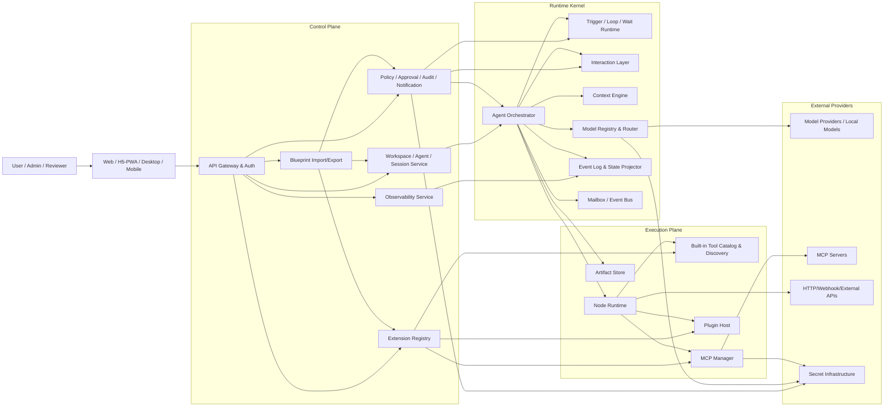
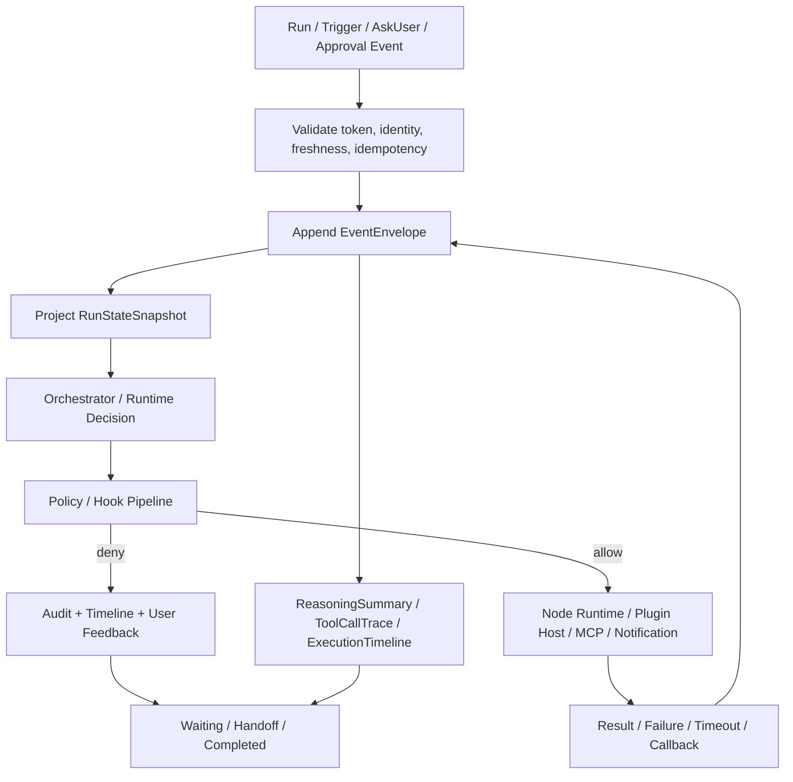
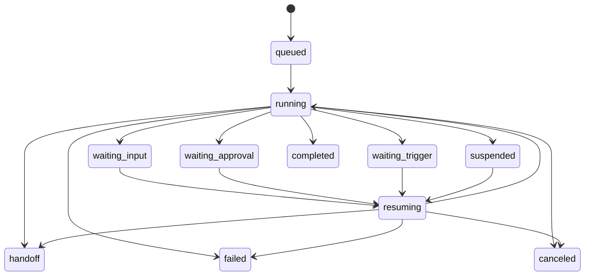
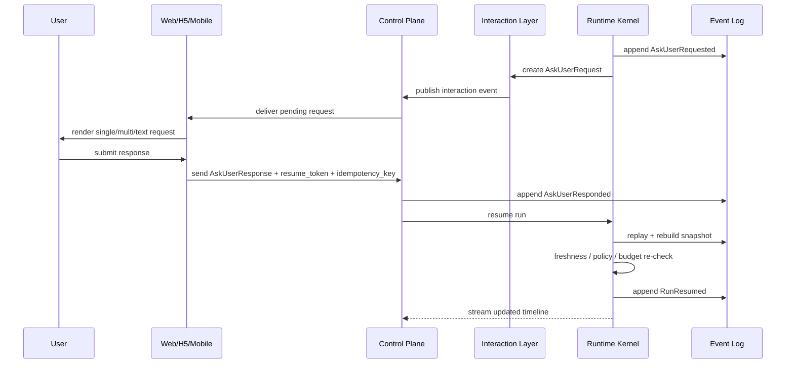
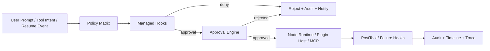
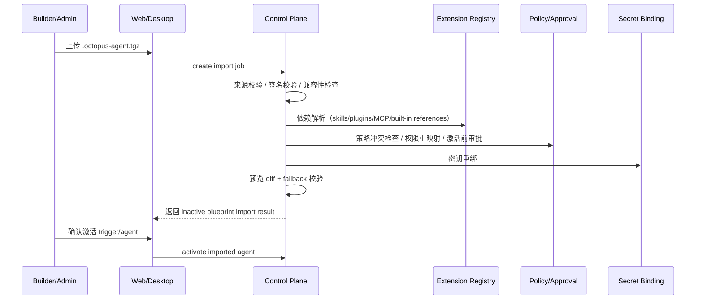
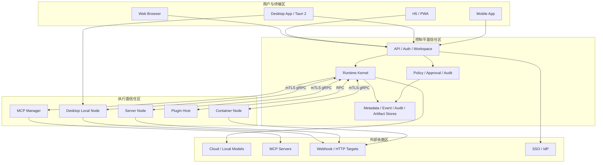
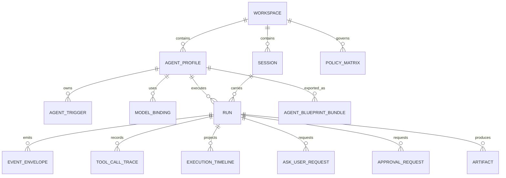

# octopus 软件架构设计说明书（SAD）v1.0

更新时间：2026-03-24  
文档状态：Draft  
文档类型：目标态软件架构说明书  
适用范围：`octopus` 首版（v1）  
依据文档：`docs/PRD.md`

## 1. 文档目的与范围

本文件定义 `octopus` 首版产品的目标态软件架构，用于统一后续控制平面、运行时内核、跨端控制面、扩展体系、治理体系和导入导出能力的工程实现边界。

本文档面向架构师、平台工程、后端工程、前端工程、客户端工程和安全治理相关角色，重点回答以下问题：

1. `octopus` v1 应由哪些核心子系统组成。
2. 各子系统的职责、边界、通信方式和信任边界是什么。
3. 多 agent、trigger、ask-user、审批、恢复、审计、memory、扩展治理应如何在统一架构中落位。
4. 哪些技术方向在系统级被锁定，哪些细节明确保持实现自由。

本文档覆盖：

1. 逻辑架构与部署架构。
2. 统一运行时状态机与事件模型。
3. 多 agent 与上下文工程。
4. 扩展体系与模型路由。
5. 安全、审批、策略、沙箱与审计。
6. 外部接口、内部集成与蓝图导入导出。
7. 质量属性、风险边界与未来预留位。

本文档不覆盖：

1. 具体代码实现、函数设计、类设计、库级实现方案。
2. ORM、数据库产品、消息队列产品、前端框架等具体组件选型。
3. 阶段排期、迭代计划、人力拆分和项目管理内容。
4. 详细 UI 线框、页面交互稿和测试用例逐条定义。

## 2. 架构驱动因素

### 2.1 产品目标与架构主题

`octopus` 的产品定位是“单租户自托管 Agent OS”。首版架构必须同时满足以下六条能力主线：

1. 多 agent 编排。
2. 节点执行。
3. 认证、权限与审批。
4. 扩展体系。
5. 跨端控制面。
6. 导入导出。

与传统聊天入口型产品相比，`octopus` 首版的核心不是“把 agent 接入更多聊天渠道”，而是把 agent 运行、治理、隔离、可移植和可审计做成正式平台能力。因此，v1 架构必须优先服务于以下目标：

1. 让 agent 作为工作区内的长期资产可配置、可治理、可迁移。
2. 让多 agent 协作成为运行时能力，而不是 prompt 技巧。
3. 让工具、技能、MCP、插件、提示词包进入统一治理面。
4. 让持续运行、等待恢复、审批接入和审计回放成为正式运行时特性。
5. 让同一平台能够支撑个人、团队和企业三种治理强度。

### 2.2 首版非目标

以下边界直接影响架构收敛，必须在设计时显式排除：

1. 不以 Slack、Telegram、Discord、企业微信等第三方聊天渠道为首版正式交付。
2. 不支持导出对话过程、推理过程、执行日志、结果物和凭据。
3. 不以多租户 SaaS 控制平面为首版目标。
4. 不将移动端定义为与桌面或服务器同权的重型执行节点。
5. 不承诺无代码工作流搭建器。
6. 不将 artifact 设计为通用、长生命周期、自持久化的应用运行时。
7. 不承诺自由 agent mesh、自适应通信拓扑和无上限自治协作。

### 2.3 架构原则

1. 先保证简单可组合的 agent loop 和 bounded orchestration 成立，再增加复杂度。
2. 硬约束由系统执行，软行为由提示词、技能、memory 辅助，二者不能混淆。
3. 所有扩展能力必须拥有稳定命名空间、作用域、风险等级和审计语义。
4. 多端允许能力差异，但命名、风险、trace 和审计语义必须一致。
5. 上下文按需加载，working memory、context budget 和 compaction 是运行时正式能力。
6. 所有高风险能力在进入默认可用面前必须先经过评测、转录审阅和治理校验。

### 2.4 关键质量属性

| 质量属性 | 对产品的含义 | 架构响应 |
| --- | --- | --- |
| 可审计性 | 企业与团队能够回放高风险行为、审批和关键状态变化 | 统一事件模型、审计链、ExecutionTimeline、ToolCallTrace、PolicyHook 记录 |
| 可恢复性 | trigger、wait、ask-user、approval、webhook 恢复时状态一致 | 事件驱动状态机、`resume_token`、`idempotency_key`、状态快照 |
| 隔离性 | 子 agent、插件、节点、MCP、artifact 不互相污染和越权 | 独立上下文、独立权限、插件宿主隔离、沙箱继承、信任边界分层 |
| 可扩展性 | 新能力可通过 skills、MCP、plugins、built-in tools 接入 | 五层扩展模型、统一治理契约、命名空间和版本契约 |
| 可移植性 | agent 能跨实例迁移，但不带出运行历史和敏感数据 | `AgentBlueprintBundle`、依赖声明、导入预检和重绑机制 |
| 多表面一致性 | 同一能力在不同端呈现可差异，但治理语义一致 | `PlatformToolProfile`、surface policy、统一 trace/audit schema |
| 治理优先 | 高风险动作必须可审批、可拦截、可追踪 | `RBAC + ABAC/Policy + Approval`、Policy Hook Pipeline、Audit Store |
| 上下文效率 | 长任务与多 agent 不应被上下文冗余拖垮 | `ContextBudgetPolicy`、WorkingMemory、ContextSnapshot、compaction |

### 2.5 硬约束

| 约束 | 架构含义 |
| --- | --- |
| Rust 控制平面与运行时内核 | 核心编排、治理、状态机、节点协议和插件宿主边界由 Rust Core 主导 |
| Desktop 基于 Tauri 2 | 桌面端必须复用统一 Web UI，并提供本机节点与系统集成功能 |
| 插件 SDK TypeScript-first | 插件生态优先优化接入效率，插件后端通过受控 RPC 与 Rust Core 交互 |
| 外部接口采用 HTTPS JSON + WebSocket/SSE | 控制面 API、流式运行观测和异步恢复入口必须统一 |
| 内部节点协议采用 mTLS gRPC | 节点执行和控制面治理之间需要明确的机机身份与安全边界 |
| MCP 支持 `stdio` 与 `Streamable HTTP/SSE` | 平台必须同时覆盖本地与远程 MCP 接入形态 |

## 3. 总体架构

### 3.1 架构风格

`octopus` v1 采用四层组合架构：

1. 控制面层：统一承载身份、工作区、agent、运行、扩展、治理、审计和通知能力。
2. 运行时层：承载 orchestrator、trigger/runtime、context、approval、interaction 和 observability。
3. 执行面层：承载节点、本机能力、built-in tools、插件宿主、MCP 连接和 side effect 执行。
4. 表面层：Web、H5/PWA、Desktop、Mobile 作为统一控制入口和有限交互面。

本架构不是“单一聊天应用 + 工具调用”的简单扩展，而是“可治理的 agent 平台 + 多表面控制面 + 多执行面运行时”的组合体。

### 3.2 总体逻辑架构图

### 3.3 核心模块职责

| 模块 | 核心职责 | 不承担的职责 |
| --- | --- | --- |
| `Control Plane` | API、鉴权、工作区管理、agent 管理、治理配置、审计、通知、导入导出 | 不直接承载所有 side effect 执行 |
| `Agent Orchestrator` | 任务拆解、Task DAG、子 agent 调度、预算与失败传播 | 不持有长期业务数据主存储 |
| `Trigger / Loop Runtime` | 定时、循环、等待、恢复、webhook、HTTP monitor | 不替代 orchestrator 做业务规划 |
| `Interaction Layer` | ask-user 请求、异步答复、等待状态打通、多端回收 | 不绕过审批或策略直接恢复执行 |
| `Context Engine` | SessionContext、WorkingMemory、AutoMemory、ExternalReferences、ContextSnapshot | 不直接放宽任何权限 |
| `Model Registry & Router` | provider 注册、模型绑定、路由、fallback、成本与速率治理 | 不托管模型本体 |
| `Policy / Hook Pipeline` | 策略判定、钩子执行、审批前置、拦截与放行理由 | 不代替提示词做软引导 |
| `Observability Pipeline` | `ReasoningSummary`、`ToolCallTrace`、`ExecutionTimeline`、回放 | 不暴露原始 chain-of-thought |
| `Node Runtime` | 命令、文件、网络、built-in tool、本机集成和 artifact 产出 | 不承载组织级治理决策 |
| `Built-in Tool Catalog` | 工具目录、发现、平台 profile、风险等级、fallback 策略 | 不经插件分发工具实现本体 |
| `MCP Manager` | `stdio` / `Streamable HTTP/SSE` 连接、授权和隔离 | 不把外部输出视为可信事实 |
| `Plugin Host` | out-of-process 插件运行、UI 扩展与后端扩展桥接 | 不与 Rust Core 共享内存 |
| `Artifact Store` | 结果物、受控交互载体、可共享引用 | 不作为可自治应用运行时 |
| `Mailbox / Event Bus` | agent 间消息、事件广播、审批和恢复回调 | 不承载无限制共享上下文 |

### 3.4 系统级技术定版

| 维度 | 架构决策 |
| --- | --- |
| 核心服务实现 | 采用 Rust Core 统一实现控制平面核心、运行时内核和关键治理逻辑 |
| 桌面端 | 基于 Tauri 2 承载统一 Web UI，并扩展本机节点与系统集成功能 |
| Web/H5/PWA | 复用统一控制面前端，不在本 SAD 中锁定具体前端框架 |
| 移动端 | 控制优先，负责状态查看、审批、ask-user、通知与轻量接管 |
| 插件生态 | TypeScript-first SDK，后端插件默认 out-of-process |
| 对外 API | HTTPS JSON API + WebSocket/SSE 流式运行输出 + 文件上传下载 |
| 对内协议 | `Control Plane ↔ Node Runtime` 使用 mTLS gRPC；`Control Plane ↔ Plugin Host` 使用受控 RPC |
| 存储角色 | 采用元数据存储、事件日志存储、对象存储、秘密存储、审计/观测存储、异步事件通道等技术角色，不在本 SAD 中锁定具体产品 |

### 3.5 关键架构决策

1. 统一控制面与运行时内核由 Rust Core 承担，以确保审批、策略、状态恢复和执行隔离具备硬约束能力。
2. 多 agent 首版采用 bounded `orchestrator-worker`，而非自由 mesh。
3. `Run`、`TriggerExecution`、`AskUserRequest`、`ApprovalRequest` 统一纳入事件驱动状态机。
4. 扩展体系必须统一治理字段和命名空间，不允许“能运行但不可治理”的能力进入默认可用面。
5. Blueprint 迁移的是“能力与策略包”，不是“运行过程与数据包”。

## 4. 运行时架构

### 4.1 统一运行时对象

`octopus` v1 将以下对象纳入统一运行时模型：

1. `Run`
2. `TriggerExecution`
3. `AskUserRequest`
4. `ApprovalRequest`

它们共享以下运行时原则：

1. 状态由不可变事件追加形成。
2. 所有恢复都通过事件回放和状态重建完成。
3. 所有外部恢复入口都必须携带 `resume_token` 与 `idempotency_key`。
4. 所有 side effect 在真正执行前都必须再次经过 freshness check、权限、策略、预算和审批校验。

### 4.2 统一事件流

`EventEnvelope` 是运行时的最小审计与恢复单位，至少应携带：

1. 事件类型与对象类型。
2. 对象标识与因果链标识。
3. 触发者主体与来源表面。
4. `resume_token` 与 `idempotency_key`。
5. 时间戳、风险等级、预算上下文。
6. 关联的审批、工具、artifact、trigger 或 interaction 引用。

### 4.3 `Run` 状态机

各状态的含义如下：

| 状态 | 含义 |
| --- | --- |
| `queued` | 已进入调度队列，尚未开始执行 |
| `running` | 正在规划、调用模型、调用工具或调度子 agent |
| `waiting_input` | 等待 ask-user 异步答复 |
| `waiting_approval` | 等待审批人处理高风险动作 |
| `waiting_trigger` | 等待定时、外部事件、webhook、条件满足或指定主体回复 |
| `suspended` | 由于资源、节点、长任务切片或人工干预被挂起 |
| `resuming` | 已收到恢复信号，正在做新鲜度、状态和策略重验证 |
| `completed` | 已完成且无待补偿副作用 |
| `failed` | 执行失败且无法自动恢复 |
| `canceled` | 被用户、系统或策略取消 |
| `handoff` | 升级人工接管或升级到其他运行路径 |

### 4.4 恢复与幂等

所有恢复入口必须遵守以下语义：

1. 先验重放：恢复前先通过事件日志重建最近一致状态。
2. 幂等去重：相同 `idempotency_key` 的恢复事件只执行一次有效恢复。
3. 新鲜度检查：若等待期间共享世界、目标或策略已变化，恢复必须进入重新规划，而不是直接沿用旧计划。
4. 二次校验：等待中的高风险 side effect 在恢复后不能直接执行，必须重新通过策略、审批、预算和上下文新鲜度检查。

### 4.5 ask-user / wait / resume 关键时序

该时序适用于 ask-user、审批恢复、webhook 恢复和 trigger 恢复的统一恢复框架，只是恢复源和恢复前验证条件不同。

## 5. 多 Agent 与上下文架构

### 5.1 持久 agent 与临时子 agent

| 类型 | 生命周期 | 主要用途 | 是否计入用户 agent 资产 |
| --- | --- | --- | --- |
| 持久 `AgentProfile` | 长期存在于 `workspace` | 数字员工、长期职责、可授权、可导入导出 | 是 |
| 运行态 `Subagent` | 仅在单个 run 内存在 | 承接拆分任务、并行执行、返回摘要 | 否 |

持久 agent 是配置资产，子 agent 是执行实体。二者必须在对象模型、审计、权限和展示层严格区分。

### 5.2 编排模型

`octopus` 首版采用 bounded `orchestrator-worker` 模式：

1. 主 agent 生成 `TaskDag`，定义子任务、依赖、聚合点和预算边界。
2. 可并发的子任务由主 agent 并行调度到多个 subagent。
3. 存在共享写目标、强顺序依赖或一致性约束的任务必须串行。
4. 每次 run 必须携带并发预算、token 预算、时间预算和失败预算。
5. 超预算时，系统必须降级为缩减并发、切换 fallback、暂停等待或升级人工接管。

### 5.3 子 agent 隔离

每个子 agent 必须具备以下隔离属性：

1. 独立上下文窗口。
2. 独立系统提示词。
3. 独立工具面与能力边界。
4. 独立权限和策略判定上下文。
5. 独立运行日志、超时与取消控制。
6. 与父 agent 解耦的失败域。

### 5.4 agent 间通信模型

agent 之间默认不共享完整上下文，协作只能通过显式载体进行：

| 载体 | 用途 |
| --- | --- |
| `MailboxMessage` | 请求、回应、补充说明、协商、失败通知 |
| `AgentEvent` | 开始、进行中、完成、取消、等待、审批挂起等状态广播 |
| `ArtifactReference` | 结构化结果物或文件引用 |
| `HumanEscalation` | 升级人工审批、人工决策或人工接管 |

内部协议应与未来 A2A `task`、`artifact update`、`stream` 语义兼容，但 v1 不强制暴露外部 A2A 网关。

### 5.5 上下文分层

| 层次 | 角色 | 是否随 blueprint 导出 |
| --- | --- | --- |
| `SessionContext` | 当前会话显式指令、最近交互与当前目标 | 否 |
| `WorkingMemory` | 任务执行中的短期结构化笔记、约束与开放问题 | 否 |
| `AutoMemory` | 长期偏好、经验与团队约定 | 否 |
| `Artifact / App State` | 与结果展示和受控交互相关的状态 | 否 |
| `ExternalReferences` | 文件、URL、查询、数据库键、artifact 引用等按需载入定位符 | 否 |
| `ContextSnapshot` | 跨上下文窗口延续的结构化摘要快照 | 否 |

### 5.6 上下文预算与压缩

1. 初始上下文只加载高信号信息，包括 agent profile、必要 prompt packs、技能元数据、策略边界和当前活动 run 的关键状态。
2. 大体量信息优先以 `ExternalReferences` 保存，通过工具按需加载。
3. 每个 run 和 subagent 都必须携带 `ContextBudgetPolicy`。
4. 当上下文压力逼近阈值时，系统必须进行 compaction，将已完成细节压缩为 `ContextSnapshot`。
5. 主 agent 聚合多个子 agent 返回结果时，必须先做摘要聚合与二次 compaction，再进入主上下文。

### 5.7 多 agent 回传与聚合策略

子 agent 返回主 agent 的默认回传形态应为：

1. `TaskSummary`
2. `DecisionSummary`
3. `ArtifactReference`
4. `RiskNote`
5. `NextActionProposal`

冗长工具输出、局部分析和细碎中间步骤保留在子 agent 自己的 trace 中，需要时再按需提取，不得默认全文回灌主 agent。

## 6. 扩展架构

### 6.1 五层能力模型

| 能力层 | 职责 | 典型内容 | 加载时机 | 关键治理关注点 |
| --- | --- | --- | --- | --- |
| `Prompt Packs` | 组织规则、角色模板、系统提示词模块 | 合规规则、行业模板、角色模板 | 会话或 run 初始化 | 版本、作用域、覆盖顺序 |
| `Skills` | 按需加载的操作知识与工作流指令 | `SKILL.md`、bundled scripts、resources | Progressive disclosure，按需激活 | 供应链风险、脚本执行、网络访问声明 |
| `Built-in Tools` | 平台原生工具能力 | 文件、命令、通知、系统集成等 | `always-loaded` 或 `deferred` | 风险等级、平台 profile、fallback |
| `MCP Servers` | 外部工具、数据源与 prompt 能力 | `stdio` / `Streamable HTTP/SSE` MCP | 连接建立后按授权使用 | 外部输出不可信、allowlist、审批 |
| `Plugins` | 第三方或组织自定义扩展 | UI 扩展、后端扩展、bundled skills/packs | 安装、授权、启用后可用 | 签名、capability grant、进程隔离 |

### 6.2 统一治理契约

`Built-in Tools`、`Skills`、`MCP Servers`、`Plugins` 必须具备统一治理字段；`Prompt Packs` 至少需要其中的治理子集：

1. `namespace`
2. `version`
3. `compatibility`
4. `source_trust`
5. `risk_tier`
6. `surface_availability`
7. `sandbox_requirement`
8. `approval_requirement`
9. `audit_events`
10. `fallback_policy`
11. `eval_coverage`

任何未声明关键治理字段的能力，不得进入默认可用面。

### 6.3 作用域、覆盖与优先级

#### 6.3.1 Prompt Packs

`Prompt Packs` 支持组织级、工作区级、agent 级作用域，并支持继承、覆盖、版本化、审核发布和回滚。

#### 6.3.2 Skills

Skills 支持组织级、用户级、工作区级作用域，优先级固定为：

1. 工作区级
2. 组织/用户级
3. 插件内置
4. 平台预置

skills 的完整正文和资源不能在会话初始时全部注入，必须通过 progressive disclosure 按需加载。

### 6.4 Built-in Tools 架构

#### 6.4.1 分类与加载

内置工具分为：

1. `always-loaded`
2. `deferred`

`ToolLoadingPolicy` 必须显式声明每个工具属于哪类。`deferred` 工具首次被发现、加载和 fallback 时，必须写入 `ExecutionTimeline` 和审计日志。

#### 6.4.2 目录与发现

平台必须提供统一的 `BuiltInToolCatalog` 与 `ToolDiscovery` 能力。每个 `BuiltInTool` 元数据至少包含：

1. 标识与命名空间。
2. 描述与参数 schema。
3. 风险等级与来源可信级别。
4. 平台可用性和所需节点能力。
5. 沙箱要求与审批要求。
6. 审计事件。
7. `eval_coverage`。
8. fallback 提示与策略引用。

#### 6.4.3 平台差异与降级

平台通过 `PlatformToolProfile` 描述 Web、Desktop、Mobile、Server Node 各自可见的工具集合。当目标端缺失某工具时，平台必须依据 `ToolFallbackPolicy` 在以下路径间降级：

1. 其他 built-in tool。
2. MCP。
3. 插件能力。
4. ask-user。
5. 手动接管。

### 6.5 模型注册、绑定与路由

模型管理采用“平台注册 + agent 选用”模式：

1. `ModelRegistration` 以 `provider + model` 注册可用模型。
2. `ModelBinding` 以功能位点为粒度把模型绑定到 agent。
3. `RoutingPolicy` 负责 fallback、成本治理、速率限制与策略约束。
4. 模型凭据统一通过 `SecretBinding` 管理，不随 blueprint 导出。

功能位点至少包括：

1. 主对话
2. 计划/推理
3. 工具调用
4. 子 agent
5. 长任务循环
6. 总结/压缩

### 6.6 MCP 架构

1. 同时支持本地 `stdio` 和远程 `Streamable HTTP/SSE`。
2. 支持组织级与工作区级注册、授权继承和审计。
3. 支持以 `SecretBinding` 注入凭据。
4. MCP 输出默认视为不可信工具输出，不得直接获得审批豁免、memory 写入豁免或更高信任等级。
5. 组织必须可按 server、tool、domain 和 surface 粒度配置 allowlist、denylist 和 approval 规则。

### 6.7 插件架构

#### 6.7.1 插件运行模型

`octopus` 插件体系采用“Rust Core + 隔离式 Plugin Host”模型：

1. 后端插件默认 out-of-process。
2. 插件通过受控 RPC 与控制平面或执行面交互。
3. UI 插件只能挂载在平台提供的 extension points，不能接管主路由与鉴权。

#### 6.7.2 插件清单

`PluginManifest` 至少应包含：

1. `id`
2. `version`
3. `configSchema`
4. `capabilities`
5. `uiExtensions`
6. `backendExtensions`
7. `bundledSkills`
8. `bundledPromptPacks`
9. `compatibility`
10. `signing`

#### 6.7.3 插件安全默认值

1. 插件安装不等于插件授权，启用前必须完成 capability grant。
2. 插件不能自动继承管理员豁免、模型密钥、网络放行或文件系统写入豁免。
3. 插件提供的 hooks 不能覆盖组织级 managed hooks。
4. 高风险插件在启用前必须具备 `eval_coverage`、transcript review 和对抗测试记录。

## 7. 安全与治理架构

### 7.1 身份与工作模式

| 模式 | 身份能力 | 架构要求 |
| --- | --- | --- |
| 个人 | 本地管理员、邮箱/密码、设备信任、PAT | 支持本机部署、本机节点和个人工作区 |
| 团队 | 邀请成员、OIDC/OAuth2 | 支持共享工作区、协作审批和共享扩展 |
| 企业 | SAML/OIDC SSO、域名绑定、服务账号 | 支持组织级策略、角色映射、审计导出和集中授权 |

人机身份与机机身份必须分离。用户身份负责工作区与治理授权，节点身份负责执行面接入与轮换。

### 7.2 权限模型

权限固定采用三层并行模型：

1. `RBAC`：`Owner`、`Admin`、`Operator`、`Builder`、`Reviewer/Approver`、`Viewer`
2. `ABAC/Policy`：按资源、环境、节点标签、表面、工具、插件能力、MCP server、风险等级决策
3. `Approval`：高风险动作的预执行审批或事后追认

### 7.3 Policy / Hook Pipeline

策略判定维度固定为：

`subject × capability × surface × environment × risk`

平台至少支持以下钩子位点：

1. `UserPromptSubmit`
2. `PreToolUse`
3. `PermissionRequest`
4. `PostToolUse`
5. `PostToolUseFailure`
6. `OutboundRequest`

### 7.4 高风险动作治理

以下动作必须进入审批、告警和审计链：

1. 命令执行
2. 外网访问
3. 敏感文件读写
4. 凭据读取
5. 插件安装与启用
6. blueprint 导入激活
7. 高权限 MCP 授权
8. 高风险 built-in tool 调用与风险级别变更
9. trigger 激活与修改
10. 持续 loop 启动
11. 模型凭据绑定与高成本路由变更

### 7.5 沙箱与执行控制

运行时至少必须支持以下控制项：

1. 工作区路径限制。
2. 文件白名单与黑名单。
3. 网络域名策略。
4. 命令执行审批。
5. 提权禁止或审批。
6. 插件 capability 限制。
7. built-in tool capability 限制。
8. managed-only hooks 与策略执行隔离。
9. outbound webhook / HTTP / MCP 域名 allowlist。
10. 约束对脚本、子进程和插件宿主进程的继承。

### 7.6 密钥、签名与供应链安全

1. 所有 secrets 必须加密存储，并通过 `SecretBinding` 被引用。
2. 所有插件和 blueprint 必须支持签名校验。
3. skills 必须显式声明 bundled scripts、外部链接、引用工具、引用 MCP server 和预期网络访问。
4. 恶意 skill、恶意 plugin、恶意 MCP server、prompt injection 和未授权 egress 必须被视为默认威胁模型。

### 7.7 审计架构

审计日志至少覆盖以下域：

1. 身份与登录变更
2. 节点注册、撤销与轮换
3. agent 生命周期变更
4. built-in tool 策略、启停与 fallback
5. 插件安装、启停、升级
6. MCP 注册与授权变更
7. blueprint 导入导出
8. trigger 生命周期
9. ask-user 请求与答复
10. 模型注册、密钥绑定和路由变更
11. 审批动作
12. 高风险执行
13. memory 写入、删除、压缩与回忆
14. policy hook 决策与拦截原因
15. eval 门禁状态与能力发布变更

## 8. 接口与集成架构

### 8.1 外部控制面 API 范围

对外 API 必须覆盖以下域：

1. `auth`
2. `workspace`
3. `agent`
4. `run`
5. `trigger`
6. `interaction`
7. `model registry`
8. `built-in tool`
9. `observability`
10. `node`
11. `plugin`
12. `skill`
13. `prompt_pack`
14. `mcp`
15. `blueprint import/export`
16. `approval`
17. `audit`
18. `artifact`
19. `notification`
20. `memory`
21. `policy`
22. `evaluation`

建议按以下接口组装：

| API 组 | 范围 |
| --- | --- |
| 身份与工作区 | `auth`、`workspace` |
| agent 与运行时 | `agent`、`run`、`trigger`、`interaction`、`approval`、`artifact` |
| 能力与扩展 | `built-in tool`、`skill`、`prompt_pack`、`plugin`、`mcp`、`model registry` |
| 治理与观测 | `policy`、`audit`、`observability`、`notification`、`evaluation` |
| 节点与迁移 | `node`、`blueprint import/export` |

### 8.2 传输契约

| 方向 | 传输方式 | 说明 |
| --- | --- | --- |
| 外部控制面请求 | HTTPS JSON API | 管理、配置、查询和触发 |
| 流式运行输出 | WebSocket 或 SSE | 推理摘要、工具调用、状态变迁、等待与恢复事件 |
| 文件传输 | 上传/下载 | blueprint 包、artifact、导入资源 |
| 恢复回调 | HTTPS + `resume_token` + `idempotency_key` | ask-user、approval、webhook、trigger 恢复 |
| 节点协议 | mTLS gRPC | 注册、心跳、能力上报、执行与结果回传 |
| 插件宿主协议 | 受控本地 RPC | 插件元数据、能力授予、扩展点调用 |
| MCP | `stdio` / `Streamable HTTP/SSE` | 外部工具与资源接入 |

### 8.3 运行流输出语义

运行流至少应输出：

1. `reasoning summary events`
2. `tool call events`
3. `execution status/timeline events`
4. `ask-user pending events`
5. `wait/resume events`
6. `policy hook events`
7. `state transition events`

对任何工具调用，都必须显式标记来源为 built-in、MCP 或 plugin，并记录 fallback 语义。

### 8.4 Blueprint 导入导出架构

#### 8.4.1 导出边界

`AgentBlueprintBundle` 导出的是静态能力与策略配置，包含：

1. `AgentProfile`
2. system prompt 与 `Prompt Packs` 引用
3. `Skills` 依赖声明与可选内嵌副本
4. `Built-in Tools` 引用、启用策略、加载策略与 fallback 策略
5. `MCP Servers` 依赖声明
6. `Plugins` 依赖声明
7. trigger 集合与 loop 配置
8. 模型绑定与模型路由
9. interaction、autonomy、observability、context、memory、tool、approval 策略
10. manifest 与签名信息

以下内容严禁导出：

1. 对话过程、推理过程、运行日志
2. 结果物、审批记录、用户数据
3. 密钥、令牌、外部连接凭据
4. `WorkingMemory`、`AutoMemory`、`ContextSnapshot`、`RunStateSnapshot`
5. artifact 的会话态或 app state
6. built-in tool 实现本体

#### 8.4.2 导入流程

导入后的默认状态必须是 `inactive`。未完成依赖检查、密钥绑定、审批和 built-in tool 重新解析前，不得进入可运行态。

### 8.5 A2A 兼容预留

v1 内部 agent 通信先采用站内协议，不强制对外暴露 A2A 网关。但内部 `Mailbox / Event` 数据模型必须为未来 A2A 兼容保留以下语义：

1. `task`
2. `artifact update`
3. `stream`
4. `status`
5. `handoff`

## 9. 部署与端侧架构

### 9.1 节点与表面分工

| 组成 | 角色定位 | 关键职责 |
| --- | --- | --- |
| Web | 主控制面 | 管理后台、会话、运行、扩展、工作区、审计与导入导出 |
| H5/PWA | 轻控制面 | 移动浏览器访问、通知跳转、审批和状态查看 |
| Desktop | 强控制面 + 本机节点 | 复用 Web UI，提供本机节点、文件系统桥接、通知、离线恢复和系统集成 |
| Mobile | 控制优先 | 登录、审批、ask-user、通知、状态查看、轻量接管 |
| Server Node | 长驻执行面 | 重型任务、后台循环、服务器资源和长期执行 |
| Desktop Local Node | 本机执行面 | 本机文件、本机工具、本机环境任务 |
| Container Node | 受控执行面 | Docker/Docker Compose 下的隔离执行 |

### 9.2 部署与信任边界图

### 9.3 端侧职责边界

#### 9.3.1 Web / H5

Web/H5 必须支持登录、多身份切换、工作区和 agent 管理、artifact 浏览、运行追踪、审批处理、审计查看、扩展治理和 blueprint 导入导出。

#### 9.3.2 Desktop

Desktop 基于 Tauri 2，除复用统一 Web UI 外，还必须提供：

1. 本机节点启停。
2. 文件系统桥接。
3. 系统通知与深链。
4. 生物识别或系统级解锁。
5. 本地缓存和离线恢复。
6. 本机 `PlatformToolProfile` 展示和 deferred tool 发现。

#### 9.3.3 Mobile

Mobile 首版仅承担控制优先职责，不承担长时命令执行、本地重型文件处理或高并发子 agent 执行。

### 9.4 节点架构

节点注册采用：

1. 短期注册令牌。
2. 注册后生成节点身份。
3. 工作负载令牌轮换。
4. 节点撤销与失效。

每个节点必须上报：

1. OS 与架构。
2. 可用能力。
3. 沙箱能力。
4. 网络能力。
5. 文件系统能力。
6. 当前健康状态。
7. 标签与执行能力画像。
8. `PlatformToolProfile` 与可用 built-in tool 集合。

### 9.5 Artifact 边界

artifact 在 v1 中只定义为结构化结果展示与受控交互面：

1. 可承载报告、图表、文档、可下载文件、结构化表单和与当前 run 绑定的受控交互。
2. 不能直接持有 secrets、调用模型、直连 MCP、长期持久化状态或运行后台自治任务。
3. 任何真实世界变更都必须回到控制平面重新经过策略、审批和审计。

## 10. 数据与核心对象模型

### 10.1 核心对象关系

### 10.2 核心对象分组

#### 10.2.1 配置与治理对象

| 对象 | 用途 |
| --- | --- |
| `Workspace` | 工作区、知识边界、共享策略与共享资产作用域 |
| `AgentProfile` | agent 身份、目标、persona、模型绑定、能力配置、策略配置 |
| `AgentOwnership` | agent 创建者、可见性和授权边界 |
| `AgentVisibility` | 私有、授权共享、发布共享 |
| `PolicyMatrix` | 基于 subject/capability/surface/environment/risk 的策略矩阵 |
| `PolicyHook` | pre/post/permission/outbound 等钩子的配置和执行结果 |
| `ModelRegistration` | provider/model 的平台注册对象 |
| `ModelBinding` | agent 在功能位点对模型的绑定 |
| `BuiltInToolCatalog` | 平台工具目录与治理状态 |
| `BuiltInTool` | 平台原生工具的元数据对象 |
| `ToolLoadingPolicy` | 内置工具的 `always-loaded` / `deferred` 加载策略 |
| `PlatformToolProfile` | 不同表面与节点上的工具能力画像 |
| `ToolFallbackPolicy` | 工具缺失、加载失败或不可用时的降级路径策略 |
| `PluginManifest` | 插件元数据、扩展点、兼容性和签名 |
| `NodeRegistration` | 节点身份、能力、健康状态、标签和可达性 |

#### 10.2.2 运行时对象

| 对象 | 用途 |
| --- | --- |
| `Session` | 人机连续交互容器 |
| `Run` | 可审计执行单元 |
| `TaskDag` | 主 agent 的任务拆解图 |
| `AgentTrigger` | 一等触发器对象 |
| `TriggerProposal` | 运行中提出、待确认激活的 trigger 草案 |
| `TriggerExecution` | 触发器的实际执行记录 |
| `AskUserRequest` / `AskUserResponse` | 异步用户交互 |
| `ApprovalRequest` / `ApprovalResponse` | 高风险动作审批 |
| `EventEnvelope` | 不可变事件记录 |
| `RunStateSnapshot` | 状态投影快照 |
| `ReasoningSummary` | 结构化推理摘要 |
| `ToolCallTrace` | 工具调用链 |
| `ExecutionTimeline` | 时间线与状态变迁 |
| `MailboxMessage` / `AgentEvent` | agent 间通信与广播 |
| `Artifact` | 结果物与受控交互载体 |

#### 10.2.3 上下文与迁移对象

| 对象 | 用途 |
| --- | --- |
| `WorkingMemoryEntry` | 任务执行中的短期结构化笔记 |
| `AutoMemoryEntry` | 长期偏好与团队约定 |
| `ContextSnapshot` | 跨上下文窗口延续的结构化摘要 |
| `ContextBudgetPolicy` | 上下文预算和压缩策略 |
| `AgentBlueprintBundle` | 可导入导出的 agent 实例包 |
| `ArtifactSurfacePolicy` | artifact 的可执行范围、可见范围和生命周期边界 |
| `SecretBinding` | 模型、MCP、插件和导入重绑使用的秘密引用 |

### 10.3 存储角色划分

为支持事务一致性、恢复、审计和大对象存储，v1 至少需要以下存储与通道角色：

| 技术角色 | 存储或承载对象 |
| --- | --- |
| 事务型元数据存储 | `Workspace`、`AgentProfile`、`ModelRegistration`、`PolicyMatrix`、`PluginManifest` |
| 事件日志存储 | `EventEnvelope`、恢复事件、时间线事件 |
| 状态投影存储 | `RunStateSnapshot`、`ExecutionTimeline` 查询视图、待处理交互/审批视图 |
| 对象存储 | artifact、导入导出包、可选模板资源 |
| 秘密存储 | `SecretBinding` 引用的真实秘密 |
| 审计/观测存储 | 审计事件、trace、指标和回放索引 |
| 异步事件通道 | 节点回调、通知、恢复任务、后台循环与异步聚合 |

## 11. 质量属性与架构策略

### 11.1 可审计性与可回放

架构策略：

1. 所有运行时对象共享统一事件模型。
2. 所有关键动作都生成 `ExecutionTimeline` 和审计事件。
3. `ReasoningSummary` 只输出结构化摘要，不输出原始 chain-of-thought。

对应验证目标：

1. 高风险动作必须可回放关键事件链路。
2. 审批、trigger、wait/resume 和 fallback 必须有完整时间线。

### 11.2 可恢复性与状态一致性

架构策略：

1. `resume_token` 和 `idempotency_key` 作为恢复入口的强制字段。
2. 所有恢复均先重放事件、再重建状态、再做 freshness check。
3. `Trigger / Wait / Resume Runtime` 不依赖内存态隐式恢复。

对应验证目标：

1. 重复恢复请求只执行一次有效恢复。
2. Control Plane 重启后，待恢复运行状态保持一致。

### 11.3 隔离性与故障域控制

架构策略：

1. subagent 上下文、权限、工具面、日志和取消控制完全隔离。
2. 插件 out-of-process，节点与控制面机机身份分离。
3. artifact、MCP 和 plugin 默认处于比平台原生能力更严格的信任基线。

对应验证目标：

1. 任一子 agent 失败不污染其他子 agent。
2. 插件崩溃不拖垮控制平面核心进程。

### 11.4 可扩展性与兼容性

架构策略：

1. 五层能力模型共用统一治理契约。
2. 所有扩展点都有版本化契约和命名空间。
3. 内部通信模型预留 A2A 兼容空间。

对应验证目标：

1. 插件 manifest 和 blueprint manifest 可静态校验。
2. 新能力变更会触发 eval 重新评测。

### 11.5 性能与用户体验

架构策略：

1. 控制面与执行面分离，执行负载不阻塞控制面。
2. built-in tools 支持 `always-loaded` 与 `deferred` 两类加载策略。
3. 长任务通过 compaction 降低上下文负载。

目标指标：

1. 控制面首屏打开时间小于 3 秒。
2. 单次 run 建立时间小于 2 秒。
3. ask-user 和审批通知到达目标小于 5 秒。
4. deferred built-in tool 首次发现与加载目标小于 3 秒。

### 11.6 评测与发布门禁

Evaluation Harness 是首版正式交付要求，不是附加项。架构层面必须保证：

1. built-in tools、skills、plugins、MCP、routing policy、trigger/wait/resume runtime、approval/policy hooks 和多 agent 编排模板都具备可测性。
2. 高风险能力在默认启用前必须完成 eval suite、transcript review 和对抗测试。
3. failure taxonomy 至少区分 planning、context、tool selection、tool schema、policy、resume/idempotency、human guidance/coordination 等失败类型。

## 12. 风险与边界

### 12.1 首版边界

以下内容明确不进入 v1 正式承诺：

1. 第三方聊天渠道矩阵。
2. 多租户 SaaS 优先控制平面。
3. 自由 agent mesh 与自演化拓扑。
4. artifact 作为可自持久化应用运行时。
5. 公共插件市场。
6. 导出运行历史、结果物、memory 条目或凭据。

### 12.2 主要架构风险与缓解方向

| 风险 | 说明 | 架构缓解 |
| --- | --- | --- |
| 统一状态机复杂度高 | `Run`、`Trigger`、`AskUser`、`Approval` 生命周期耦合 | 用统一事件模型和状态投影消解分叉状态 |
| 多表面能力漂移 | Web/Desktop/Mobile/Node 的能力集不一致 | 用 `PlatformToolProfile` 和统一治理语义收敛 |
| 插件与 skill 供应链风险 | 自定义扩展可能引入隐藏行为或外传数据 | 签名、来源、risk tier、capability grant、审计和 eval |
| MCP 不可信输出污染记忆 | 外部服务器可能返回诱导信息 | 默认不可信、必须经 trace、policy 和防注入策略处理 |
| 长任务上下文膨胀 | 多 agent 和长 loop 可能压垮上下文窗口 | `ContextBudgetPolicy`、compaction、摘要回传 |
| fallback 语义失控 | 端侧能力差异可能导致行为不可预测 | `ToolFallbackPolicy` 显式建模并审计 fallback 事件 |

### 12.3 未来预留位

以下能力不属于 v1 交付，但需要在对象模型或协议边界中预留兼容空间：

1. 外部 A2A Server。
2. 官方 `Blueprint Registry`。
3. Rust/WASM 插件 SDK。
4. 更复杂的 adaptive topology / graph pruning。
5. 更强的 artifact/app runtime。

### 12.4 结论

`octopus` v1 的架构核心不是“把大模型接上工具”，而是将 agent 的运行、治理、隔离、恢复、导入导出和多表面控制统一到一套可审计、可恢复、可扩展的平台内核中。为此，首版必须坚定围绕以下主线收敛：

1. 统一控制平面。
2. 事件驱动运行时。
3. bounded 多 agent 编排。
4. 五层能力扩展与统一治理契约。
5. 强制安全、审批、沙箱与审计。
6. 单租户自托管与跨实例 blueprint 迁移。

只要上述主线保持稳定，后续无论扩展更多端、更多 provider、更多插件还是 A2A 互联，都可以在不推翻核心内核的前提下持续演进。
