# Octopus · 软件架构设计说明书（SAD）

**版本**: v2.2 | **状态**: 重构定稿版 | **日期**: 2026-03-28
**对应 PRD**: v2.2

---

## 1. 架构目标与设计原则

### 1.1 文档目标

本文档定义 Octopus 的目标态逻辑架构、领域边界、运行时模型、知识架构、治理模型、协议互操作层、安全与恢复机制，用于支撑 [PRD](../product/PRD.md) 中定义的统一 Agent Runtime Platform。

本文档覆盖：

- repo 级架构拓扑、workspace 治理与跨层依赖约束
- 系统边界、部署模式与信任边界
- 领域对象、边界上下文和跨平面职责
- Run、Automation、Trigger、ResidentAgentSession、Delegation、Knowledge、Approval 的运行时流程
- 数据分层、状态机、恢复策略和观测模型
- MCP / A2A 一等互操作架构
- 安全、预算、授权、审计与运维要求

本文档不覆盖：

- 项目排期、团队拆分与开发里程碑
- 具体 crate / package 名称、数据库表字段和 API 路由样板
- 函数级伪代码、框架样板和容器编排脚本

### 1.2 架构驱动因素

| 驱动因素 | 架构响应 |
| --- | --- |
| 同一平台覆盖个人、本地、团队与企业治理 | 用统一对象模型承载不同能力深度，只在部署和治理上分层 |
| 正式支持长期驻留代理和事件驱动运行 | 建立 Trigger、Automation、ResidentAgentSession、Run 的统一运行模型 |
| 私有记忆、共享知识和组织图谱并存 | 建立独立的 Knowledge Plane，并为写回、晋升、删除和审计建模 |
| 多 Agent 协作不再局限于单 Leader 编排 | 将 Collaboration Mesh 作为正式平面，引入 delegation、authority、knowledge scope |
| 自治执行必须受预算和权限治理 | 建立 CapabilityGrant、BudgetPolicy、ApprovalRequest、Policy Decision Point |
| 外部工具和外部 Agent 都是核心能力 | 将 MCP 与 A2A 都纳入 Interop Plane，并共享身份、信任、授权和审计 |
| 工具暴露、结构化交互与 skill 注入不能依赖 prompt 偶然行为 | 用 CapabilityCatalog、CapabilityResolver、ToolSearch、InteractionPrompt / MessageDraft 与 ExecutionProfile / SkillPack 建立正式运行时约束链路 |
| 长时运行必须可恢复、可回放、可撤销 | 采用事件驱动状态机、checkpoint、lease、idempotency 和 lineage |

### 1.3 核心设计原则

1. **统一平台，不拆产品线**：个人、团队、企业是同一平台中的能力组合与治理深度差异，不形成独立产品、平行目录树或平行实现。
2. **Monorepo + 双 Workspace 治理**：仓库目标态由根统一治理 `Cargo Workspace` 与 `pnpm Workspace`，在同一仓库内承载应用表面、Hub 领域能力、前端共享能力、共享契约与文档。
3. **Hub 为事实源，Client 为交互层**：Hub 是正式事实源与治理中心；Client 负责交互、缓存和连续性，但不持有远程正式业务事实。
4. **Run 优先**：所有正式执行都必须以 Run 为权威执行外壳。
5. **能力运行时一等化**：工具存在性、能力可见性、结构化交互和 skill 注入都必须经正式目录、求值与审计，而不是 prompt 层偶然行为。
6. **环境真值驱动**：Agent 必须基于工具结果、环境状态和外部反馈持续校正。
7. **知识分层治理**：私有记忆、共享知识和组织图谱采用不同写入、检索和删除规则。
8. **预授权优先，越界审批兜底**：系统默认通过 grant 和 budget 控制自治，通过审批处理越界。
9. **协议一等化**：MCP 和 A2A 与原生能力共享治理语义，不是旁路扩展。
10. **恢复内建**：checkpoint、lease、idempotency 和 resume token 是正式架构要素。
11. **可观测优先于隐式智能**：Trace、Audit、Policy Decision、Knowledge Lineage、Cost Ledger 都必须可见。

### 1.4 首版 GA 交付切片

本文档描述目标态架构，但首版 GA 只强制交付以下子集：

- `Desktop + Remote Hub`
- `run_type=task`、`run_type=automation`、审批驱动的 `run_type=review`
- `Shared Knowledge`
- `Approval`
- `MCP`
- `cron`、`webhook`、`manual event`、`MCP event` 四类 Trigger

以下能力保留架构接口，但进入 Beta：

- `A2A`
- `Org Knowledge Graph` 正式晋升
- `Mobile`
- 高阶 `Mesh` 协作
- `DiscussionSession`
- `ResidentAgentSession`

补充说明（截至 2026-03-28 的 tracked repository state）：

- 当前跟踪树仍处于 `doc-first rebuild` 状态，但已包含首批 monorepo 根 manifests、当前 GA 运行时共享契约、首批 Rust runtime crates，以及最小 `apps/desktop + apps/remote-hub + packages/schema-ts + packages/hub-client` surface foundation；
- 当前已验证的实现范围是本地 `Automation(manual_event | cron | webhook | mcp_event) -> TriggerDelivery -> Task -> Policy / Budget / Approval -> Run -> Execution Adapter / MCP Gateway -> EnvironmentLease -> Artifact -> KnowledgeCandidate gate -> Shared Knowledge recall -> Audit / Trace` 闭环，并包含持久化的 `ApprovalRequest`、`InboxItem`、`Notification`、`PolicyDecisionLog`、TriggerDelivery 去重/恢复记录、`McpServer`、`McpInvocation`、`EnvironmentLease`、项目级 `KnowledgeSpace`、`KnowledgeCandidate`、`KnowledgeAsset`、知识写回重试记录与 knowledge lineage；
- 当前 tracked shell 已验证 thin remote-hub webhook ingress / cron tick shell、persisted remote user / membership / JWT session state、route-level auth enforcement、minimum automation-management surface，以及 approval detail / inbox handling / approval-driven knowledge promotion request-and-resolve 的最小治理交互面，并补齐 project-bound capability execution-state explainability 与 Run policy decision surface consumption；低信任 connector 输出可入 Artifact，但不得绕过 gate 自动进入 Shared Knowledge；
- 不得把这一步误写成已完成的 full tenant / RBAC administration、external IdP、向量检索或 Org Graph 正式晋升实现。

### 1.5 架构平面

Octopus 目标态架构显式拆分为六个主平面和一个横切观测层：

| 平面 | 核心职责 |
| --- | --- |
| **Interaction Plane** | Chat、Board、Trace、Inbox、Knowledge、Hub Connections、结构化交互与消息草稿等交互表面 |
| **Runtime Plane** | Intent Intake、Scheduler、Event Bus、Run Orchestration、CapabilityResolver、Resident Supervisor |
| **Knowledge Plane** | 私有记忆、共享知识空间、组织知识图谱、lineage、检索和写回门控 |
| **Governance Plane** | RBAC、Policy Decision Point、Grant/Budget、Approval、Model Center、Secrets |
| **Interop Plane** | MCP Gateway、A2A Gateway、Webhook / Event Adapter、Peer Registry、Connector Registry |
| **Execution Plane** | Environment Manager、Sandbox Runner、Tool Runtime、Artifact Runtime、Lease Manager、Node Runtime |
| **Observation Layer** | Trace、Audit Log、Policy Decision Log、Knowledge Lineage、Delegation Graph、Cost Ledger |

### 1.6 技术选型总览

当前架构主决策已确认；后续若重新补充实施规范或交付文档，也不得改写本 SAD 的架构主边界。

| 层次 | 技术 | 版本要求 | 备注 |
|------|------|---------|------|
| **Desktop Shell** | Tauri 2 | 2.x | Hub 逻辑直接内嵌，无 sidecar |
| **Hub 核心** | Rust + tokio + axum | Rust stable, tokio 1.x, axum 0.7 | 本地走 Tauri invoke，远程走 HTTP |
| **数据库** | sqlx | 0.7+ | async，编译期 SQL 检查 |
| **向量 DB（本地）** | LanceDB | lancedb crate 0.x | 编译进二进制，零外部依赖 |
| **向量 DB（远程）** | Qdrant | qdrant-client 1.x | 官方 Rust client |
| **Frontend** | Vue 3 + TypeScript | Vue 3.4+, TS 5 | Composition API + `<script setup>` |
| **构建工具** | Vite | 5.x | Tauri 官方推荐 |
| **状态管理** | Pinia | 2.x | Vue 官方 |
| **UI 组件** | shadcn-vue + Tailwind CSS | — | 可定制，无运行时依赖 |
| **实时推送（本地）** | Tauri Event System | built-in | emit/listen，零网络开销 |
| **实时推送（远程）** | SSE | — | axum 内置支持 |
| **认证** | JWT（jsonwebtoken crate）| — | 仅远程 Hub 模式 |
| **DB 迁移** | sqlx migrate | built-in | 嵌入二进制，启动时自动执行 |
| **序列化** | serde + serde_json | — | 全链路统一 |
| **HTTP 客户端** | reqwest | 0.12+ | 调 LLM API + MCP HTTP transport |
| **MCP 协议** | 自实现（reqwest + serde）| — | JSON-RPC 2.0，不依赖任何 SDK |
| **部署容器化** | Docker + Docker Compose | — | 远程 Hub 分发 |

### 1.7 仓库组织与工程治理

以下内容描述的是目标态 monorepo 组织与重建约束。当前 tracked tree 已包含根 `Cargo.toml`、根 `package.json`、`pnpm-workspace.yaml` 与首批顶层骨架目录，但这些只证明边界骨架和共享契约源初始化已存在，不等于已存在可运行实现；后续仍必须以后续实际 tracked manifests、源码与验证结果为准。

目标态仓库采用单一 monorepo，由根同时治理 Rust Workspace 与 pnpm Workspace，并按以下五层组织：

| 顶层路径 | 角色定位 | 目标态职责边界 |
| --- | --- | --- |
| `apps/` | 应用表面 | 承载 Desktop、Web、Mobile 等交互 surface 与可部署应用，只按 surface / target 组织，不按个人、团队、企业拆目录 |
| `crates/` | 领域能力 | 承载 Hub 领域模型、运行时、治理、互操作、执行与存储适配能力 |
| `packages/` | 前端共享 | 承载 UI、状态模型、Client 适配器、共享 TypeScript 工具与前端复用逻辑 |
| `schemas/` | 契约层 | 承载 Hub / Client 共享 schema、IDL 与生成入口，是跨 Rust / TypeScript 的唯一契约事实源 |
| `docs/` | 文档层 | 承载 PRD、SAD、参考资料、计划与治理文档 |

根治理入口约束：

- 目标态根 `Cargo.toml` 作为 Rust Workspace 根，统一管理 `crates/` 与需要进入 Rust 构建图的应用侧宿主工程。
- 目标态根 `pnpm-workspace.yaml` 与根 `package.json` 作为 pnpm Workspace 根，统一管理前端应用、共享包与契约消费链路。
- 两套 workspace 必须共处同一 monorepo，并接受同一套版本控制、文档约束、评测门禁与变更治理。

跨层依赖规则：

- `schemas/` 不依赖 `apps/`、`crates/` 或 `packages/`。
- `crates/` 只能消费 `schemas/` 提供的共享契约，不反向依赖 `packages/`。
- `packages/` 只能消费 `schemas/` 提供的共享契约，不反向依赖 `crates/`。
- `apps/` 负责 surface-specific 的装配、接线与交互编排，不承载应下沉到 `crates/` 或 `packages/` 的共享业务逻辑。
- `docs/` 不参与运行时依赖图。
- 由 `schemas/` 生成到 Rust 或 TypeScript 消费侧的语言绑定属于派生物，不改变 `schemas/` 的契约所有权。

管理方式与变更落点规则：

- 契约变更必须先落在 `schemas/`，再同步更新 Hub 与 Client 的消费侧实现。
- Hub 侧领域、运行时、治理、互操作和执行逻辑必须优先落在 `crates/`。
- 前端跨 surface 复用逻辑必须优先落在 `packages/`。
- `apps/` 只保留应用表面专有的装配、接线、壳层能力与交互编排。
- 禁止在仓库根目录或按产品线建立平行实现；个人、团队、企业差异必须体现在能力组合、配置与治理深度上，而不是体现在平行代码树上。

---

## 2. 系统上下文与部署视图

### 2.1 系统上下文

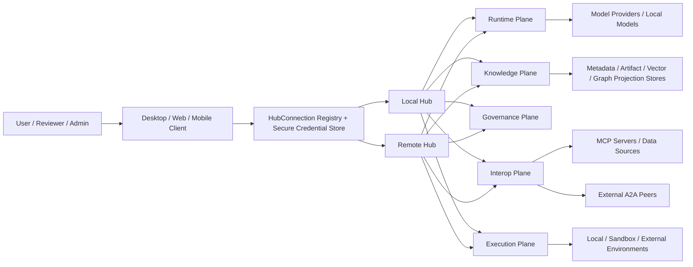

### 2.2 部署模式

| 模式 | 形态 | 核心特点 |
| --- | --- | --- |
| Desktop 本地模式 | Client 与 Hub 同一桌面应用内 | 完整离线能力、本地执行、本地知识与本地治理 |
| Desktop / Web 远程模式 | Client 连接远程 Hub | 共享协作、集中治理、集中执行 |
| Mobile 远程模式（Beta） | 移动端连接远程 Hub | 审批、通知、查看、轻量介入与跨端继续 |
| 企业私有化模式 | 远程 Hub 部署于企业环境 | 多租户、集中策略、审计、协议治理与配额控制 |

### 2.3 信任边界

| 边界 | 角色 | 信任规则 |
| --- | --- | --- |
| Client 边界 | UI、缓存、凭证、安全存储 | 可缓存和持有凭证，但不作为远程业务事实源 |
| Hub 边界 | 运行、治理、知识、协议接入 | 负责事实源、权限、审计、恢复和持久化 |
| 执行边界 | 工具执行、代码运行、文件系统、网络访问 | 必须受 sandbox tier、lease、grant 和 budget 限制 |
| 外部服务边界 | 模型 Provider、MCP、A2A Peer、HTTP API | 输出默认不可信，必须经过信任和写回门控 |
| 存储边界 | 元数据、对象、向量索引、图谱投影、缓存 | 必须区分权威数据、衍生数据和客户端缓存 |

### 2.4 事实源与缓存原则

1. 远程模式下，Hub 是 Agent、Team、Workspace、Run、Automation、ResidentAgentSession、Artifact、Knowledge、Grant 和 Audit 的权威事实源；Client 是交互层，不持有这些对象的远程正式业务事实。
2. Client 只保留连接配置、认证凭证和最近同步快照，用于离线查看、状态呈现和跨端连续性。
3. 本地模式下虽然 Client 与 Hub 同包部署，但逻辑上仍保留 Hub 为事实源的边界。
4. 断网或认证失效时，Client 进入只读缓存模式，不得假装远程写操作成功。

---

## 3. 领域模型与边界上下文

### 3.1 边界上下文

| 边界上下文 | 核心职责 |
| --- | --- |
| Access & Identity | HubConnection、认证、会话身份、设备与跨端上下文 |
| Workspace & Project | Workspace、Project、成员、共享边界和项目归属 |
| Agent Registry | Agent、Team、coordination_mode、模板和运行前有效性校验 |
| Capability Management | CapabilityCatalog、CapabilityBinding、CapabilityResolver、ToolSearch、ExecutionProfile、SkillPack 注入 |
| Run Orchestration | Run、Task、Discussion、Automation、Trigger、checkpoint、恢复 |
| Collaboration Mesh | delegation、authority_scope、knowledge_scope、cross-team 协作 |
| Knowledge System | 私有记忆、共享知识空间、组织知识图谱、lineage、晋升、删除传播 |
| Governance & Policy | Role、Permission、Policy Decision、CapabilityGrant、BudgetPolicy、Approval |
| Execution Management | EnvironmentLease、sandbox、tool runtime、node runtime、heartbeats |
| Interop Gateway | MCP、A2A、Webhook、对端身份、对端健康和互操作策略 |
| Artifact & Inbox | Artifact、Attachment、InboxItem、Notification、导出与引用 |
| Observation & Provenance | Trace、Audit、Policy Decision Log、Knowledge Lineage、Cost Ledger |

### 3.2 领域关系模型

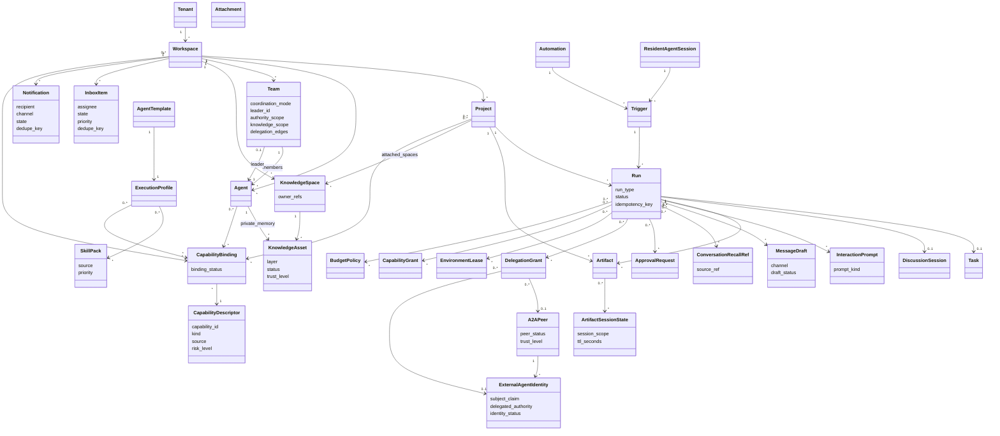

### 3.3 核心对象语义

| 对象 | 责任归属 | 说明 |
| --- | --- | --- |
| `Project` | Workspace & Project | 业务上下文边界，承载 Run、Artifact，并附着一个或多个 KnowledgeSpace 视图 |
| `Run` | Run Orchestration | 正式执行外壳，统一承载计划、状态、恢复、审批、委托和结果 |
| `Task` | Run Orchestration | 交付导向业务对象，对应一类 Run 语义 |
| `DiscussionSession` | Collaboration Mesh | 讨论导向业务对象，对应 `run_type=discussion` |
| `Team` | Collaboration Mesh | 协作单元，必须显式携带 `coordination_mode`、`authority_scope`、`knowledge_scope` 和 `delegation_edges`，但不作为 Shared Knowledge 主属边界 |
| `Automation` | Run Orchestration | 可重复执行定义，负责触发规则与预算基线 |
| `ResidentAgentSession` | Run Orchestration | 长驻观察和自主建 Run 的正式对象 |
| `KnowledgeSpace` | Knowledge System | Shared Knowledge 的权威容器与权限边界，并负责指定知识晋升与冲突处理责任人 |
| `KnowledgeAsset` | Knowledge System | 正式知识条目，承载来源、层级、可信度、晋升状态和关系 |
| `ConversationRecallRef` | Knowledge System | 对历史会话、讨论或运行片段的结构化引用，用于 episodic recall，但不直接等同于长期知识事实 |
| `CapabilityDescriptor` | Capability Management | 正式能力描述项，声明 schema、来源、平台、风险级别、fallback 和观测要求 |
| `CapabilityBinding` | Capability Management | 将正式能力绑定到 Agent、Workspace、Project、Run 或 Template 范围内的连接对象 |
| `CapabilityGrant` | Governance & Policy | 主体在某范围内的能力授权窗口 |
| `BudgetPolicy` | Governance & Policy | 约束成本、时间、动作数、重试数和升级条件 |
| `ModelProvider` | Governance & Policy | 已登记的模型提供方与协议家族记录 |
| `ModelCatalogItem` | Governance & Policy | 可治理的模型目录项，记录 release channel、模态和最小 feature 标签 |
| `ModelProfile` | Governance & Policy | Agent 或系统默认选择的命名模型档案，指向主模型与回退模型 |
| `TenantModelPolicy` | Governance & Policy | 租户级模型准入与预览审批基线 |
| `ModelSelectionDecision` | Run Orchestration | 某次 Run 的模型选择记录，承载所需 feature、缺失 feature 和审批结论 |
| `DelegationGrant` | Collaboration Mesh | 某次委托的 authority、budget 和 expiry 约束 |
| `InteractionPrompt` | Artifact & Inbox | 正式结构化提问/确认对象，进入 Chat、Inbox 与 Approval 语义 |
| `MessageDraft` | Artifact & Inbox | 正式消息草稿对象，支持审阅、确认、发送前校验和引用 |
| `ArtifactSessionState` | Execution Management | Artifact 会话内的短期状态容器，默认随会话结束而失效，不作为长期事实源 |
| `AgentTemplate` | Agent Registry | Agent 的复用模板，描述默认角色、能力、知识边界和协作偏好 |
| `ExecutionProfile` | Capability Management | 运行模板，定义模型档案、能力选择、预算缺省、记忆/检索策略与交互行为 |
| `SkillPack` | Capability Management | 在运行期间即时注入的规则包，用于规划、生成、验证和安全约束 |
| `EnvironmentLease` | Execution Management | 对执行环境的租约与恢复锚点 |
| `A2APeer` | Interop Gateway | 外部 Agent 系统的身份、能力和信任承载对象 |
| `ExternalAgentIdentity` | Interop Gateway | 绑定到具体 A2A 对端的外部主体身份声明，用于委托、回执、轮换和吊销 |
| `InboxItem` | Artifact & Inbox | 正式待处理项，承载归属人、状态、目标对象、优先级和去重键 |
| `Notification` | Artifact & Inbox | 正式提醒对象，承载渠道、去重、投递状态和抑制策略 |

### 3.4 核心不变量

1. 所有正式执行都必须存在一个 `Run`。
2. `Task`、`DiscussionSession`、`Automation` 和 `ResidentAgentSession` 都不能绕开 Run 体系。
3. `Team.coordination_mode` 决定 `leader_id` 的必填性。
4. `authority_scope`、`knowledge_scope` 和 `delegation_edges` 必须作为 Team 的正式可校验配置存在。
5. 每个 `KnowledgeSpace` 都必须指定至少一个负责人。
6. `KnowledgeAsset` 的主属边界必须是 `KnowledgeSpace`；`Project` 只形成引用视图。
7. Agent 私有记忆不能被其他 Agent 直接编辑。
8. 写入共享知识或组织图谱必须先进入候选知识路径，再经过 Knowledge Plane 和 Governance Plane 的门控。
9. 没有 grant 和 budget 的真实动作不能执行。
10. 需要环境的动作必须绑定 `EnvironmentLease`。
11. 外部 Agent 协作必须绑定 `A2APeer` 与具体 `ExternalAgentIdentity`，不能只依赖粗粒度对端注册。
12. `CapabilityDescriptor` 与 `CapabilityBinding` 是正式能力目录的唯一入口；顶层领域对象不得直接绑定具体第三方工具名。
13. 能力可见性必须由 `platform`、connector 状态、`Workspace / Project` policy、grant 和 budget 共同求值。
14. `ToolSearch` 只能发现当前主体可见的 deferred 或 connector-backed capabilities，不能自动完成授权。
15. `InteractionPrompt` 与 `MessageDraft` 必须进入 `Chat / Inbox / Approval` 流程，而不是仅作为前端私有控件。
16. `ArtifactSessionState` 只允许持有短期 UI/runtime 状态，默认不进入 Hub 长期存储、Knowledge 写回或 Run 恢复检查点。
17. `SkillPack` 只能增强既有运行约束，不能绕过 PDP、Grant、Budget 或 CapabilityCatalog。

---

## 4. 核心组件与职责分解

### 4.1 总体组件视图

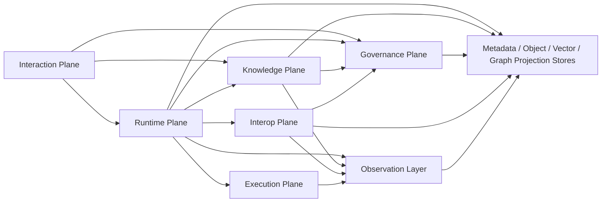

### 4.2 Interaction Plane

职责：

- 提供 Chat、Board、Trace、Inbox、Knowledge、Workspace / Project、Hub Connections 界面
- 提供 `InteractionPrompt`、`MessageDraft` 与能力可见性解释等结构化交互能力
- 管理本地连接配置、凭证、安全缓存与实时事件订阅
- 提供审批、导出、跨端继续、Artifact 会话态呈现和通知处理入口
- 对首版 GA 核心表面，页面语法与状态呈现必须符合 [`VISUAL_FRAMEWORK.md`](./VISUAL_FRAMEWORK.md)

不负责：

- 最终权限判定
- Run 调度
- Knowledge 正式写入

### 4.3 Runtime Plane

核心组件：

| 组件 | 职责 |
| --- | --- |
| `Intent Intake` | 接收用户输入、触发器事件、外部回执并标准化为运行请求 |
| `Capability Resolver` | 基于 platform、connector、Workspace / Project policy、grant 和 budget 解析能力可见性与执行性 |
| `Tool Search Service` | 在已解析可见性的前提下暴露 deferred / connector-backed capability descriptors 与 schema |
| `Scheduler / Event Bus` | 调度自动化、触发器投递、事件发布和异步恢复 |
| `Run Orchestrator` | 管理 Run 生命周期、计划、状态机、checkpoint 和恢复 |
| `Task Adapter` | 将 Task 业务语义映射到 Run 执行流程 |
| `Discussion Adapter` | 将 DiscussionSession 业务语义映射到讨论型 Run |
| `Watch Adapter` | 将 watch 型触发和观察事件映射到 Run 执行流程 |
| `Delegation Adapter` | 将受控委托映射到 delegation 型 Run 和 DelegationGrant 生命周期 |
| `Review Adapter` | 将审阅、审批前复核和结论校验映射到 review 型 Run |
| `Resident Supervisor` | 管理 ResidentAgentSession 生命周期、心跳和降级 |
| `Automation Manager` | 管理 Automation、Trigger 和最近执行状态 |
| `Execution Profile Resolver` | 将 AgentTemplate、ExecutionProfile 与 SkillPack 解析为具体运行约束和默认策略 |

关键约束：

- Runtime Plane 不把“工具是否存在”建模为 prompt 层偶然行为；正式闭环是 `CapabilityCatalog -> CapabilityBinding -> CapabilityResolver -> ToolSearch -> InteractionPrompt / MessageDraft -> Audit`。
- `Tool Search Service` 只返回当前主体在当前上下文中可发现的 descriptor、schema、治理标签与 fallback，不直接授予执行权。
- `Execution Profile Resolver` 只能基于已注册 capability 和现有治理上下文解析 `SkillPack`，不能注入未注册能力或绕过 grant、budget、approval。
- `Model Center` 负责 provider / catalog / profile / tenant-policy 真相；`ExecutionProfile` 只表达默认偏好，未来 `ModelSelectionDecision` 只记录模型选择结果，不得改写 capability 真相或绕过 `CapabilityResolver -> ToolSearch` 边界。
- 工具实现、deferred discovery、结构化提问与消息草稿交互形态可参考 `docs/references/Claude_Hidden_Toolkit.md` 作为模式样例，但正式能力边界、对象语义和治理约束仍以本 SAD 与 PRD 为准。

### 4.4 Knowledge Plane

核心组件：

| 组件 | 职责 |
| --- | --- |
| `Private Memory Service` | 管理 Agent 私有记忆的 recall、writeback、delete |
| `Conversation Recall Service` | 管理对历史会话、讨论与运行片段的引用、索引与检索授权 |
| `Shared Knowledge Service` | 管理 KnowledgeSpace、候选知识、共享知识条目和查询授权 |
| `Org Graph Service` | 管理组织知识图谱的实体、关系、晋升和回滚 |
| `Knowledge Write Gate` | 对外部结果、候选知识和图谱晋升进行门控 |
| `Knowledge Lineage Service` | 维护来源、使用链路、晋升历史和墓碑记录 |
| `Retrieval Planner` | 根据 scope、policy 和 run context 组合召回私有记忆、共享知识和图谱 |

### 4.5 Governance Plane

核心组件：

| 组件 | 职责 |
| --- | --- |
| `Auth & Identity` | 管理登录、Token、会话身份、设备身份 |
| `RBAC Service` | 管理 Role、Permission、Workspace / Tenant 授权 |
| `Policy Decision Point` | 统一判定动作是否允许、降级、升级审批或阻断，并负责策略求值顺序与冲突处理 |
| `Grant Service` | 管理 CapabilityGrant、DelegationGrant 的签发、撤销和过期 |
| `Budget Service` | 管理 BudgetPolicy 的计量、限额、预警和越界 |
| `Approval Service` | 管理 ApprovalRequest、幂等处理、超时和恢复参数 |
| `Model Center` | 管理 `ModelProvider`、`ModelCatalogItem`、`ModelProfile`、`TenantModelPolicy` 与系统默认档案；运行时消费其选择结果，但 provider adapter 和 built-in tool 细化留待后续切片 |
| `Secret Scope Manager` | 管理 Provider、MCP、A2A 和节点所需凭证的作用域 |

### 4.6 Interop Plane

核心组件：

| 组件 | 职责 |
| --- | --- |
| `MCP Gateway` | 注册 MCP Server、命名空间管理、健康检测、鉴权和调用代理 |
| `A2A Gateway` | 外部 Agent 发现、身份校验、委托、回执和治理接入 |
| `Connector Registry` | 维护 connector 启用状态、平台可见性、provider 绑定与 capability exposure policy |
| `Peer Registry` | 维护 A2APeer、ExternalAgentIdentity 和信任级别 |
| `Webhook / Event Adapter` | 将外部事件标准化为 Trigger 或回执 |
| `Trust & Provenance Service` | 对协议结果打标签、记录来源并提供写回门控输入 |

### 4.7 Execution Plane

核心组件：

| 组件 | 职责 |
| --- | --- |
| `Environment Manager` | 分配执行环境、维护 sandbox tier、环境租约和回收 |
| `Lease Manager` | 维护 EnvironmentLease、heartbeat、expiry、revoke 和 resume token |
| `Tool Runtime` | 执行原生工具、MCP 工具、代码执行、受控文件和网络操作 |
| `Artifact Runtime` | 托管 artifact 执行、会话态桥接、短期状态隔离与 capability bridge |
| `Node Runtime` | 管理本地节点、远程节点或受控执行节点能力画像 |
| `Safety Adapter` | 应用命令过滤、路径约束、外部写限制和系统命令控制 |

### 4.8 Observation Layer

职责：

- 记录 `Trace`
- 记录 `Audit Log`
- 记录 `Policy Decision Log`
- 记录 `Knowledge Lineage`
- 记录 `Delegation Graph`
- 记录 `Cost Ledger`
- 记录 `Evaluation Record`

---

## 5. 统一运行时模型与关键流程

### 5.1 统一运行时模型

Octopus 的目标态运行链路统一为：

`Intent -> Capability Resolve / Recall -> Trigger -> Run -> Plan -> Action / Delegation -> Artifact / Knowledge -> Policy Check -> Approval / Escalation -> Resume / Terminate`

解释：

- `Intent` 可以来自用户、Automation、ResidentAgentSession、Webhook、MCP 事件或 A2A 回执。
- `Capability Resolve / Recall` 负责解析当前可见能力、检索 `ConversationRecallRef` 与知识引用，并决定是否允许 `ToolSearch` 继续暴露 deferred capabilities。
- `Trigger` 是将 Intent 变成可执行入口的正式对象。
- `Run` 是正式执行外壳。
- `Run` 可以是 `task / discussion / automation / watch / delegation / review` 中的一种，但并非每种都要求独立业务对象。
- `Action / Delegation` 可以触发工具执行、知识读写、外部委托或讨论回合。
- 所有关键动作都会进入 `Policy Check`。
- 越界时通过 `Approval / Escalation` 处理。
- 运行可以继续、等待、恢复、终止或失败。
- `ToolSearch` 命中、`InteractionPrompt` 产生和 `MessageDraft` 生成都必须具备可审计来源，并可追溯到 resolver、policy decision 与 run context。
- `ArtifactSessionState` 只服务于单次 artifact 会话，不进入长期恢复或跨会话事实层。

### 5.2 人工发起 Run

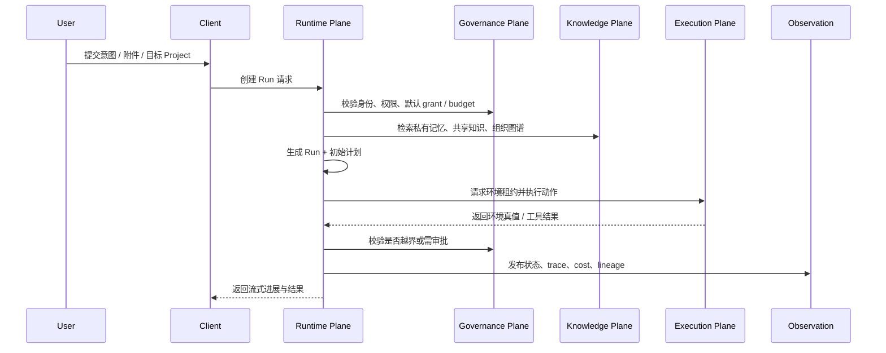

关键规则：

- 计划与执行必须分离，但共享同一个 Run 上下文。
- 执行动作必须基于环境真值校正计划，而不是只按初始计划线性推进。
- 结果写入 Artifact 或 Knowledge 前，必须再经过对应平面门控。

### 5.3 Automation / Trigger / Resident 流程

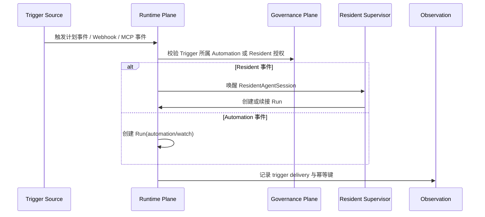

关键规则：

- Trigger 投递必须具备幂等键和 delivery 记录。
- 首版 GA 仅开放 `cron`、`webhook`、`manual event`、`MCP event` 四类 Trigger。
- ResidentAgentSession 的观察行为与执行行为必须区分建模；观察不等于可任意执行动作，且该能力保留在 Beta。

### 5.4 Mesh 委托与外部 A2A 协作

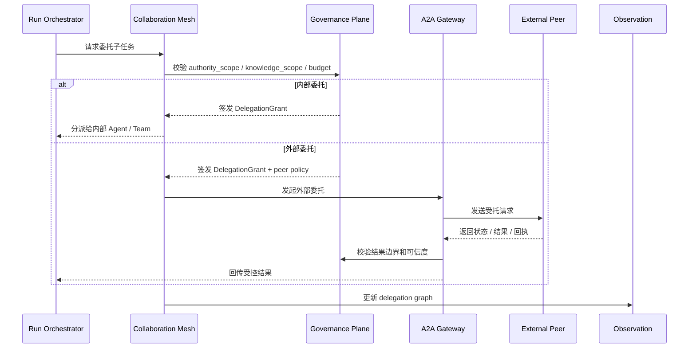

关键规则：

- 委托必须是显式对象，不允许隐式 handoff。
- 外部结果进入 Run 前，必须经过 trusted provenance 检查。
- Mesh 协作不能绕过 grant、budget、approval。
- `A2A` 与高阶 Mesh 协作在首版仅保留架构接口和 Beta 能力位，不作为 GA 默认承诺。
- Team 的 `knowledge_scope` 只引用可访问的 KnowledgeSpace，不授予 Team 对 Shared Knowledge 的所有权。

### 5.5 Approval 与预算越界恢复

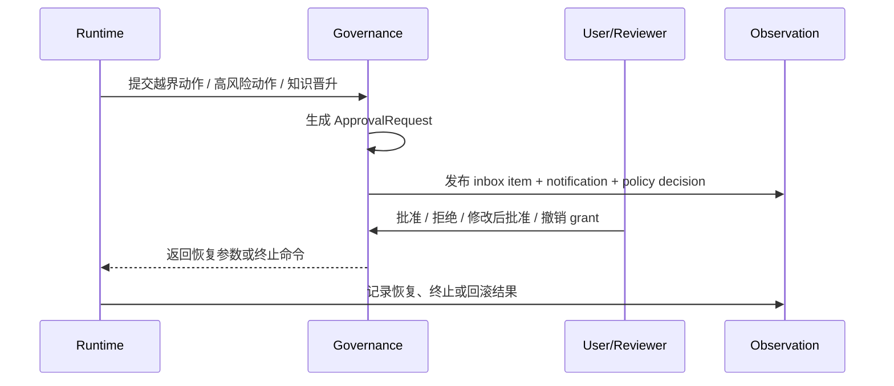

关键规则：

- `ApprovalRequest` 控制运行是否继续。
- `CapabilityGrant` 和 `BudgetPolicy` 控制是否已具备预授权。
- 用户修改 Artifact 或预算窗口时，系统必须生成新版本或新授权对象。
- 审批默认分为 `execution`、`knowledge_promotion`、`external_delegation`、`export_sharing` 四类，并分别路由到 `reviewer`、`KnowledgeSpace owner`、`tenant_admin`、`workspace_admin`。
- `KnowledgeSpace owner` 自动获得所属空间内的 `approval.knowledge.review` 与 `knowledge.promote` 派生权限。
- 外部委托请求必须先满足 `delegation.external.request` 权限，再进入 `external_delegation` 审批流。

### 5.6 Knowledge 写回与晋升

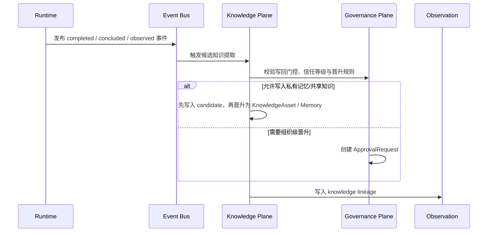

关键规则：

- 知识写回是异步流程，不阻塞主结果完成。
- 外部结果不能直接进入长期知识。
- 组织级知识晋升必须具备来源、责任主体和审批语义。
- 组织级知识事实默认继承来源 `KnowledgeSpace owner` 作为事实 owner。
- `Project` 中可见的 Shared Knowledge 必须来自其附着的 KnowledgeSpace，而不是直接挂载在 Project 上。

### 5.7 Hub 重启与恢复

恢复流程必须遵循：

1. 重放未完成 Run 的事件流和 checkpoint
2. 恢复 EnvironmentLease 与 TriggerDelivery 状态
3. 对仍有效的 grant、budget、approval、peer 和 environment 做 freshness check
4. 只续跑未确认完成的动作
5. 发布恢复结果和差异

---

## 6. 数据架构与状态模型

### 6.1 数据分层与存储映射

| 数据类别 | 典型对象 | 本地模式 | 远程模式 |
| --- | --- | --- | --- |
| 元数据与业务状态 | Workspace、Project、Agent、Team、Run、Automation、Approval、Inbox、Notification | SQLite | PostgreSQL |
| Capability 与模板元数据 | CapabilityDescriptor、CapabilityBinding、AgentTemplate、ExecutionProfile、SkillPack | SQLite | PostgreSQL |
| Artifact 与 Attachment 内容 | 文档、报告、文件、结论 | 本地文件系统或嵌入式对象存储 | 对象存储或文件存储 |
| Conversation recall 引用 | ConversationRecallRef、历史片段索引、episodic recall metadata | SQLite | PostgreSQL |
| 私有记忆与共享知识向量索引 | Embedding、检索索引 | LanceDB | Qdrant |
| 知识元数据与图谱投影 | KnowledgeAsset、实体、关系、lineage | SQLite + 图谱投影表 | PostgreSQL + 图谱投影表 |
| Artifact 会话态 | ArtifactSessionState、短期 UI/runtime state | 会话缓存 / 临时存储 | 会话缓存 / 临时存储 |
| 客户端缓存 | 摘要、连接状态、只读快照 | 加密本地缓存 | 加密本地缓存 |
| 秘密与凭证 | Hub Token、Provider Secret、Protocol Secret | OS Keychain / Keystore | Hub Secret Store + Client 安全存储 |
| 事件与观测数据 | Trace、Audit、Policy Log、Cost Ledger、Evaluation Record | SQLite / 本地事件存储 | PostgreSQL / 事件存储 |

说明：

- 组织知识图谱是**逻辑图谱模型**，不要求首版引入独立图数据库；可通过关系型投影表和索引实现。
- Artifact 的权威对象由元数据、版本信息和内容引用共同组成，而不仅是文件本身。

### 6.2 数据事实源

1. 远程模式下，Hub 是正式对象的唯一权威事实源；Client 是交互层，不保存权威运行状态或远程正式业务事实。
2. Client 只保存快照、连接上下文和必要缓存，用于显示、离线查看与连续性。
3. Knowledge 的事实由元数据、向量索引和 lineage 共同组成。
4. 观测数据虽可单独存储，但必须与正式对象可关联追溯。

### 6.3 核心状态机

#### Run 状态机

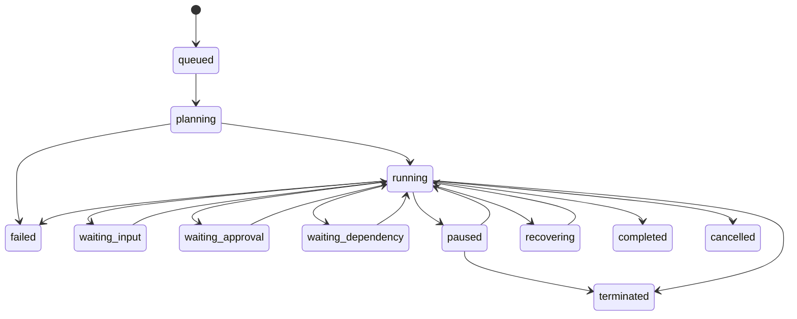

#### Automation 状态机

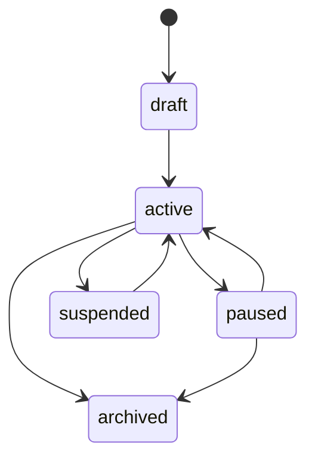

#### ResidentAgentSession 状态机

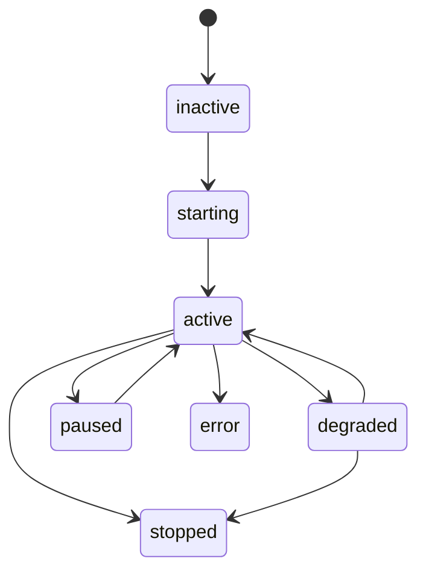

#### TriggerDelivery 状态机

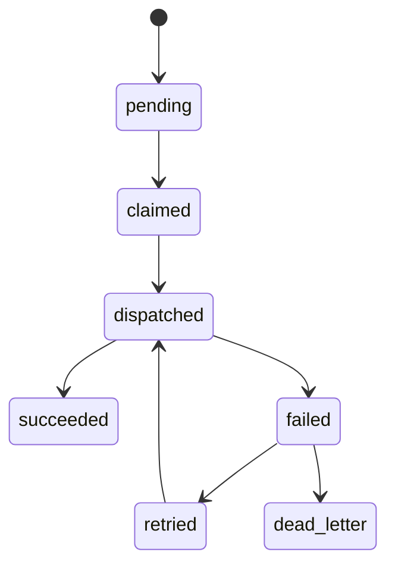

#### EnvironmentLease 状态机

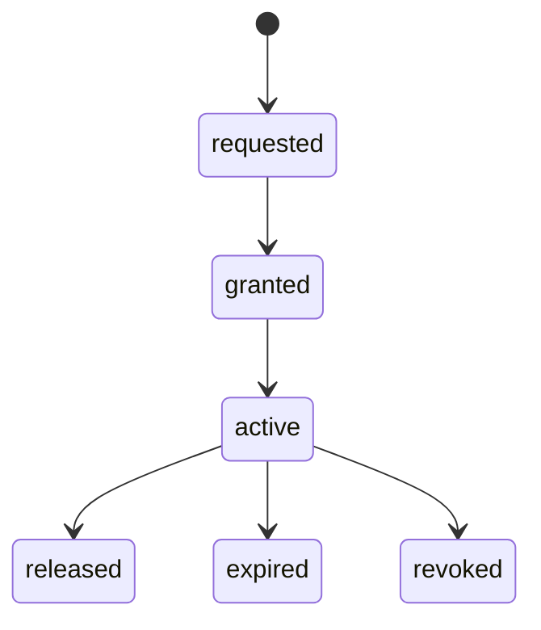

#### DelegationGrant 状态机

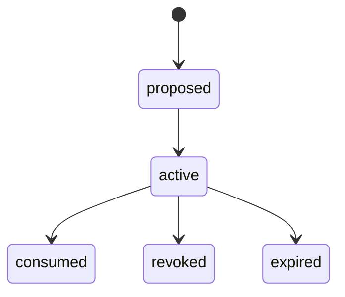

#### KnowledgeAsset 状态机

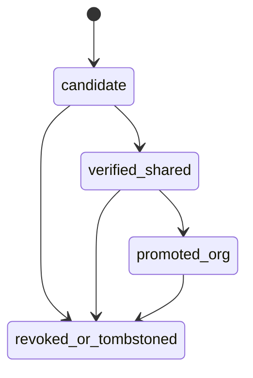

#### ApprovalRequest 状态机

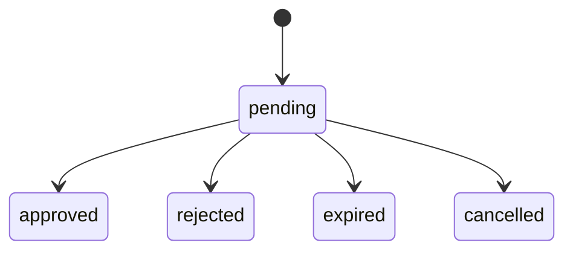

#### InboxItem 状态机

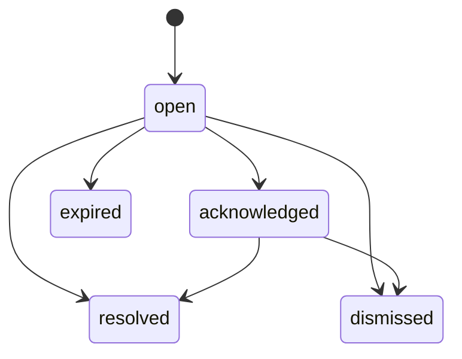

#### Notification 状态机

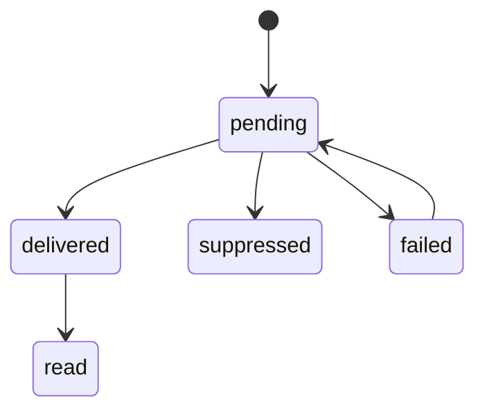

### 6.4 版本、幂等与恢复策略

- `Run` 必须支持 checkpoint。
- 关键动作必须支持 `action_idempotency_key`。
- Trigger 投递、审批处理、外部回执都必须有幂等键。
- `EnvironmentLease` 必须保留 heartbeat、expiry 和 resume token。
- `Artifact` 采用版本化引用，审批修改不覆盖旧版本。
- `KnowledgeAsset` 删除采用墓碑 + 索引撤回 + lineage 保留策略。
- `InboxItem` 与 `Notification` 必须有去重键和幂等投递语义，避免多端重复提醒或重复待办。
- `ArtifactSessionState` 默认是 session-scoped；会话结束后清除，不作为 `Run` checkpoint、长期 memory 或共享知识事实。

### 6.5 保留与清理策略

| 数据对象 | 默认策略 |
| --- | --- |
| Run / Automation / Resident 元数据 | 长期保留，允许管理员归档 |
| Trace / Policy Log / Delegation Graph | 默认保留，可配置清理周期 |
| Audit Log | 长期保留，满足组织级审计要求 |
| Artifact | 默认长期保留，允许导出后归档 |
| KnowledgeAsset | 长期保留，支持显式删除和降级 |
| Client 缓存 | 可安全清空，不影响 Hub 正式数据 |

---

## 7. 安全、治理与恢复机制

### 7.1 认证与授权

认证模型：

- 本地模式：设备所有者与本地工作区用户模型
- 远程模式：用户名密码、SSO 或等效远程认证方式

授权模型：

- Role 表示权限组合
- Permission 表示最小授权单位
- Workspace / Tenant 策略共同决定默认模型、默认审批、默认预算和导出限制
- `KnowledgeSpace owner` 不是全局角色，而是由 `workspace_admin` 在具体 KnowledgeSpace 上指定的责任人
- `KnowledgeSpace owner` 自动获得 owner-scoped 的 `approval.knowledge.review` 与 `knowledge.promote` 派生权限
- 外部委托请求必须具备显式权限 `delegation.external.request`

统一求值顺序：

1. `Tenant Hard Policy`
2. `Workspace Policy`
3. `Role / Permission`
4. `CapabilityGrant`
5. `BudgetPolicy`
6. `ApprovalRequest`

求值规则：

- 上游显式 `deny` 优先于下游 `allow`。
- `CapabilityGrant` 不能绕过 RBAC 或租户硬策略。
- `BudgetPolicy` 只约束资源与时窗，不授予新能力。
- `ApprovalRequest` 只能覆盖被标记为可升级的动作，不能越过不可覆盖的硬禁止。
- `CapabilityResolver` 必须在 `platform`、connector 状态、Workspace / Project policy 和 grant/budget 共同上下文中运行，不允许把 conversation 或 artifact 会话态当作授权来源。

### 7.2 CapabilityGrant 与 BudgetPolicy

`CapabilityGrant` 最少需要覆盖：

- subject
- scope
- tool set
- data scope
- environment scope
- protocol scope
- issued_by
- effective window
- revoke / expire rule

`BudgetPolicy` 最少需要覆盖：

- model budget
- token budget
- tool action budget
- retry ceiling
- runtime ceiling
- escalation condition
- overrun handling

预算层级规则：

- 默认主预算挂载在 `Workspace`。
- `Project` 与 `Run` 只继承并细分子预算，用于隔离成本视图和局部限额。
- `Project` 或 `Run` 的子预算不能绕过所属 `Workspace` 主预算独立扩张。
- `Automation` 的子预算必须定义 reset 周期；默认按 Automation 所属调度窗口重置，并受 `Workspace` 主预算约束。

### 7.3 Sandbox Tiers

Execution Plane 必须正式支持以下四类沙箱等级：

| 沙箱等级 | 说明 | 典型场景 |
| --- | --- | --- |
| `local_trusted` | 用户本地可信环境 | 桌面本地模式、用户明确授权的本机操作 |
| `tenant_sandboxed` | 租户内受控环境 | 企业远程 Hub 的受控运行 |
| `ephemeral_restricted` | 短生命周期隔离环境 | 单次高风险执行、临时代码运行、临时文件处理 |
| `external_delegated` | 外部对端环境 | A2A 外部 Agent 或第三方执行域 |

权限控制必须至少区分：

- 文件系统读
- 文件系统写
- 网络读
- 网络写
- 系统命令
- 进程管理
- 本地设备能力
- 外部持久化写入

### 7.4 结果可信度与注入隔离

必须正式支持以下安全语义：

- `tool result trust level`
- `prompt injection quarantine`
- `memory write gate`
- `cross-agent impersonation prevention`
- `org data classification`

规则：

- 外部协议结果默认低信任。
- 低信任结果需要经过隔离、摘要或人工确认，才能进入长期知识或组织图谱。
- 外部 Agent 不得冒用内部 Agent 身份；UI 和日志必须明确展示主体来源。

### 7.5 恢复与补偿

系统恢复必须依赖：

- `run checkpoint`
- `action idempotency key`
- `environment lease`
- `heartbeat`
- `resume token`
- `compensation policy`

补偿原则：

- 对已确认的外部写操作，不依赖“假回滚”，必须记录补偿建议或后续人工处理待办。
- 对未确认完成的内部动作，可基于幂等键安全重放。

---

## 8. 互操作与协议架构

### 8.1 MCP 架构

MCP 在 Octopus 中承担：

- 工具接入
- 数据源接入
- 工作流接入
- 客户端内应用接入

架构要求：

- 由 Hub 统一注册和治理
- 作为 `connector-backed capabilities` 注册进统一 `CapabilityCatalog`
- 使用命名空间隔离
- 鉴权、健康、失败和信任级别可见
- 输出进入 Artifact 或 Knowledge 前必须经过门控

### 8.2 A2A 架构

A2A 在 Octopus 中承担：

- 外部 Agent 发现
- 外部身份声明
- 委托与回执
- 受托 authority / scope / budget 传递
- 信任与治理接入

架构要求：

- A2A Peer 必须由 `tenant_admin` 在 Hub 中登记并带有信任级别
- 作为 `connector-backed` 或 `beta-reserved` capability descriptors 进入统一 `CapabilityCatalog`
- 每次外部委托和回执都必须绑定具体 `ExternalAgentIdentity`
- DelegationGrant 必须能映射到 A2A 委托语义
- 回执必须可关联 Run、DelegationGrant 和 Cost Ledger
- 外部对端能力变化必须影响后续治理决策
- 外部身份轮换、吊销和信任降级必须能在不删除 A2APeer 的前提下独立生效

### 8.3 导入导出与协议边界

导入导出范围至少包括：

- Agent / Team / Workspace Template
- Artifact 导出
- 知识快照导出
- 协议接入配置的受控迁移

规则：

- 导入前必须进行依赖、权限、能力和安全校验
- 导出必须保留来源、版本、时间和最小化身份信息
- 密钥与秘密不能通过普通导出包明文迁移

---

## 9. 观测、运维与技术决策

### 9.1 观测模型

| 对象 | 目的 | 典型内容 |
| --- | --- | --- |
| `Trace` | 运行过程回放 | 状态变化、工具调用、阶段、耗时、错误 |
| `Audit Log` | 责任追溯 | 谁批准了什么、谁发放了什么授权、谁导出了什么 |
| `Policy Decision Log` | 治理诊断 | 哪条策略命中、为何阻断、为何升级审批 |
| `Knowledge Lineage` | 知识追溯 | 某知识从哪次 Run、哪个 Artifact、哪条提取链路而来 |
| `Delegation Graph` | 协作回放 | 谁委托给谁、何时委托、在什么预算和 authority 下委托 |
| `Cost Ledger` | 成本治理 | 模型成本、工具成本、协议成本、预算消耗和越界记录 |
| `Evaluation Record` | 质量门禁 | 哪个模板、哪种协作拓扑、哪条恢复或晋升路径在什么基线上通过或失败 |

### 9.2 运维要求

- 需要观察 Run 队列、Automation 健康、Resident 会话健康、审批积压、协议对端健康和环境租约利用率。
- 需要提供知识写回失败、图谱晋升失败、外部委托失败和恢复失败的专项视图。
- 需要提供最小可用备份与一致性校验能力，覆盖元数据、Artifact 引用、知识索引和审计。

### 9.3 评测与回归门禁

平台必须提供 `Evaluation Harness`，用于：

- 管理关键 Agent 模板、协作拓扑、A2A 委托、知识晋升和恢复路径的评测用例
- 记录 failure taxonomy，例如规划失败、工具失败、策略阻断、预算超限、恢复失败和知识污染
- 保存评测基线、版本、结果快照和上线门禁结论
- 将评测结果写入 `Evaluation Record` 并关联 `Run`、模板、策略版本和协议接入配置

规则：

- 高风险能力默认启用前必须具备可回放的评测记录。
- 新的 MCP / A2A 接入、Mesh 协作策略和知识晋升策略上线前必须通过对应回归集。
- 评测失败不能只留在 CI 日志中，必须进入正式观测和治理视图。

### 9.4 关键技术选型

| 层次 | 选型 | 作用 |
| --- | --- | --- |
| Repository / Workspace | Monorepo + Cargo Workspace + pnpm Workspace | 统一 Hub、Client、共享契约与文档治理边界 |
| Desktop Shell | Tauri 2 | 构建桌面端并承载本地 Hub |
| Frontend | Vue 3 + TypeScript | 构建统一 Client 交互层 |
| Hub Core | Rust | 构建运行时、治理、协议和执行核心 |
| 本地元数据存储 | SQLite | 本地模式元数据、事件和状态持久化 |
| 远程元数据存储 | PostgreSQL | 远程模式元数据和事件持久化 |
| 本地向量索引 | LanceDB | 本地私有记忆与共享知识检索 |
| 远程向量索引 | Qdrant | 远程知识检索 |
| 实时推送 | SSE / 本地事件桥接 | 统一流式输出与状态推送 |
| 认证令牌 | JWT 或等效机制 | 远程会话认证 |

### 9.5 架构决策摘要

| 决策 | 结论 | 原因 |
| --- | --- | --- |
| 是否按个人 / 团队 / 企业拆产品线 | 否 | 三者是同一平台中的能力组合与治理深度差异，不形成平行产品或目录树 |
| 是否采用根级双 Workspace Monorepo | 是 | 需要在同一仓库统一治理 Hub、Client、共享契约与文档 |
| `schemas/` 是否为唯一契约源 | 是 | Rust 与 TypeScript 的共享契约必须从单一事实源派生，避免双边漂移 |
| Client 是否可以拥有远程业务事实 | 否 | Client 只负责交互、缓存与连续性，远程正式对象由 Hub 持有 |
| 正式运行对象是否统一为 Run | 是 | 统一任务、讨论、自动化、常驻与委托语义 |
| Team 是否仍然全局强制唯一 Leader | 否 | 支持 leadered、mesh、hybrid 三种拓扑 |
| Knowledge 是否只保留私有记忆 | 否 | 需要共享知识与组织图谱支撑协作和治理 |
| 自治治理是否以逐项审批为主 | 否 | 采用预授权 + 预算窗口 + 越界审批 |
| MCP 与 A2A 是否为一等能力 | 是 | 工具接入和外部 Agent 协作都已成为核心架构能力 |
| 工具存在性是否可由 prompt 隐式决定 | 否 | 正式能力必须经 CapabilityCatalog、Resolver 与 ToolSearch 暴露，并进入审计链路 |
| ToolSearch 是否等同自动授权 | 否 | 搜索只负责发现，执行仍受 grant、budget 与 approval 约束 |
| 结构化交互与 SkillPack 是否可绕过治理 | 否 | InteractionPrompt、MessageDraft 与 SkillPack 都必须进入正式运行和审计流程 |
| 组织知识图谱是否必须引入独立图库 | 否 | 首版以逻辑图谱模型为主，避免物理实现锁死 |
| 恢复机制是否内建 | 是 | 长时运行和常驻代理要求恢复成为架构内核 |

---

## 10. 架构风险与约束

### 10.1 主要风险

| 风险 | 说明 | 缓解策略 |
| --- | --- | --- |
| 长上下文膨胀 | 多 Agent、长时驻留、委托协作会放大上下文成本 | 使用知识检索、滚动摘要、Artifact 引用和阶段性压缩 |
| 知识污染 | 外部协议或低可信结果可能污染长期知识 | 建立信任分级、写回门控和晋升审批 |
| 委托失控 | Mesh 与 A2A 可能形成不可解释委托链 | 显式 DelegationGrant、委托深度限制和 Delegation Graph |
| 恢复复杂度上升 | Run、Automation、Resident 和环境租约共同参与恢复 | 使用统一 checkpoint、lease 和 idempotency 模型 |
| 多端认知不一致 | 不同 Client 对同一 Run、Grant、Knowledge 理解偏差 | 统一状态机、统一日志和统一通知语义 |
| 扩展供应链风险 | MCP、A2A、插件和外部模型增加攻击面 | 名单治理、信任级别、权限约束、审计和快速吊销 |
| 能力表面膨胀 | 能力目录、connector 和 adapter 数量增加后容易失控 | 采用 CapabilityCatalog、风险分级、ToolSearch 暴露控制和 capability card 审核 |
| Artifact 会话态泄漏 | UI 会话状态被误当作长期事实或恢复锚点 | 把 ArtifactSessionState 明确限定为 session-scoped 并禁止写回长期层 |

### 10.2 明确约束

- 不支持跨 Hub 自动共享正式业务对象。
- consumer-only 设备能力不纳入正式默认能力面。
- 消费级设备工具、provider-specific connectors 与内容型工具只允许以 adapter 或 connector-backed capability 形态接入，不进入首版核心领域对象。
- 不允许外部协议绕过平台治理直接修改正式事实。
- 不允许按个人、团队、企业产品线建立平行目录树或平行实现。
- 不允许 Client 成为远程正式业务状态的事实源。
- 不允许 `packages/` 与 `crates/` 直接形成实现依赖；共享契约只能经由 `schemas/`。
- 不允许把目标态目录设计、workspace manifests 或应用骨架写成“当前 tracked tree 已存在实现”。
- 本 SAD 提供逻辑与运行时架构，不锁定具体接口和表结构。

### 10.3 结论

Octopus 的目标态架构不是“聊天应用外接若干工具”，而是“统一 Agent Runtime Platform”。架构必须同时满足四件事：

1. 让 Run 成为所有正式执行的权威外壳。
2. 让 Knowledge、Grant、Budget、Approval、Lease 成为正式治理对象。
3. 让 Mesh 协作与 A2A 互操作在同一治理模型下成立。
4. 让本地与远程模式共享统一语义、统一恢复机制和统一可观测性。
