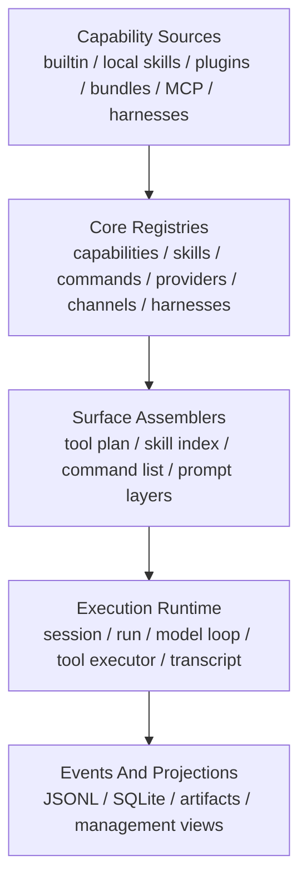
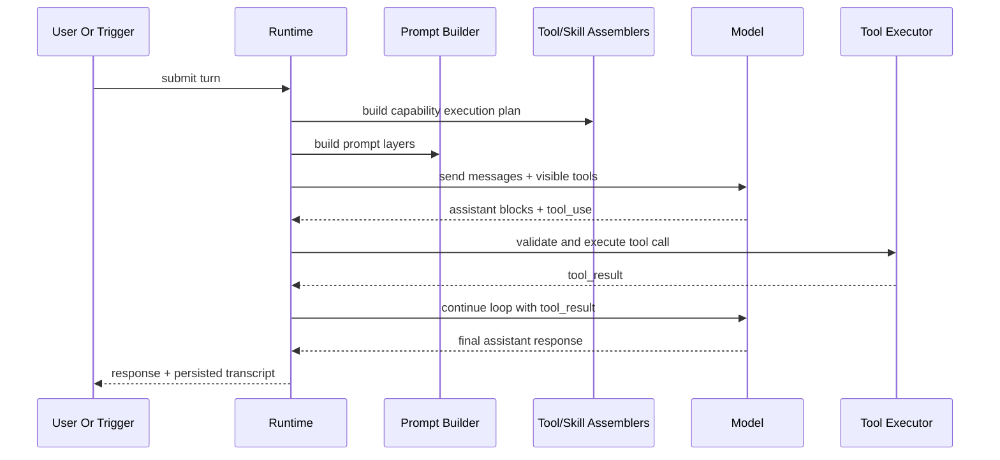

# Unified Agent Platform Architecture

This document defines the canonical core architecture for an Octopus agent platform that combines:

- OpenClaw's plugin and capability ownership model
- Claude Code's tool-loop and transcript discipline
- Hermes Agent's skill lifecycle and prompt assembly discipline

It is the canonical architecture document for Octopus agent runtime shape, extension boundaries, and execution flow. General HTTP and OpenAPI policy still lives in `docs/api-openapi-governance.md`. Older runtime companion docs may remain for migration context, but they do not override this document.

## Purpose

The platform must support coding, research, document, browser, workflow, and long-running automation work on one execution trunk.

The architecture must satisfy five goals:

1. One canonical execution loop.
2. One canonical capability registry.
3. One canonical prompt and tool assembly boundary.
4. Portable skills, plugins, MCP, and native harnesses.
5. Recoverable execution state across retries, compaction, and restart.

## Non-Goals

This design does not:

- redefine OpenAPI or host transport policy
- redefine runtime-config ownership
- make bundle content equivalent to native plugin runtime code
- allow product pages or adapters to bypass the runtime core
- keep multiple permanent execution trunks

## Design Principles

### Capability First

The system truth is capability-oriented, not tool-family-oriented. Builtins, local skills, plugins, MCP, and bundles must normalize into the same capability model before they are exposed anywhere.

### Deny Before Expose

The model must only see tools that survive trust, permission, auth, health, and policy checks. Visibility is a planning result, not a property of raw registration.

### Central Assembly

Prompt layers, tool pools, skill visibility, and command exposure must be assembled in one place. No plugin, page, or ad hoc tool may append model-facing instructions on its own.

### Transcript Discipline

The runtime must persist the real assistant trajectory, including `tool_use`, `tool_result`, retries, approvals, and synthetic recovery events. This is the basis for resume, audit, debugging, and compaction.

### Narrow Trust Boundaries

Manifest discovery must work without executing plugin code. Native plugins, bundles, MCP servers, and user-authored skills do not share the same trust level.

## Canonical Layers

The platform has four layers:

1. `Capability Sources`
2. `Core Registries`
3. `Surface Assemblers`
4. `Execution Runtime`

## Layer 1: Capability Sources

The allowed source families are:

- builtin
- local skill
- bundled skill or bundle content
- native plugin
- MCP server
- native agent harness

Each source family has a different trust profile:

- builtin: highest trust, shipped with the product
- native plugin: trusted extension runtime, manifest-first discovery, runtime code allowed only after enablement
- bundle: content pack with selective mapping, no arbitrary in-process runtime execution
- MCP: remote or subprocess capability source, runtime-gated and auth-gated
- local skill: user-authored procedural content, sandboxed and policy-scoped
- harness: trusted runtime integration point for native agent systems

## Layer 2: Core Registries

The platform needs one central registry boundary. It must not use separate unrelated registries for tools, skills, commands, MCP, and plugins.

### Canonical Registry Types

The registry must own these records:

- `CapabilitySpec`
- `SkillSpec`
- `CommandSpec`
- `ProviderSpec`
- `ChannelSpec`
- `HarnessSpec`
- `ResourceSpec`

`CapabilitySpec` is the root execution object. Other records stay typed and explicit. The platform uses one registry boundary, not one monolithic object type.

No reference project uses one literal root object for every surface:

- Claude Code centralizes tool assembly and transcript flow, not commands, skills, providers, and channels under one type
- Hermes Agent centralizes tools plus prompt and skill lifecycle, but keeps those concerns in distinct registries and builders
- OpenClaw centralizes plugin ownership and public capability registration, while channels, providers, and harnesses still keep specialized contracts

Octopus should copy the single boundary, not collapse all record kinds into one runtime-callable shape.

### Registry Role Boundaries

- `CapabilitySpec`: normalized dispatch contract for anything the runtime may execute or expose through a shared host. Builtin tools, native plugin tools, MCP tools, shared host actions, and harness-routed tool surfaces normalize here.
- `SkillSpec`: procedural-memory package plus activation metadata. A skill may contribute prompt layers, templates, references, scripts, and capability allowlists. A skill is not itself a tool call unless it resolves to one or more `capability_id`s through a command or runtime action.
- `CommandSpec`: user or control-plane entrypoint. Commands may activate skills, invoke management actions, switch agents, or call capabilities indirectly. Commands are not injected into the model tool pool.
- `ProviderSpec`: provider and model metadata, auth state, fallback compatibility, and transport or runtime ownership hints. Providers inform planning and harness selection but are never model-callable surfaces.
- `ChannelSpec`: shared host and channel adapter contract. Channels may contribute scoped discovery, schema fragments, and final dispatch for host-owned surfaces, but they do not bypass the runtime planner.
- `HarnessSpec`: native attempt executor binding for provider-model pairs that need a dedicated runtime. A harness may own foreign thread identifiers and native event grammars, but it does not replace core policy, planning, or transcript ownership.
- `ResourceSpec`: non-callable context or artifact descriptor used by prompt assembly, MCP exposure, or management views.

### Record Classes

The registry must keep three classes distinct:

- execution-plane records: `CapabilitySpec`
- control-plane records: `CommandSpec`, `ProviderSpec`, `ChannelSpec`, `HarnessSpec`
- knowledge-plane records: `SkillSpec`, `ResourceSpec`

Rules:

- only execution-plane records become model-callable tools
- control-plane records may influence planning, routing, discovery, or management, but never become tools by accident
- knowledge-plane records may affect prompt assembly and activation, but do not become executable without an explicit runtime mapping
- every derived surface must preserve `owner_id` and source provenance back to the typed registry record

### CapabilitySpec Minimum Contract

Each capability record must declare:

- `capability_id`
- `source_kind`
- `execution_kind`
- `owner_id`
- `trust_profile`
- `input_schema`
- `output_contract`
- `permission_requirements`
- `auth_requirements`
- `health_state`
- `visibility_defaults`
- `search_hint`
- `read_only` and `destructive` hints
- `dispatch_target`
- `callable_by_model`
- `callable_by_runtime_only`
- `deferred_exposure`
- `transcript_policy`

Additional rules:

- `CapabilitySpec` is required for any model-callable tool or host-routed action that may reach execution
- a pure prompt skill, pure slash command, or provider metadata row does not need a synthetic `CapabilitySpec` unless the runtime can actually dispatch it
- multiple surfaces may point to the same `capability_id`, but one surface must not hide ownership of a different execution target

### Ownership Model

Ownership follows OpenClaw's strong pattern:

- plugin is the ownership boundary
- capability is the public contract
- tool, command, prompt block, route, and management row are derived surfaces

One vendor or feature plugin should own its full OpenClaw-facing surface instead of scattering related behavior across multiple unrelated modules.

## Layer 3: Surface Assemblers

Assemblers turn registry state plus policy state into model-visible and user-visible surfaces.

This layer is where the three reference systems combine best.

Assemblers must work from typed registry snapshots plus runtime state. They are planning functions, not direct execution entrypoints.

Shared rules:

- assemblers are the only place where registry state becomes model-visible or user-visible
- assembler output must be deterministic for the same registry snapshot and runtime state
- every emitted surface item must carry `owner_id`, source provenance, and the backing typed record id
- plugins, skills, channels, and MCP refresh paths may contribute input state, but may not append directly to assembled output

### Assembler Output Classes

- execution plan output: consumed by the runtime loop and tool executor
- prompt assembly output: consumed by the prompt builder only
- control-plane output: consumed by UI, slash-command, gateway, or management surfaces

The runtime must consume only assembler output. It must not re-read raw plugin, MCP, or skill manifests mid-turn.

### Tool Surface Assembler

The tool surface assembler takes:

- registered capabilities
- session policy
- trust and permission state
- runtime health
- current auth state
- current model family

It returns a `ToolExecutionPlan` with:

- `visible_tools`
- `deferred_tools`
- `hidden_tools`
- `activated_tools`
- `granted_tools`
- `pending_approval_tools`
- `auth_blocked_tools`
- `provider_fallbacks`

Each tool entry in the plan must include at least:

- `capability_id`
- `tool_name`
- `owner_id`
- `dispatch_target`
- `exposure_kind`
- `mediation_state`
- `source_kind`
- `transcript_policy`

Rules:

- visible tools are the only tools sent to the model
- tool ordering must be deterministic for prompt-cache stability
- deferred tools must be discoverable without forcing the full schema block into every turn
- MCP tools are not a parallel path; they enter through the same plan
- builtin, plugin, and MCP tools share the same execution-plan shape
- deterministic ordering must prefer stable prefixes for cache-sensitive builtins before appending dynamic surfaces such as MCP where needed
- a tool may be visible but still require mediation at execution time; visibility and executability are related but not identical states
- hidden or auth-blocked tools may still appear in management projections, but never in the model-facing tool list

This follows the Claude Code pattern and must remain the only model-facing tool assembly point.

### Skill Surface Assembler

Skills are not plain prompt snippets. A skill package may contain:

- markdown instructions
- frontmatter metadata
- references
- templates
- scripts
- assets
- activation conditions
- allowed tools
- model or effort overrides

The skill assembler takes:

- registry state
- workspace and project rules
- platform and environment filters
- agent allowlists
- remote execution eligibility

It returns:

- `discoverable_skills`
- `active_skills`
- `user_invocable_skills`
- `model_invocable_skills`

Rules:

- only `active_skills` contribute prompt material to the current turn
- `discoverable_skills` and `user_invocable_skills` are control-plane outputs, not direct prompt injections
- `model_invocable_skills` are allowed only when the runtime exposes an explicit skill-activation action; raw `SKILL.md` files are never emitted as model tools
- a skill may narrow accessible capabilities or recommend tools, but it does not widen trust or bypass permission policy

The Hermes pattern is the right default here:

- skills are procedural memory
- skills can be created, edited, and patched by the agent
- verified successful workflows should become reusable skill packages

### Command Surface Assembler

Commands are a separate surface from tools and skills.

Commands exist for:

- user entry points
- native UI or gateway invocation
- skill invocation shortcuts
- management and status operations

The command assembler combines:

- builtin commands
- skill-derived commands
- plugin commands
- channel-native command aliases

The result must be one canonical command list for all clients.

Each command must declare one of these action kinds:

- `activate_skill`
- `invoke_capability`
- `open_surface`
- `run_management_action`
- `switch_agent_or_mode`

Rules:

- commands stay separate from tools even when they resolve to the same backing capability
- command execution happens through the runtime as a control-plane action, not by adding slash commands to the model tool pool
- channel aliases resolve to canonical commands before execution or transcript write

### Prompt Builder

Prompt assembly must be centralized.

The prompt builder must support ordered layers:

1. runtime safety and invariant layer
2. system identity layer
3. selected agent layer
4. workspace and project rule layer
5. active skill layer
6. turn-scoped context layer
7. untrusted inbound context layer

Rules:

- untrusted content must never be injected as trusted system instructions
- context files and external content should be scanned for prompt injection patterns before inclusion
- model-family-specific operational guidance is allowed, but only from the central prompt builder
- prompt overrides are explicit runtime controls, not hidden plugin behavior
- each prompt layer must declare provenance and trust level
- layer precedence is strict: upper layers may constrain lower layers, but lower layers may not rewrite trusted invariant layers
- skill layers may add procedural guidance, but may not silently widen tool availability or permissions
- turn-scoped context may add facts and artifacts, not system-level policy
- the runtime must persist a prompt-assembly manifest with source ids or hashes so prompt decisions remain auditable without storing unnecessary full prompt duplicates

This takes Hermes's prompt discipline and removes prompt scattering.

## Layer 4: Execution Runtime

The runtime is the only execution brain.

It owns:

- session and run lifecycle
- prompt assembly
- tool execution planning
- model loop
- approvals and auth mediation
- transcript persistence
- event emission
- subrun and workflow coordination

### Canonical Runtime Objects

- `Session`: durable conversation lane
- `Run`: one foreground execution attempt
- `Subrun`: delegated or background execution under lineage
- `TranscriptEvent`: append-only assistant, tool, approval, auth, and runtime events
- `CapabilityExecutionPlan`: per-turn visibility and dispatch plan

### Canonical Run Flow

### Tool Loop Contract

The execution loop must follow the Claude Code discipline:

1. stream assistant output
2. collect `tool_use`
3. validate schema and values
4. run hooks and permission checks
5. execute tool
6. map result to `tool_result`
7. append to transcript
8. continue until the turn closes

This loop is the canonical trunk for builtin, plugin, MCP, and routed tool calls.

### Runtime Loop Phases

Each foreground run should move through these phases:

1. snapshot registry and runtime state
2. assemble tool, skill, command, and prompt surfaces
3. persist the per-turn plan summary before model execution begins
4. execute the model attempt or selected harness attempt
5. mediate tool calls, approvals, auth, and retries through the same runtime policy layer
6. mirror committed outputs back into the Octopus transcript and projections
7. close, compact, or resume the run from persisted state

Rules:

- assembly happens before the model sees tools or prompt layers
- the model or harness consumes only the assembled turn state, not raw registries
- retries and resume rebuild from persisted turn state plus transcript events, not from hidden in-memory objects
- compaction is a runtime operation that produces synthetic recovery events instead of silently replacing history

### Direct Tool Loop And Harness Loop

Builtin, plugin, MCP, and shared-host-routed tools execute directly through the canonical tool loop.

Harnesses do not create a second permanent execution trunk. A harness replaces only the inner attempt executor for a supported provider-model pair while the outer runtime still owns:

- run lifecycle
- assembled surfaces
- approval and auth mediation
- transcript and projection writes
- retry, resume, and compaction policy

This keeps Claude Code's single tool-loop discipline while adopting OpenClaw's harness boundary.

### Transcript Contract

The transcript must preserve:

- assistant text blocks
- `tool_use`
- `tool_result`
- approval requests and decisions
- auth interruptions and resumptions
- recovery or synthetic events used during retry or compaction

For harness-backed attempts, the runtime must mirror at least these native events into canonical transcript events:

- assistant partial or final reply blocks
- native tool start or declared tool invocation as `tool_use`
- native tool completion, denial, or failure as `tool_result`
- approval request and decision edges
- auth pause and auth resume edges
- retry, compaction, and recovery markers

Source of truth rules:

- the Octopus transcript plus append-only runtime events are the canonical audit and resume source
- harness-native thread ids, resume tokens, or event logs are foreign references attached to the run; they assist resume but do not replace Octopus transcript ownership
- runtime projections must be derivable from canonical transcript events plus structured runtime state without replaying opaque harness-only memory

The model loop must be recoverable from transcript plus append-only events and runtime projections.

## Shared Host Surfaces

Some product surfaces should be shared hosts, not one tool per channel or provider.

The strongest pattern here is OpenClaw's shared `message` host:

- core owns the host tool contract
- channel plugins own discovery, schema fragments, and final execution

Use the same rule for any future shared host surface:

- one core host contract
- plugin-owned scoped action discovery
- plugin-owned final dispatch

This keeps the model surface stable while letting plugins vary by channel or provider.

## MCP Architecture

MCP must be a first-class bridge in both directions.

### Inbound MCP

Inbound MCP means external servers expose tools, prompts, or resources to Octopus.

Rules:

- MCP capabilities normalize into the same registry and planning path as every other capability
- tool names must be deterministic and collision-safe
- auth state and health state are part of visibility planning
- environment variables and credentials must be filtered before subprocess launch
- dynamic tool refresh is allowed, but only through the canonical registry and planning path

### Outbound MCP

Outbound MCP means Octopus exposes selected local capabilities to external agents.

Rules:

- outbound MCP servers must expose only approved local surfaces
- the bridge must respect the same pre-execution checks as native runtime execution
- channel surfaces and plugin-registered tool surfaces may be exposed through separate MCP endpoints when their trust and operational boundaries differ

This keeps Claude Code's MCP client/server symmetry without weakening the runtime boundary.

## Plugin And Bundle Model

### Native Plugins

Native plugins may register:

- capabilities
- providers
- channels
- tools
- commands
- services
- routes
- harnesses

Rules:

- discovery is manifest-first
- enablement and validation happen before runtime code load
- runtime registration happens through the central registry only
- plugins do not mutate model-facing surfaces directly
- plugin setup metadata may be read before runtime code loads, but executable registrations happen only after explicit enablement
- shared host surfaces stay core-owned even when plugin code owns discovery and final dispatch

### Bundles

Bundles are imported content packs, not arbitrary runtime modules.

Supported bundle content may map into:

- skills
- commands
- MCP config
- hooks with explicit native-compatible layouts
- settings defaults where explicitly allowed

Rules:

- unsupported bundle features are detected and reported, not silently executed
- bundle trust is narrower than native plugin trust
- bundle import is translation into native surfaces, not foreign runtime passthrough
- bundle import requires the target native surface types to already exist; bundles are compatibility input, not architecture drivers

This keeps OpenClaw's compatibility advantage without importing undefined runtime semantics.

## Native Agent Harnesses

Harnesses are low-level runtime integrations for agent systems that own native threads, resumes, compaction, or event grammars.

A harness is not a general model provider replacement.

Use a harness when:

- a native coding agent owns thread state
- a daemon or CLI owns its own session runtime
- the integration must stream native tool and reasoning events

Rules:

- provider selection and model metadata still live in the provider layer
- the harness claims compatible provider-model pairs
- the runtime still owns policy, transcript mirror, approvals, and surface assembly
- harness state must be resettable when the owning session resets
- harness-native resume state must be attached to the run as foreign state, not treated as the only recoverable session record

This captures OpenClaw's harness idea and prevents runtime-specific hacks inside the normal provider path.

## Extension Integration Order

Extension families should enter the platform in this order:

1. builtin capabilities, local skills, centralized prompt builder, and the canonical tool loop
2. native plugins with manifest-first discovery and central registry registration
3. bundle translation into already-supported native skill, command, hook, or MCP surfaces
4. inbound MCP through the same registry, planning, auth, health, and permission path as native tools
5. outbound MCP after local capability exposure policy matches native pre-execution checks
6. native harnesses after provider-model resolution and transcript-mirror contracts are stable

Why this order:

- Claude Code proves the runtime trunk first: one tool pool, one deferred exposure path, one transcript discipline
- Hermes proves prompt and skill assembly must be centralized before broader extension growth
- OpenClaw proves plugin manifests, bundle translation, shared hosts, and harnesses work only when the native boundary types already exist

Readiness gates for each stage:

- native plugins: registry types, owner model, and shared host contracts are already stable
- bundles: native target surfaces and compatibility translation rules are already explicit
- inbound MCP: tool naming, auth state, health state, and dynamic refresh all route through canonical planning
- outbound MCP: approved exposure surfaces and runtime-side permission checks are already reusable
- harnesses: provider metadata, approval callbacks, transcript mirror mapping, and reset semantics are already implemented

Do not start with harnesses or bundle imports. They sit on top of the core runtime contract; they do not define it.

## Persistence And Observability

The persistence split must follow repository governance. This document does not redefine it.

The core architecture requires these runtime guarantees:

- append-only execution events are persisted
- queryable projections are persisted separately
- large outputs and artifacts live on disk with metadata in structured storage
- transcript and runtime state are reconstructable without hidden in-memory-only state

At minimum, projections must answer:

- what tools were visible
- what tool was called
- what permission or auth gate blocked execution
- what result was produced
- what skill or prompt package was activated
- what harness and provider handled the turn

## Security And Safety Rules

The architecture must enforce these default rules:

- no capability is exposed before trust, permission, auth, and health checks
- untrusted inbound text is isolated from trusted prompt layers
- plugin discovery does not require plugin execution
- bundle content does not receive native plugin privileges
- MCP subprocess environments are filtered
- transcript redaction and secret handling occur before user-facing or exported output

## Recommended Build Order

Implementation should follow this sequence:

1. Define the canonical core registry types.
2. Define the typed role boundaries between execution-plane, control-plane, and knowledge-plane records.
3. Route builtin capabilities and local skills into those types.
4. Build centralized surface assemblers for tools, skills, commands, and prompt layers.
5. Make the model loop consume only the assembled tool plan and prompt output.
6. Standardize transcript, prompt-assembly manifests, and event persistence around the canonical loop.
7. Add native plugins through manifest-first discovery and central registration.
8. Add bundle translation into already-supported native surfaces.
9. Add inbound and outbound MCP bridges on top of the same runtime checks.
10. Add native harness selection only after transcript-mirror and provider-model contracts are stable.

## What To Reuse From The Three References

Reuse these patterns directly:

- from Claude Code:
  - unified tool contract
  - deterministic tool pool assembly
  - deferred tool exposure
  - `tool_use -> tool_result` transcript discipline
  - MCP client and server symmetry
- from Hermes Agent:
  - central registry
  - skill lifecycle management
  - platform-aware skill filtering
  - central prompt builder
  - model-family execution guidance as a builder concern
- from OpenClaw:
  - plugin equals ownership boundary
  - capability equals public contract
  - manifest-first discovery and validation
  - shared host tools
  - bundle translation layer
  - native agent harness abstraction

Do not reuse these weak patterns:

- parallel execution trunks
- plugin-owned hidden prompt mutation outside the prompt builder
- direct model exposure of raw registries
- treating skills, commands, and tools as the same object
- granting bundle content native plugin trust by default

## Result

The target platform is:

- OpenClaw-shaped at the boundary layer
- Claude Code-shaped at the execution layer
- Hermes-shaped at the knowledge and prompt layer

That combination gives Octopus one trunk for execution, one trunk for extension, and one trunk for reusable procedural knowledge.
