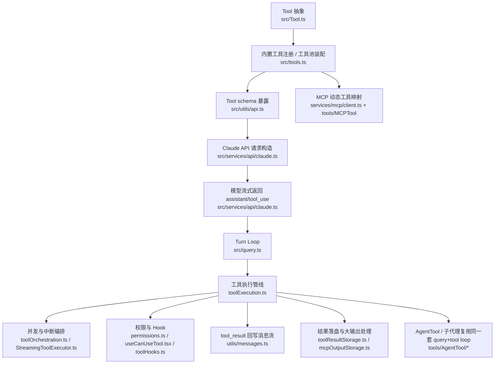

# Claude Code 工具调用架构与实现梳理

## 目标与范围

本文针对参考项目 `docs/references/claude-code-sourcemap-main` 中 `restored-src/src/**` 的工具调用体系做一次完整拆解，重点回答四个问题：

1. Claude Code 的工具调用整体是怎样分层的。
2. 工具从“定义/注册”到“暴露给模型”再到“执行/回写”的完整闭环是什么。
3. 权限、Hook、并发、MCP、子代理是如何接入这条主链路的。
4. 关键实现落在什么文件、什么符号，后续应优先从哪里入手复用或改造。

本文聚焦工具调用主链路，不展开以下内容：

- 单个业务工具的内部业务逻辑
- UI 展示细节本身
- 非工具主题，例如账户、订阅、普通设置页

---

## 一句话结论

Claude Code 的工具调用不是“模型输出一个 tool name，客户端直接执行”这么简单，而是一套 **五层闭环体系**：

1. `Tool` 抽象层：统一工具契约
2. `tools.ts` 装配层：统一决定本轮可见工具池
3. `utils/api.ts` + `services/api/claude.ts` 暴露层：把工具 schema 以可缓存、可延迟加载的方式发给模型
4. `query.ts` turn loop：负责流式消费模型输出、识别 `tool_use`、执行工具并回写 `tool_result`
5. `toolExecution.ts` / `toolOrchestration.ts` / `StreamingToolExecutor.ts` 执行层：负责校验、权限、Hook、并发、中断、结果封装

其核心设计不是“能调用工具”，而是：

- **统一契约**：内置工具、MCP 工具、AgentTool 都走同一个 `Tool` 接口
- **最小暴露**：不是所有工具都一开始发给模型，ToolSearch + deferred tools 用来控制 tools block 体积与 prompt cache 稳定性
- **强约束执行**：工具执行前必须经过 schema 校验、值校验、权限决策、Hook
- **可恢复 transcript**：`tool_use` / `tool_result` 配对、消息归一化、超长结果落盘都围绕“长会话和恢复能力”设计

---

## 分层架构总览

---

## 端到端调用链

一次完整工具调用主链路大致如下：

1. `tools.ts` 组装当前轮次的 built-in tools + MCP tools。
2. `services/api/claude.ts` 决定是否启用 ToolSearch，并计算 deferred tools。
3. `utils/api.ts::toolToAPISchema()` 把每个 `Tool` 转成 API schema。
4. `query.ts::query()` / `queryLoop()` 发起模型请求并流式读取 assistant 输出。
5. 当流中出现 `tool_use` block 时，`query.ts` 收集到 `toolUseBlocks`。
6. `StreamingToolExecutor` 或 `runTools()` 调 `toolExecution.ts::runToolUse()`。
7. `runToolUse()` 内部依次完成：
   - 找工具
   - Zod schema 校验
   - `validateInput`
   - pre-tool hooks
   - 权限检查
   - `tool.call`
   - post-tool hooks
   - 把结果映射成 `tool_result`
8. `query.ts` 把 `tool_result` 追加回消息，再进入下一轮 model call。

这说明 Claude Code 的工具调用本质是一个 **assistant -> tool_use -> tool_result -> assistant** 的循环，而不是单次 RPC。

---

## 1. 工具抽象层

### 核心实现

- `docs/references/claude-code-sourcemap-main/restored-src/src/Tool.ts`
  - `ToolPermissionContext`：约束权限模式、allow/deny/ask rules、附加工作目录等
  - `ToolUseContext`：工具执行期上下文，含 app state、abort controller、mcp clients、messages、refreshTools 等
  - `toolMatchesName()`：`Tool.ts:348`
  - `findToolByName()`：`Tool.ts:358`
  - `buildTool()`：`Tool.ts:783`

### 设计要点

- 所有工具都被统一成一个 `Tool` 对象。
- `Tool` 不只包含 `name + call`，还内置了完整的“执行治理信息”：
  - 输入约束：`inputSchema` / `inputJSONSchema`
  - 调用入口：`call`
  - 二次值校验：`validateInput`
  - 权限检查：`checkPermissions`
  - 结果映射：`mapToolResultToToolResultBlockParam`
  - 执行特征：`isConcurrencySafe`、`interruptBehavior`、`requiresUserInteraction`
  - 行为标签：`isReadOnly`、`isDestructive`、`isOpenWorld`
  - UI 渲染：`renderToolUseMessage`、`renderToolResultMessage` 等

### `buildTool()` 的意义

`buildTool()` 不是语法糖，而是默认策略注入器。它为所有工具提供 fail-closed 或保守默认值，例如：

- 默认 `isConcurrencySafe = false`
- 默认 `isReadOnly = false`
- 默认 `checkPermissions = allow`
- 默认 `userFacingName = def.name`

这使得新工具最少只要实现核心行为，但不会绕过统一执行框架。

---

## 2. 内置工具注册与工具池装配

### 核心实现

- `docs/references/claude-code-sourcemap-main/restored-src/src/tools.ts`
  - `getAllBaseTools()`：`tools.ts:193`
  - `getTools()`：同文件中部
  - `assembleToolPool()`：`tools.ts:345`
  - `getMergedTools()`：文件末尾

### 设计要点

`getAllBaseTools()` 是“所有内置工具定义”的单一源头。它不是简单数组，而是带 feature flag、环境变量、简单模式、REPL 模式、协调器模式的条件装配器。

`getTools(permissionContext)` 再做两层过滤：

- 模式过滤：例如 simple mode 只保留 Bash/Read/Edit
- deny rule 过滤：被 blanket deny 的工具在模型看到之前就被移除

`assembleToolPool(permissionContext, mcpTools)` 负责把 built-in tools 与 MCP tools 合并，并做两个重要动作：

- built-in 与 MCP 都按名称排序，保证 prompt cache 稳定
- `uniqBy(name)` 去重，built-in 优先

这是 Claude Code 非常关键的工程决策：**工具池装配是单点，不允许不同调用方各自拼工具列表。**

---

## 3. 工具 schema 暴露给模型

### 核心实现

- `docs/references/claude-code-sourcemap-main/restored-src/src/utils/api.ts`
  - `toolToAPISchema()`：`utils/api.ts:119`
  - `normalizeToolInput()`：`utils/api.ts:566`
  - `normalizeToolInputForAPI()`：`utils/api.ts:685`

### `toolToAPISchema()` 的职责

它把内部 `Tool` 转成发给 Claude API 的工具 schema，核心内容包括：

- `name`
- `description`，来自 `tool.prompt(...)`
- `input_schema`
- 可选 `strict`
- 可选 `eager_input_streaming`
- 每轮可叠加的 `defer_loading`
- 每轮可叠加的 `cache_control`

### 设计要点

1. **支持两种 schema 来源**
- 常规工具：`inputSchema` 走 Zod -> JSON Schema
- MCP 等动态工具：可直接提供 `inputJSONSchema`

2. **session-stable cache**
- `toolToAPISchema()` 会缓存基础 schema
- 目的是避免 mid-session feature gate 抖动或 prompt 文本漂移导致 tools block 频繁变化

3. **per-request overlay**
- `defer_loading`、`cache_control` 不写回基础缓存，只按每次请求叠加

这说明 Claude Code 把“工具 schema 本身”当成 prompt cache 的一部分去治理，而不是临时字符串。

---

## 4. ToolSearch 与 deferred tools

### 核心实现

- `docs/references/claude-code-sourcemap-main/restored-src/src/tools/ToolSearchTool/ToolSearchTool.ts`
- `docs/references/claude-code-sourcemap-main/restored-src/src/tools/ToolSearchTool/prompt.ts`
- `docs/references/claude-code-sourcemap-main/restored-src/src/services/api/claude.ts`
  - `isToolSearchEnabled(...)` 的调用：`claude.ts:1120`
  - `extractDiscoveredToolNames(...)` 使用：`claude.ts:1158`
  - tool schema 构造与 `defer_loading`：`claude.ts:1231`

### 核心机制

Claude Code 不会把所有工具都一股脑发给模型。它引入了两层机制：

1. `ToolSearchTool`
   - 始终作为“找工具”的元工具存在
   - 模型可以先搜索，再 `select:<tool_name>` 选择真正要用的工具

2. deferred tools
   - 某些工具被标为 `defer_loading`
   - 未被发现前，不把完整 schema 发给模型
   - 只有在消息历史里出现对应 `tool_reference` / discovered name 后，才真正纳入本轮 tools block

### 设计价值

- 减少 tools block 大小
- 稳定 prompt cache
- 允许 MCP 工具数量动态增长，而不让每次请求都爆炸

### 一个重要细节

`claude.ts` 中的过滤不是直接删掉所有 deferred tools，而是：

- 非 deferred 工具始终可见
- `ToolSearchTool` 始终可见
- 只有“已发现”的 deferred tool 才真正发给模型

这是 Claude Code 在大规模工具场景下最值得复用的设计之一。

---

## 5. Claude API 流式 tool_use 解析

### 核心实现

- `docs/references/claude-code-sourcemap-main/restored-src/src/services/api/claude.ts`
  - `normalizeContentFromAPI` 引用：`claude.ts:79`
  - `content_block_start`：`claude.ts:1995`
  - `content_block_delta`：`claude.ts:2053`
  - `input_json_delta`：`claude.ts:2087`
  - `content_block_stop`：`claude.ts:2171`
  - `message_delta`：`claude.ts:2213`

### 解析逻辑

Claude Code 不是等整条 assistant message 结束后再看有没有 tool call，而是逐块解析：

- `content_block_start`
  - 初始化 `tool_use` / `server_tool_use` / text block
- `content_block_delta`
  - 对 tool input 的 `input_json_delta` 做增量拼接
- `content_block_stop`
  - 形成内部 assistant content block
- `message_delta`
  - 回填最终 `stop_reason` 与 usage

### 设计要点

- 工具输入是增量 JSON，不是一次性完整对象
- `stop_reason === 'tool_use'` 并不可靠，主循环最终还是看有没有真实 `tool_use` block
- `server_tool_use` 与普通 `tool_use` 同时被纳入统一消息体系，只是结果块类型不同

---

## 6. Query 主循环

### 核心实现

- `docs/references/claude-code-sourcemap-main/restored-src/src/query.ts`
  - `query()` / `queryLoop()` 主链路
  - `toolUseBlocks` 收集：`query.ts:557` 及后续多处
  - `deps.callModel(...)`：`query.ts:659`
  - `StreamingToolExecutor` 初始化：`query.ts:563`
  - `runTools(...)`：`query.ts:1382`
  - 关于 `stop_reason` 不可靠的注释：`query.ts:554`

### 主流程

`query.ts` 负责 orchestrate 整个 turn：

1. 组织 `messagesForQuery`
2. 调 `deps.callModel(...)`
3. 流式接收 assistant 输出
4. 发现 `tool_use` 后收集到 `toolUseBlocks`
5. 交给 `StreamingToolExecutor` 或 `runTools(...)`
6. 把返回的 `tool_result` 追加到消息列表
7. 若还有工具结果待继续消费，则递归进入下一轮 model call

### 设计要点

- query 层不关心工具细节，只负责 turn loop
- 它把“模型输出解析”和“工具执行”解耦成两个阶段
- 工具执行完成后，仍然通过消息回写驱动下一轮 assistant 推理，而不是直接在工具执行函数里续调模型

这让工具调用天然兼容 resume、compaction、streaming fallback。

---

## 7. 工具执行管线

### 核心实现

- `docs/references/claude-code-sourcemap-main/restored-src/src/services/tools/toolExecution.ts`
  - `runToolUse()`：`toolExecution.ts:337`
  - `streamedCheckPermissionsAndCallTool()`：`toolExecution.ts:492`
  - `buildSchemaNotSentHint()`：`toolExecution.ts:578`
  - `checkPermissionsAndCallTool()`：`toolExecution.ts:599`

### 标准执行顺序

`checkPermissionsAndCallTool()` 的责任非常完整，基本顺序是：

1. `findToolByName`
2. `tool.inputSchema.safeParse(input)`
3. `tool.validateInput(...)`
4. `runPreToolUseHooks(...)`
5. `resolveHookPermissionDecision(...)`
6. `canUseTool(...)` / `hasPermissionsToUseTool(...)`
7. `tool.call(...)`
8. `mapToolResultToToolResultBlockParam(...)`
9. `runPostToolUseHooks(...)`
10. 异常时 `runPostToolUseFailureHooks(...)`

### `buildSchemaNotSentHint()` 的价值

在 deferred tool 场景里，模型有时会直接调用一个尚未真正加载 schema 的工具，导致本应是数组/数字/布尔值的输入被错误生成为字符串。Claude Code 不只返回 Zod 错误，还主动提示模型：

- 这个工具 schema 还没发给你
- 先调用 `ToolSearch` 进行 `select:<tool_name>`
- 再重试

这是一个非常务实的“自愈型错误提示”设计。

---

## 8. 并发、中断与 streaming executor

### 核心实现

- `docs/references/claude-code-sourcemap-main/restored-src/src/services/tools/toolOrchestration.ts`
  - `runTools(...)`
  - `partitionToolCalls(...)`
- `docs/references/claude-code-sourcemap-main/restored-src/src/services/tools/StreamingToolExecutor.ts`
  - `StreamingToolExecutor`：`StreamingToolExecutor.ts:40`

### 并发策略

Claude Code 不会无脑并发所有工具。它使用 `tool.isConcurrencySafe(input)` 来决定批处理方式：

- 并发安全工具：可批量并发
- 非并发安全工具：必须串行、独占

`toolOrchestration.ts` 的做法是先把一串工具调用切成 batch：

- 一批连续的 concurrency-safe 工具
- 或一个独占工具

### `StreamingToolExecutor` 的额外职责

相对 `runTools(...)`，`StreamingToolExecutor` 额外解决了 streaming 场景下的三个问题：

1. 工具边到边执行，不必等整条 assistant message 完全结束
2. progress 消息可先吐出，最终 result 维持原始顺序
3. 支持 sibling abort

其中 sibling abort 很关键：

- 如果并发批中的 Bash 工具报错
- 子 abort controller 会取消同批并发兄弟工具
- 但不会直接终止整个父 turn

另外，中断策略通过 `interruptBehavior` 区分：

- `cancel`：用户打断时可以取消
- `block`：用户打断时仍应阻塞直到工具结束

---

## 9. 权限系统与 Hook

### 核心实现

- `docs/references/claude-code-sourcemap-main/restored-src/src/utils/permissions/permissions.ts`
  - `checkRuleBasedPermissions()`：`permissions.ts:1071`
  - `hasPermissionsToUseToolInner()`：`permissions.ts:1158`
- `docs/references/claude-code-sourcemap-main/restored-src/src/hooks/useCanUseTool.tsx`
  - `useCanUseTool(...)`：`useCanUseTool.tsx:28`
- `docs/references/claude-code-sourcemap-main/restored-src/src/hooks/toolPermission/handlers/interactiveHandler.ts`
- `docs/references/claude-code-sourcemap-main/restored-src/src/hooks/toolPermission/PermissionContext.ts`
  - `createPermissionContext(...)`：`PermissionContext.ts:96`
- `docs/references/claude-code-sourcemap-main/restored-src/src/services/tools/toolHooks.ts`
  - `runPostToolUseHooks()`：`toolHooks.ts:39`
  - `runPostToolUseFailureHooks()`：`toolHooks.ts:193`
  - `resolveHookPermissionDecision()`：`toolHooks.ts:332`
  - `runPreToolUseHooks()`：`toolHooks.ts:435`

### 权限层级

Claude Code 的权限不是一个函数，而是四层叠加：

1. 规则层
   - allow / deny / ask rules
   - MCP server 级规则也可直接过滤整组工具

2. 工具自定义权限层
   - `tool.checkPermissions(...)`

3. Hook 层
   - pre-tool hook 可追加上下文、拒绝、修改输入或建议规则

4. 交互层
   - `useCanUseTool()` + `interactiveHandler.ts` 决定是否弹确认、是否等待 classifier、如何把用户决策写回 permission context

### 设计要点

- 规则检查与交互确认解耦
- `ToolPermissionContext` 是整个权限系统的共享状态载体
- hook 不只是 side-effect，它可以实质参与权限决策

这套设计非常适合以后在 Octopus 做“本地规则 + 审批 + 自动策略”三层叠加。

---

## 10. 消息归一化与 `tool_result` 配对修复

### 核心实现

- `docs/references/claude-code-sourcemap-main/restored-src/src/utils/messages.ts`
  - `stripToolReferenceBlocksFromUserMessage()`：`messages.ts:1677`
  - `stripCallerFieldFromAssistantMessage()`：`messages.ts:1742`
  - `normalizeMessagesForAPI()`：`messages.ts:1989`
  - `ensureToolResultPairing()`：`messages.ts:5133`

### `normalizeMessagesForAPI()` 在做什么

它并不是简单过滤系统消息，而是在做 transcript 修整：

- 先重排 attachment，使其向上冒泡到 assistant 或 tool_result 边界
- 去掉只用于 UI 的虚拟消息
- 合并连续 user messages
- 处理 tool search 开/关下的 `tool_reference`
- 剥离旧模型或不支持模型不能接受的字段
- 对 PDF / image too large 场景剥除会导致持续报错的元数据块

### `ensureToolResultPairing()` 为什么重要

Claude API 对 transcript 结构很严格：

- `tool_use` 必须有匹配的 `tool_result`
- 不允许 orphaned `tool_result`
- 不允许重复 `tool_use id`

Claude Code 在 resume、streaming fallback、teleport 等复杂场景下，会主动修复这些问题：

- 缺失 `tool_result`：注入 synthetic error `tool_result`
- 多余 `tool_result`：删除
- 重复 `tool_use`：去重
- orphaned server-side tool use：删除或替换成占位文本

这部分是长会话稳定性的关键，不建议省略。

---

## 11. 大结果落盘与 MCP 输出落盘

### 核心实现

- `docs/references/claude-code-sourcemap-main/restored-src/src/utils/toolResultStorage.ts`
- `docs/references/claude-code-sourcemap-main/restored-src/src/utils/mcpOutputStorage.ts`

### 设计要点

Claude Code 对大输出不是只做截断，而是优先“落盘 + 给模型读回路径”：

- `persistToolResult(...)`
  - 把超长 `tool_result` 写到 session 下的 `tool-results/`
- `buildLargeToolResultMessage(...)`
  - 在 `tool_result` 里只保留 preview + 文件路径
- `processToolResultBlock(...)`
  - 在统一映射后决定是否持久化

对 MCP 输出还额外支持：

- MIME -> 扩展名推断
- 二进制内容原样写盘
- 给模型返回“文件已保存到某路径”的说明

这套设计的核心不是省 token，而是让模型在后续 turn 中仍然能以 Read/Bash/jq 等工具继续处理完整输出。

---

## 12. MCP 动态工具接入

### 核心实现

- `docs/references/claude-code-sourcemap-main/restored-src/src/tools/MCPTool/MCPTool.ts`
- `docs/references/claude-code-sourcemap-main/restored-src/src/services/mcp/client.ts`
  - `fetchToolsForClient(...)`：`client.ts:1743`
  - `callMCPToolWithUrlElicitationRetry(...)`：`client.ts:2813`
  - `callMCPTool(...)`：`client.ts:3029`

### 映射逻辑

`fetchToolsForClient()` 会：

1. 对已连接的 MCP server 发 `tools/list`
2. 取回每个 MCP tool 的 schema / description / annotations
3. 基于 `MCPTool` 模板对象生成内部 `Tool`

生成时会覆写这些关键信息：

- `name`
- `mcpInfo`
- `inputJSONSchema`
- `description` / `prompt`
- `isConcurrencySafe`
- `isReadOnly`
- `isDestructive`
- `isOpenWorld`
- `checkPermissions`
- `call`

### `call()` 的设计要点

MCP 调用不是裸调 SDK，而是包了一层恢复与交互逻辑：

- 支持 progress 事件透出
- session 过期时自动重连后重试
- URL elicitation 时支持 hooks 或用户交互完成后再 retry
- 最终结果可带回 `_meta` 与 `structuredContent`

这意味着 MCP 在 Claude Code 里不是插件旁路，而是正式纳入统一工具调用系统。

---

## 13. AgentTool / 子代理如何复用工具调用体系

### 核心实现

- `docs/references/claude-code-sourcemap-main/restored-src/src/tools/AgentTool/AgentTool.tsx`
  - `AgentTool`：`AgentTool.tsx:196`
- `docs/references/claude-code-sourcemap-main/restored-src/src/tools/AgentTool/runAgent.ts`
  - `initializeAgentMcpServers(...)`：`runAgent.ts:95`
  - `runAgent(...)`：`runAgent.ts:248`
- `docs/references/claude-code-sourcemap-main/restored-src/src/tools/AgentTool/forkSubagent.ts`
  - `isForkSubagentEnabled()`：`forkSubagent.ts:32`
  - `buildForkedMessages()`：`forkSubagent.ts:107`

### 设计要点

`AgentTool` 本质上不是特殊分支，而是“再启动一个 query + tool loop”：

- `AgentTool.call()` 负责决定同步/异步、fork/self-fork、worktree、remote 等模式
- `runAgent()` 内部再次组装工具池、MCP clients、system prompt、messages
- 最终还是调用 `query()` 跑同一套模型/工具主循环

### 这意味着什么

1. 子代理和主代理复用相同工具契约
2. 子代理也能拥有自己的 MCP servers
3. fork subagent 只是把父 assistant message + placeholder `tool_result` 包装成一个新的起始 transcript

Claude Code 这里的设计非常值得参考：**“Agent”不是另一套 runtime，而是工具调用 runtime 的递归使用。**

---

## 14. 关键设计判断

### 1. 工具调用必须做成“消息闭环”，不要做成“直接 RPC”

Claude Code 的关键不是 `tool.call()`，而是 `tool_use -> tool_result -> next assistant turn` 的稳定闭环。这样才能天然兼容：

- resume
- compaction
- replay
- 子代理
- 审批与权限回写

### 2. 工具池必须单点装配

`assembleToolPool()` 统一 built-in + MCP + deny rules，是正确做法。否则不同入口很快会出现：

- 模型看到的工具集合不同
- UI 与执行期工具不一致
- prompt cache 无法稳定

### 3. 大工具集必须支持 deferred loading

Claude Code 的 ToolSearch 不是锦上添花，而是大工具集下的必要机制。否则：

- tools block 过大
- MCP 工具一多就压垮上下文
- prompt cache 几乎失效

### 4. transcript 修复层不能省

如果以后 Octopus 要支持长会话、恢复、子代理、后台任务，`ensureToolResultPairing()` 这类修复层几乎是必需品。

---

## 15. 对 Octopus 的可借鉴点

结合当前 Octopus runtime / capability 方向，建议重点吸收以下几点：

1. 建立统一 `Tool` 契约层。
目前 Octopus 已有 capability/runtime 结构，但如果未来要统一内置能力、MCP、子代理、审批，需要类似 Claude Code 的统一执行元数据接口，而不只是 `execute(name, args)`。

2. 把工具池装配做成单点。
无论是桌面 host、browser host、workflow step 还是 subrun，都应复用同一个“当前可见工具集合”装配函数。

3. 引入 deferred tool / tool search 机制。
Octopus 后续如果 capability 数量继续增长，建议不要把所有 capability schema 全量发给模型。

4. 把 transcript 修复与结果落盘纳入正式 runtime。
长输出不应只靠截断；工具调用历史也不能假设永远结构完好。

5. 子代理应复用同一条 tool loop，而不是单独再造一套 agent runtime。
Claude Code 的递归式复用能明显减少系统分叉。

---

## 16. 关键文件索引

| 模块 | 关键文件 / 符号 | 作用 |
| --- | --- | --- |
| 工具抽象 | `src/Tool.ts` / `buildTool`, `findToolByName`, `ToolUseContext` | 定义统一工具契约 |
| 工具注册 | `src/tools.ts` / `getAllBaseTools`, `getTools`, `assembleToolPool` | 决定当前工具池 |
| API schema | `src/utils/api.ts` / `toolToAPISchema` | 把内部工具转成 Claude API 工具 schema |
| ToolSearch | `src/tools/ToolSearchTool/*` | 工具搜索与 deferred loading 配套机制 |
| 请求侧总装 | `src/services/api/claude.ts` | 工具过滤、schema 构造、流式响应解析 |
| turn loop | `src/query.ts` / `query`, `queryLoop` | assistant/tool loop 主循环 |
| 执行管线 | `src/services/tools/toolExecution.ts` | 校验、权限、hooks、调用、结果映射 |
| 并发编排 | `src/services/tools/toolOrchestration.ts` | 批量串并发编排 |
| 流式执行器 | `src/services/tools/StreamingToolExecutor.ts` | 边流边执行、顺序输出、中断控制 |
| 权限规则 | `src/utils/permissions/permissions.ts` | 规则匹配与最终权限决策 |
| 权限交互 | `src/hooks/useCanUseTool.tsx` + `src/hooks/toolPermission/*` | 用户审批、classifier、队列 |
| Hook | `src/services/tools/toolHooks.ts` | pre/post/failure hooks |
| 消息归一化 | `src/utils/messages.ts` / `normalizeMessagesForAPI`, `ensureToolResultPairing` | transcript 清洗与结构修复 |
| 结果落盘 | `src/utils/toolResultStorage.ts`, `src/utils/mcpOutputStorage.ts` | 大输出与二进制输出持久化 |
| MCP 动态工具 | `src/tools/MCPTool/MCPTool.ts`, `src/services/mcp/client.ts` | 把 MCP server tool 映射为内部 Tool |
| 子代理 | `src/tools/AgentTool/*` | 复用同一 query/tool loop 实现 agent/fork |

---

## 建议阅读顺序

如果后续需要继续深入源码，建议按下面顺序阅读：

1. `src/Tool.ts`
2. `src/tools.ts`
3. `src/utils/api.ts`
4. `src/services/api/claude.ts`
5. `src/query.ts`
6. `src/services/tools/toolExecution.ts`
7. `src/services/tools/toolOrchestration.ts`
8. `src/services/tools/StreamingToolExecutor.ts`
9. `src/utils/permissions/permissions.ts`
10. `src/utils/messages.ts`
11. `src/services/mcp/client.ts`
12. `src/tools/AgentTool/*`

这个顺序基本就是 Claude Code 工具调用架构从“定义”到“递归复用”的真实展开顺序。
