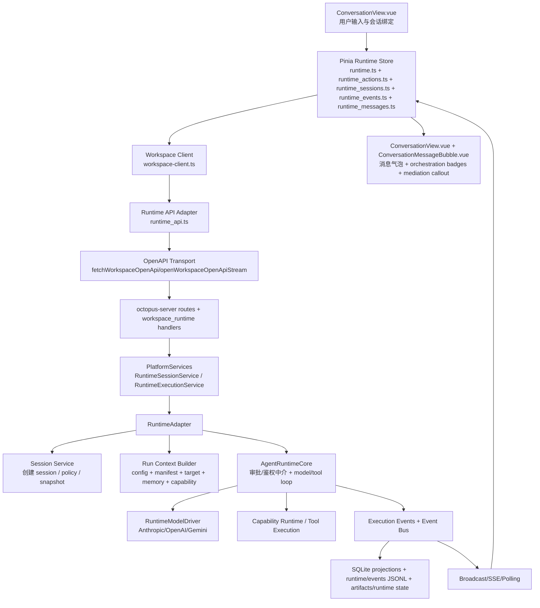

# Runtime 主链路梳理：发送消息 -> 调用模型 -> 结果显示

## 目标与范围

本文梳理 Octopus 桌面端中一次对话从“用户发送消息”到“模型执行与工具循环”再到“UI 最终显示”的完整链路，重点回答四个问题：

1. 消息从哪里进入系统。
2. 消息如何穿过前端 store、adapter、HTTP handler、runtime adapter 和 model driver。
3. 运行中间状态如何以事件、投影和持久化形式落地。
4. 最终 UI 为什么能同时显示正文、thinking/process、tool calls、approval、artifact，以及页面级 workflow / mailbox / background / auth / memory 中介状态。

本文聚焦主链路与运行时设计，不展开以下主题：

- 工具实现细节本身，例如每个 capability/tool 的内部执行逻辑
- provider SDK 的完整 HTTP payload 差异
- 非对话主链路的独立产品面，例如模型配置编辑 UI

---

## 本次审计更新（2026-04-19）

基于当前代码再次核对后，这篇文档的主结论仍然成立，但有几处需要补正，本文已同步更新：

- 前端 runtime store 现在明确按 `workspaceConnectionId` 分桶保存状态，核心字段是 `activeWorkspaceConnectionId` 与 `workspaceStateSnapshots`，切换 workspace 时会保存/恢复整套 runtime 视图，而不是只切换一个 session id。
- `loadSession()` 不只是覆盖 detail；当 run 仍处于 busy 状态时，`setActiveSession()` 会保留并回灌已有 optimistic assistant placeholder，避免一次 `submit -> loadSession -> SSE` 往返期间把 thinking/progress UI 闪掉。
- 事件分类已经比“run/message/trace/approval/workflow”更细，当前实际使用的是 `runtime.message.created`、`trace.emitted`、`runtime.run.updated`、`model.*`、`policy.*`、`approval.*`、`auth.*`、`memory.*`、`subrun.*`、`workflow.*`、`background.*`、`runtime.error`。
- 模型显示字段的来源已进一步明确：后端先从 `ResolvedExecutionTarget` 填充 `RuntimeRunSnapshot` 和 `RuntimeMessage`，前端再把消息侧的 `configuredModelName ?? modelId` 归一进 UI `Message.modelId`；run 级 badge 仍主要走 `TraceView.vue`。
- schema 侧的事实来源仍是 OpenAPI generated types，但 UI `Message` 已明确位于 `packages/schema/src/workbench.ts`，而不是 runtime generated types 本身。

---

## 一句话结论

Octopus 的对话链路不是“前端直接请求模型然后把文本塞回页面”，而是一个 **runtime session / run 驱动、事件流驱动、投影驱动** 的体系：

- 前端先绑定 `conversation -> runtime session`
- runtime store 还会按 `workspace connection -> workspaceStateSnapshots` 维度保存/恢复整套 runtime 视图，避免跨 workspace 串线
- 发送消息时先写入 optimistic user/assistant message
- 请求后端 `/api/v1/runtime/sessions/{sessionId}/turns`
- 后端在 `RuntimeAdapter` 内构建 `RunContext`，做权限与鉴权中介，再进入 capability planning + model/tool loop
- loop 结果不会只以“一个最终字符串”返回，而是被拆成 `runtime.message.created / trace.emitted / runtime.run.updated / model.* / approval.* / auth.* / memory.* / workflow.*` 等 runtime event
- event 被持久化到 SQLite + JSONL + runtime/data 文件，并通过 SSE replay + live stream 或 polling 回流到前端
- 前端 store 再把 `RuntimeMessage` 投影成 UI `Message`，渲染正文、thinking、tool 状态、审批与 artifact
- 页面级的 orchestration badges 与 approval/auth/memory mediation callout 则由 `ConversationView.vue` 基于 `activeSession/activeRun` 继续组合
- 模型显示字段同时落在 `RuntimeRunSnapshot` 与 `RuntimeMessage` 上；消息侧会先把 `configuredModelName ?? modelId` 归一成前端 `Message.modelId`

这条链路的核心设计目标是：**同一份 runtime contract 同时服务 UI、恢复、审计、重放、审批、team/subrun orchestration 与 host parity**。

---

## 分层架构总览



---

## 代码责任边界

### 1. 前端页面入口

- `apps/desktop/src/views/project/ConversationView.vue`
  - 负责把当前 route 绑定到 `workspaceId/projectId/conversationId`
  - 负责通过 `ensureRuntimeSession()` 建立或加载 runtime session
  - 负责 `submitRuntimeTurn()`，即真正的“发送消息”动作
  - 负责把 runtime store 的消息、approval/auth/memory 中介、workflow、mailbox、background 状态组装进页面

### 2. 前端 runtime 聚合层

- `apps/desktop/src/stores/runtime.ts`
  - 统一 state/getters/actions 入口
  - runtime 视图除了 `activeSessionId` 之外，还显式持有：
    - `activeWorkspaceConnectionId`
    - `workspaceStateSnapshots`
  - 暴露：
    - `activeSession`
    - `activeRun`
    - `activeMessages`
    - `activeTrace`
    - `pendingApproval`
    - `pendingMediation`
    - `authTarget`
    - `pendingMemoryProposal`
    - `activeToolStats`

- `apps/desktop/src/stores/runtime_sessions.ts`
  - session 生命周期：bootstrap / ensureSession / loadSession / deleteSession / queue
  - workspace 维度状态切换：`saveActiveWorkspaceSnapshot()` / `restoreWorkspaceSnapshot()` / `syncWorkspaceScopeFromShell()`
  - `setActiveSession()` 会在 run 仍 busy 时保留并回灌 optimistic assistant placeholder

- `apps/desktop/src/stores/runtime_actions.ts`
  - turn 提交、审批/鉴权/内存提案处理、optimistic message 管理

- `apps/desktop/src/stores/runtime_events.ts`
  - SSE/polling 管理与 runtime event 归并

- `apps/desktop/src/stores/runtime_messages.ts`
  - `RuntimeMessage -> Message` UI 映射
  - optimistic message 构造
  - assistant placeholder 与真实消息合并

### 3. 前端 adapter / transport

- `apps/desktop/src/tauri/workspace-client.ts`
  - 聚合 workspace API 与 runtime API，形成单一 client surface

- `apps/desktop/src/tauri/runtime_api.ts`
  - runtime 相关 HTTP/OpenAPI 调用：
    - `createSession`
    - `loadSession`
    - `submitUserTurn`
    - `pollEvents`
    - `subscribeEvents`
    - `resolveApproval`
    - `resolveAuthChallenge`
    - `resolveMemoryProposal`

- `apps/desktop/src/tauri/openapi_transport.ts`
  - `fetchWorkspaceOpenApi()` 负责普通请求
  - `openWorkspaceOpenApiStream()` 负责 SSE 请求

- `apps/desktop/src/tauri/runtime_events.ts`
  - `openRuntimeSseStream()` 解析 `text/event-stream`

### 4. 后端 HTTP / service facade

- `crates/octopus-server/src/routes.rs`
  - runtime 路由统一挂在 `/api/v1/runtime/*`

- `crates/octopus-server/src/workspace_runtime.rs`
  - handler 层，负责：
    - 鉴权
    - project scope 解析
    - 输入归一化
    - idempotency
    - 选择 SSE 或 polling 返回形式

- `crates/octopus-platform/src/runtime.rs`
  - `RuntimeSessionService`
  - `RuntimeExecutionService`
  - 平台级服务接口

### 5. runtime 核心

- `crates/octopus-runtime-adapter/src/lib.rs`
  - `RuntimeAdapter`，runtime 对外实现体

- `crates/octopus-runtime-adapter/src/session_service.rs`
  - session 创建与初始投影

- `crates/octopus-runtime-adapter/src/run_context.rs`
  - `build_run_context()`，turn 级上下文构建

- `crates/octopus-runtime-adapter/src/agent_runtime_core.rs`
  - `submit_turn()`
  - `execute_runtime_turn_loop()`
  - team/subrun/workflow continuation

- `crates/octopus-runtime-adapter/src/execution_service.rs`
  - `RuntimeExecutionService` trait 实现，连接 platform facade 与 runtime core

- `crates/octopus-runtime-adapter/src/model_runtime/mod.rs`
  - model runtime 模块出口与 re-export

- `crates/octopus-runtime-adapter/src/model_runtime/driver.rs`
  - `RuntimeModelDriver` / `ProtocolDriver` / `RuntimeConversationExecution`
  - model response -> `AssistantEvent` 转换与能力边界校验

- `crates/octopus-runtime-adapter/src/model_runtime/driver_registry.rs`
  - `ModelDriverRegistry` 安装与选择 `anthropic_messages/openai_chat/openai_responses/gemini_native`

- `crates/octopus-runtime-adapter/src/execution_events.rs`
  - turn 提交后的 runtime event 构造与发射

- `crates/octopus-runtime-adapter/src/event_bus.rs`
  - runtime event sequence、aggregate 写入、JSONL append、broadcast

- `crates/octopus-runtime-adapter/src/persistence.rs`
  - SQLite/runtime 文件持久化与恢复

### 6. team / workflow / mailbox 扩展

- `crates/octopus-runtime-adapter/src/team_runtime.rs`
- `crates/octopus-runtime-adapter/src/worker_runtime.rs`
- `crates/octopus-runtime-adapter/src/workflow_runtime.rs`
- `crates/octopus-runtime-adapter/src/mailbox_runtime.rs`
- `crates/octopus-runtime-adapter/src/handoff_runtime.rs`
- `crates/octopus-runtime-adapter/src/subrun_orchestrator.rs`
- `crates/octopus-runtime-adapter/src/background_runtime.rs`

这些模块决定主 run 之外的 worker subrun、workflow step、handoff、mailbox、background summary 如何投影回主 session。

---

## 端到端时序

```mermaid
sequenceDiagram
    participant UI as ConversationView
    participant Store as Runtime Store
    participant API as runtime_api.ts
    participant Server as workspace_runtime.rs
    participant Adapter as RuntimeAdapter
    participant Loop as AgentRuntimeCore
    participant Model as RuntimeModelDriver
    participant Bus as EventBus

    UI->>Store: ensureRuntimeSession()
    Store->>API: createSession/loadSession
    API->>Server: /api/v1/runtime/sessions
    Server->>Adapter: create_session_with_owner_ceiling/get_session
    Adapter-->>Store: RuntimeSessionDetail

    UI->>Store: submitTurn(content)
    Store->>Store: addOptimisticUserMessage()
    Store->>API: submitUserTurn(sessionId, input)
    API->>Server: POST /runtime/sessions/{sessionId}/turns
    Server->>Adapter: runtime_execution.submit_turn()
    Adapter->>Loop: build_run_context + submit_turn
    Loop->>Loop: approval/auth mediation
    Loop->>Model: execute_resolved_conversation()
    Model-->>Loop: AssistantEvent(TextDelta/ToolUse/Usage/Stop)
    Loop->>Loop: tool loop / pending tool uses / checkpoint
    Loop->>Bus: emit_submit_turn_events()
    Bus->>Bus: persist projections + append JSONL + broadcast
    Bus-->>Store: SSE or polling events
    Store->>Store: applyRuntimeEvent()
    Store-->>UI: activeMessages / activeRun / badges
    UI->>UI: ConversationView / ConversationMessageBubble render
```

---

## 前端详细链路

### 1. 会话绑定：`ConversationView.vue`

`ConversationView.vue` 不是一个纯输入框页面，它先做三件事：

1. 根据 route 解析 `workspaceId/projectId/conversationId`
2. 通过 `ensureConversationComposerContext()` 加载 model、agent、team、project runtime config
3. 通过 `ensureRuntimeSession()` 确保当前 conversation 拥有对应 runtime session

`ensureRuntimeSession()` 的关键行为：

- 先确保 shell session、workspace access control、user profile、runtime bootstrap 已准备好
- 在 `runtime.sessions` 中查找当前 `conversationId + projectId` 对应 session
- 若已有 session，则 `runtime.loadSession(existingSession.id)`
- 若没有 session，则调用 `runtime.ensureSession(...)` 创建
- session 创建参数里会冻结：
  - `conversationId`
  - `projectId`
  - `selectedActorRef`
  - `selectedConfiguredModelId`
  - `executionPermissionMode`
- 页面侧避免 session 串线时使用的 key 不只是 `projectId + conversationId`，而是：
  - `workspaceConnectionId`
  - `workspace session token`
  - `projectId`
  - `conversationId`

这意味着对话页面并不是“每次发送时临时挑 actor/model”，而是先形成一个稳定的 runtime session，再在该 session 里提交 turn。

### 2. 发送动作：`submitRuntimeTurn()`

`submitRuntimeTurn()` 的前端入口很薄，但顺序很重要：

1. 检查 `canSubmit`
2. 暂存并清空 `messageDraft`
3. `await ensureRuntimeSession()`
4. 调 `runtime.submitTurn({ content, permissionMode })`
5. 若失败，再把输入框内容恢复

页面本身不直接发 HTTP。所有发送行为都统一进入 runtime store。

### 3. runtime store 是真正的前端中枢

`runtime.ts` 的 getters 把复杂 runtime detail 转成 UI 可消费状态：

- `activeSession`：当前 session detail
- `activeRun`：当前 run snapshot
- `activeMessages`：把 `RuntimeMessage` 转成 UI `Message`，并把 `configuredModelName ?? modelId` 归一到前端消息的 `modelId`
- `pendingApproval`：优先取 `run.approvalTarget`，否则回退到 session pending approval
- `pendingMediation` / `authTarget` / `pendingMemoryProposal`：统一暴露阻塞执行的中介状态
- `isBusy`：不仅看 `run.status`，还看是否存在 optimistic assistant placeholder

这层 getter 很关键，因为页面渲染依赖的是“统一 runtime 视图”，而不是去理解后端所有细粒度字段。

---

### optimistic message 机制

`runtime_actions.ts` 的 `addOptimisticUserMessage()` 会一次性写入两条消息：

- optimistic user message
- optimistic assistant placeholder

对应构造函数在 `runtime_messages.ts`：

- `createOptimisticRuntimeMessage()`
- `createOptimisticAssistantMessage()`

设计目的：

- 用户一发送就能看到自己的消息已进入会话
- assistant 立刻占位，后续 trace/tool/approval 可以持续追加到这条 placeholder 上

如果请求失败，`replaceOptimisticMessages()` 会把匹配的 optimistic user/assistant 消息回滚掉。

---

### 提交 turn：`runtime_actions.ts`

`submitTurn()` 是前端发送主入口，关键顺序如下：

1. 确认 `activeSessionId` 存在
2. trim 输入
3. 若当前 busy，则进入 `enqueueTurn()`，不直接并发发送
4. 写 optimistic messages
5. 通过 `client.runtime.submitUserTurn(...)` 调 `/api/v1/runtime/sessions/{sessionId}/turns`
6. 紧接着 `client.runtime.loadSession(...)`
7. `setActiveSession(detail)`
8. 如果 `run.status` 仍然 busy，则 `startEventTransport(sessionId)`，否则结束 transport cycle

这里可以看出两个设计点：

- `submit_turn` 的同步 HTTP 返回值只代表“turn 已被 runtime 接收并更新到某个阶段”，不是完整 UI 最终态
- 真正的持续更新依赖后续 SSE/polling event stream
- 当 `loadSession(detail)` 返回的 run 仍 busy 时，`setActiveSession()` 会把已有 optimistic assistant placeholder 通过 `rehydrateOptimisticAssistantMessage()` 回灌进新 detail，避免思考面板在首轮 load 后闪断

---

### 事件回流：SSE 优先，polling 降级

`runtime_events.ts` 的 `startEventTransport()` 逻辑：

1. 优先调用 `client.runtime.subscribeEvents()`
2. 成功则使用 SSE
3. 如果 SSE 建立失败或中途报错，则自动降级为 polling

当前 SSE 不是“只接未来事件”：

- 前端会把 `lastEventId` 同时放进 `after` query 和 `Last-Event-ID`
- 后端 `runtime_events()` 会先 replay 缺失事件，再进入 live `broadcast` 订阅

polling 的间隔是 250ms，`pollSessionEvents()` 会按 `after=lastEventId` 拉增量事件。

`finishTransportCycle()` 决定何时停 transport：

- `waiting_approval` 且存在 pending approval
- `waiting_input` 且存在 mediation/auth/memory proposal
- `blocked` 或 `failed`
- `completed` 或 `idle`

也就是说，transport 生命周期是按 run 状态机控制的，而不是按一次 HTTP 请求生命周期控制的。

---

### 前端事件归并：`applyRuntimeEvent()`

`applyRuntimeEvent()` 是“最终显示”能成立的关键函数。它会把增量 event 合并回 `sessionDetails[sessionId]`：

- `event.summary`：更新 session summary
- `event.run`：更新 run snapshot；这也是 auth target / pending memory proposal / pending mediation / last mediation outcome 的主要回流入口
- `event.message`：写入真实 user/assistant message
- `event.trace`：写入 trace，并同时补充 optimistic assistant 的 processEntries/toolCalls
- `event.approval`：更新 pending approval 与 assistant placeholder 状态

当前真正会触发前端特殊分支处理的代表性 `eventType` 包括：

- `runtime.message.created`
- `trace.emitted`
- `approval.requested` / `runtime.approval.requested`
- `approval.resolved` / `runtime.approval.resolved`
- `auth.challenge_requested`
- `auth.resolved` / `auth.failed`
- `runtime.run.updated`

assistant message 归并的核心逻辑：

- 若收到真实 assistant message，则先用 `mergeAssistantMessageWithPlaceholder()` 把 placeholder 上已经累积的 process/tool 状态并入真实消息
- 再移除旧的 optimistic assistant message

trace 对 UI 的价值：

- `trace.kind !== tool` 时，补到 processEntries，形成 thinking/processing 面板
- `trace.kind === tool` 时，除了 processEntries，还会聚合成 `toolCalls`

因此 UI 中的“Thinking...”“Used X times”“Awaiting approval...”都不是页面自己推断出来的，而是 runtime event 在 store 中归并后的投影结果。

---

### 当前 event taxonomy（审计后）

为了避免继续把 runtime event 简化成“只有 run/message/trace 三类”，这里列出当前消息主链路上最常见的 envelope 分类：

- `runtime.message.created`
- `trace.emitted`
- `runtime.run.updated`
- `model.started` / `model.delta` / `model.tool_use` / `model.usage` / `model.completed`
- `policy.exposure_denied` / `policy.surface_deferred`
- `approval.requested` / `runtime.approval.requested`
- `auth.challenge_requested` / `auth.resolved` / `auth.failed`
- `memory.selected` / `memory.proposed`
- `tool.*` / `skill.*` / `mcp.*`
- `subrun.spawned` / `subrun.completed` / `subrun.failed` / `subrun.cancelled`
- `workflow.started` / `workflow.step.*` / `workflow.completed` / `workflow.failed`
- `background.started` / `background.completed` / `background.failed`
- `runtime.error`

前端不会对这些 taxonomy 做完整业务重构，但它会消费其中一部分 `eventType` 做特殊 UI 分支，并把其余 envelope 中的 `run/message/trace/...` 字段统一归并回 `RuntimeSessionDetail`。

---

### `RuntimeMessage -> Message` 的 UI 映射

`runtime_messages.ts` 的 `toConversationMessage()` 完成最终 UI 适配：

- `RuntimeMessage.senderType=assistant` 被映射成 UI `senderType='agent'`
- `Message.modelId` 不直接透传 `RuntimeMessage.modelId`，而是优先采用 `configuredModelName ?? modelId`
- 透传：
  - `content`
  - `status`
  - `usage`
  - `toolCalls`
  - `processEntries`
  - `resourceIds`
  - `deliverableRefs`
  - `attachments`
- 对 `waiting_approval` 且匹配 pending approval 的 assistant message，额外挂上 `approval` 结构，供 message bubble 直接渲染审批卡片

这里要特别区分“消息字段归一”和“页面真正显示模型标签”：

- message 级别：`toConversationMessage()` 会把 `configuredModelName ?? modelId` 写进 `Message.modelId`
- run 级别：当前真正可见的模型 badge 主要在 `apps/desktop/src/views/project/TraceView.vue`，使用 `runtime.activeRun.configuredModelName ?? runtime.activeRun.modelId`
- conversation bubble 当前并不会单独渲染 `message.modelId`

这也是为什么 message bubble 基本不需要理解后端 event taxonomy，它只需要消费已经投影好的 `Message`；而模型标签展示则分成 message 归一和 run badge 两条 UI 路径。

---

### 页面最终渲染：`ConversationView.vue` + `ConversationMessageBubble.vue`

`ConversationMessageBubble.vue` 对每条消息渲染以下层次：

- 头像、发送者、时间
- actor 类型与 actor label
- message content
- process panel
  - 来源：`message.processEntries`
- inline tool call chips
  - 来源：`message.toolCalls`
- inline approval callout
  - 来源：`message.approval`
- resources / artifacts
  - 来源：`resourceIds / deliverableRefs`
- usage footer
  - 来源：`message.usage.totalTokens`

补充两点当前实现细节：

- `attachments` 确实会从 `ConversationView.vue` 透传给 bubble，并参与“是否显示资源区”的判断
- 但 bubble 模板当前没有单独渲染 attachment chips，所以“附件字段已进入 UI message”与“气泡中已有独立附件展示”不是一回事

真正的页面级运行态由 `ConversationView.vue` 继续补齐：

- message list：`renderedMessages -> runtime.activeMessages`
- queue list：`runtime.activeQueue`
- orchestration badges：`runtime.activeSession.workflow / subrunCount / pendingMailbox / backgroundRun`
- global mediation callout：`runtime.pendingMediation / pendingApproval / authTarget / pendingMemoryProposal`

所以“正文 / process / tool / approval / artifacts”属于 bubble 责任，而“workflow / mailbox / background / auth / memory proposal”属于页面级状态拼装责任。

这些字段不是页面计算的，而是 runtime adapter 直接投影出来的结果。

---

## adapter 与 transport 设计

### 1. `createWorkspaceClient()` 是统一 client surface

`workspace-client.ts` 返回：

- `...createWorkspaceApi(context)`
- `runtime: createRuntimeApi(context)`

这意味着桌面前端所有 workspace/runtime 业务请求都通过统一 adapter surface 走，不在业务页面直接 `fetch`。

这符合仓库治理里明确要求的 adapter-first 约束。

补充一个当前实现细节：

- runtime store 并不直接持有固定 client，而是每次通过 `activeWorkspaceConnectionId -> resolveWorkspaceClient()` 解析当前 workspace 对应的 client
- 这也是为什么 runtime 状态需要和 workspace 连接快照一起保存/恢复

### 2. `runtime_api.ts` 的 runtime surface

消息主链路涉及的接口主要是：

- `createSession()` -> `POST /api/v1/runtime/sessions`
- `loadSession()` -> `GET /api/v1/runtime/sessions/{sessionId}`
- `submitUserTurn()` -> `POST /api/v1/runtime/sessions/{sessionId}/turns`
- `pollEvents()` -> `GET /api/v1/runtime/sessions/{sessionId}/events?after=...`
- `subscribeEvents()` -> `openRuntimeSseStream(...)`
- `resolveApproval()`
- `resolveAuthChallenge()`
- `resolveMemoryProposal()`

### 3. OpenAPI transport 复用

`openapi_transport.ts` 中：

- `fetchWorkspaceOpenApi()` 统一路径解析、method 解析、header/session 注入
- `openWorkspaceOpenApiStream()` 使用同一套 OpenAPI path 解析逻辑建立流式 GET 请求

这保证了普通 HTTP 和 SSE 流不是两套平行 transport 体系。

### 4. host parity

桌面端 transport 仍通过 shared shell/host adapter 暴露：

- Tauri host 与 browser host 可以有不同 transport 实现
- 但公共 contract shape 保持一致

因此前端 store/页面只依赖 workspace client contract，不依赖具体 host。

---

## 后端 HTTP -> runtime service 链路

### 1. 路由入口

`crates/octopus-server/src/routes.rs` 中，runtime 主链路路由包括：

- `GET/POST /api/v1/runtime/sessions`
- `GET/DELETE /api/v1/runtime/sessions/:session_id`
- `POST /api/v1/runtime/sessions/:session_id/turns`
- `GET /api/v1/runtime/sessions/:session_id/events`
- `POST /api/v1/runtime/sessions/:session_id/approvals/:approval_id`
- `POST /api/v1/runtime/sessions/:session_id/auth-challenges/:challenge_id`
- `POST /api/v1/runtime/sessions/:session_id/memory-proposals/:proposal_id`

### 2. handler 层职责

`workspace_runtime.rs` 的 handler 不是 runtime 真正执行脑，而是 transport/facade 层，负责：

- request id
- project scope 解析
- capability/session 鉴权
- 输入归一化
- idempotency key 检查与缓存
- 选择 JSON 还是 SSE

例如 `submit_runtime_turn()` 的顺序是：

1. 取 `request_id`
2. 解析 session 对应 `project_id`
3. `normalize_runtime_submit_input(&mut input)`
4. `ensure_runtime_submit(...)`
5. 检查幂等响应缓存
6. 调 `state.services.runtime_execution.submit_turn(&session_id, input)`
7. 回写幂等响应缓存
8. 返回 transport payload

所以 server handler 的定位很清晰：**守住授权、幂等、协议和路由，真正的 runtime 逻辑下沉到 service 实现。**

### 3. 平台服务接口

`crates/octopus-platform/src/runtime.rs` 抽象了两条主接口：

- `RuntimeSessionService`
  - list/create/get/delete/list_events
- `RuntimeExecutionService`
  - submit_turn/resolve_approval/resolve_auth_challenge/resolve_memory_proposal/cancel_subrun/subscribe_events

这样 server 依赖 trait，而不是直接耦合 runtime adapter 的内部模块。

---

## RuntimeAdapter 是实际 runtime 脑

`crates/octopus-runtime-adapter/src/lib.rs` 的 `RuntimeAdapter` 是平台 runtime 的真实实现体。它持有：

- runtime state 内存态
- config loader
- executor (`RuntimeModelDriver`)
- secret store
- session aggregates
- broadcasters

`execution_service.rs` 中 `RuntimeExecutionService for RuntimeAdapter` 的实现很薄：

- `submit_turn()` 直接委托 `AgentRuntimeCore::submit_turn(...)`
- `subscribe_events()` 返回当前 session broadcaster 的 receiver

这说明主执行逻辑集中在 `agent_runtime_core.rs`。

---

## session 创建链路

`session_service.rs` 的 `create_session_with_owner_ceiling()` 是 session 初始化入口。它会完成以下动作：

1. 生成 `session_id` / `conversation_id` / `run_id`
2. 读取当前有效 runtime config snapshot
3. 持久化 config snapshot
4. 根据 `selected_actor_ref` 编译 actor manifest
5. 根据 snapshot、actor、model、permission ceiling 编译 session policy
6. 持久化：
  - actor manifest snapshot
  - session policy snapshot
7. 做 capability projection，得到初始 capability summary/provider/auth/policy summary
8. 初始化 `RuntimeSessionDetail` 与 `RuntimeRunSnapshot`
9. 建立 `RuntimeAggregate`
10. `persist_runtime_projections(&aggregate)`

session 创建阶段就已经冻结了几个关键事实：

- config snapshot
- actor manifest snapshot
- session policy snapshot
- capability projection 初始态

因此后续 turn 不是每次重新“自由组合上下文”，而是在冻结的 session 基础上推进 run。

---

## turn 执行前：`build_run_context()`

`run_context.rs` 的 `build_run_context()` 会在每次 submit turn 时重新拼出 turn 级上下文。它读取并重建：

- `conversation_id`
- `project_id`
- `session_policy_snapshot_ref`
- 当前 `run_id`
- 当前 capability state ref
- 当前 run snapshot 与 subruns
- session policy snapshot
- actor manifest snapshot
- requested permission mode 的收窄结果
- resolved execution target / configured model
- capability projection
- memory selection
- provider auth policy decision
- model execution policy decision

产物 `RunContext` 本质上是本次 turn 的“冻结执行包”。后面的审批、中介、模型执行、工具循环都只依赖这个上下文，不再直接散读前端输入和零散 session 字段。

---

## submit turn 主流程：`AgentRuntimeCore::submit_turn()`

`agent_runtime_core.rs` 的 `submit_turn()` 可以分成六步。

### 第一步：构建 run context

- `build_run_context(session_id, &input, now)`

### 第二步：执行前中介判断

它会先看两类阻塞条件：

- execution permission 是否要求 approval
- provider auth 是否缺失

然后构造 mediation request，并交给 broker 决策：

- allow -> 继续执行
- block/wait -> 生成 pending mediation 状态，不进入模型 loop

### 第三步：模型与工具循环

若 broker state 为 `allow`，则创建初始 runtime session，并进入 `execute_runtime_turn_loop(...)`。

### 第四步：把 loop 结果投影回 run/session

`apply_submit_state(...)` 会根据：

- 用户输入
- execution response
- mediation 状态
- usage
- serialized session/checkpoint

更新：

- run snapshot
- user message
- assistant message
- approval/auth/pending mediation
- trace

### 第五步：team/workflow 扩展推进

如果 actor manifest 是 team，则继续进入：

- `continue_team_runtime_subruns(...)`

这一步会决定是否要调度 worker subrun，并把主 session 的 workflow/mailbox/background 投影同步更新。

### 第六步：发出执行事件

最后调用：

- `execution_events::record_submit_turn_activity(...)`
- `execution_events::emit_submit_turn_events(...)`

这些事件才是前端持续收到更新的来源。

---

## 模型循环：`execute_runtime_turn_loop()`

这是整个 runtime 的核心。

### 1. 每一轮先做 capability planning

loop 每轮开头会：

- 加载 capability store
- `prepare_capability_runtime_async(...)`
- 生成 capability projection 与 visible capabilities

这意味着模型每轮看到的 tool surface 不是静态全量工具集，而是当前 capability plan 下的 `visible_tools`。

### 2. 优先处理 pending tool uses

若上轮 assistant 已经发出 tool_use，本轮先执行这些 pending tool uses：

- 调 capability executor bridge
- 结果可能是：
  - `Allow { output }`
  - `RequireApproval`
  - `RequireAuth`
  - 其它失败结果

若被要求 approval/auth，则会：

- 形成 mediation request
- 更新 capability projection
- 序列化当前 session with pending tool uses
- 直接返回 `RuntimeLoopResult`，让外层进入等待审批/鉴权状态

### 3. 构造 provider conversation request

当没有待执行 tool use，或者 tool use 已处理完成后，会构造：

- `RuntimeConversationRequest`
  - `system_prompt`
  - `messages`
  - `tools`

### 4. 调 model driver

- `adapter.execute_resolved_conversation(resolved_target, &request)`

model driver 返回的是 `AssistantEvent` 序列，而不是单纯字符串。

### 5. 把 provider response 转成 runtime 状态

loop 会从 events 中提取：

- assistant text
- tool uses
- usage
- stop

然后：

- 把 assistant message push 回 session
- 若没有 tool uses，则本轮完成
- 若有 tool uses，则进入下一轮 pending tool use 执行

这个循环解释了为什么系统可以天然支持：

- 多轮 tool call
- 中途 approval/auth 挂起
- capability plan 在轮次之间变化
- 会话 checkpoint/恢复

---

## 模型调用实现：`model_runtime/*`

当前模型执行层已经不再是单个 `executor.rs`，而是拆成 `model_runtime` 子模块：

- `model_runtime/mod.rs`
  - 对外 re-export model runtime 能力
- `model_runtime/driver.rs`
  - `RuntimeModelDriver`
  - `LiveRuntimeModelDriver`
  - `MockRuntimeModelDriver`
  - `ProtocolDriver`
  - `RuntimeConversationExecution`
- `model_runtime/driver_registry.rs`
  - `ModelDriverRegistry::installed()`

当前 provider family 分支包括：

- `anthropic_messages`
- `openai_chat`
- `openai_responses`
- `gemini_native`

真正的能力边界由各 driver 的 `ProtocolDriverCapability` 决定。当前要注意：

- `anthropic_messages`
- `openai_chat`

目前是工具循环的主要完整支持路径。

而：

- `openai_responses`
- `gemini_native`

在 `request.tools` 非空的 conversation loop 下仍有限制；`model_runtime/driver.rs` 会直接报“tool-enabled turns not supported yet”。

这是一条非常重要的当前能力边界。

---

## 事件、投影与持久化

### 1. event 是最终一致性的中心

`execution_events.rs` 的 `emit_submit_turn_events()` 会基于 submit turn 的结果构造一组 runtime events。事件中可能包含：

- `run`
- `message`
- `trace`
- `approval`
- `auth_challenge`
- `memory_selection_summary / memory_proposal`
- planner/model/capability/subrun/workflow/background 相关事件信息

这些 event 不只是给 UI 用，也是 runtime projection 和审计的统一来源。

### 2. `emit_event()` 的责任

`event_bus.rs` 中 `emit_event()` 会：

1. 为 event 分配递增 `sequence`
2. 从 approval/auth/pending mediation/run 上补齐 `approval_layer / target_kind / target_ref`
3. 追加到 session aggregate 的 `events`
4. `persist_runtime_projections(aggregate)`
5. append 到 `runtime/events/{session}.jsonl`
6. 通过 `broadcast::Sender` 广播出去

这说明 event bus 同时承担三种职责：

- 内存 aggregate 的追加
- durable persistence
- 实时订阅推送

### 3. 持久化分层

`persistence.rs` 的 `persist_runtime_projections()` 会把 runtime aggregate 的关键投影写入 SQLite。代码中可以看到它会持久化：

- `RuntimeSessionDetail` / `RuntimeRunSnapshot` JSON
- capability snapshot 摘要
- provider/auth/policy 决策摘要
- pending mediation / last mediation outcome
- approval lineage
- 其它 session/run projection 字段

结合 `event_bus.rs` 与已有 runtime 设计，当前持久化分层是：

- SQLite：
  - session/run/subrun/workflow/mailbox/handoff 等 query-friendly projection
- `runtime/events/*.jsonl`
  - append-only runtime event log
- runtime / data 文件
  - checkpoint、memory state、artifact body、background/workflow 等运行期文件内容

这与根治理文档中的 local-first persistence 约束一致：

- DB 存 projection 和索引
- append-only event 存 JSONL
- 大对象和运行态文件落磁盘

---

## team / workflow / mailbox / background 如何回到主对话

主对话并不是只关心 primary run。

当 actor 是 team，`continue_team_runtime_subruns()` 会推进 worker subrun 体系。相关关键模块如下。

### 1. subrun 调度

`subrun_orchestrator.rs` 的 `schedule_subrun_tick()`：

- 统计已占用 worker slot
- 从 `queued` subruns 中按顺序挑选可提升的 run
- 把其状态推进为 `running`
- 返回本轮可运行 subrun 列表与已提升 run 列表

### 2. team runtime 投影

`team_runtime.rs` 的 `apply_team_runtime_state()` / `apply_subrun_state_projection()` 会把 subrun 状态汇总回主 session detail，包括：

- `subrun_count`
- `subruns`
- `worker_dispatch`
- `pending_approval`
- `pending_auth_challenge`
- `pending_mediation`

如果主 run 自己没有 blocking mediation，它还会把子运行造成的阻塞态提升到主 run 上。

### 3. mailbox 与 handoff

`mailbox_runtime.rs` 提供两个关键汇总：

- `build_mailbox_summary()`
- `summarize_handoffs()`

它们把多个 handoff 的状态压缩成前端可直接消费的：

- `mailbox_ref`
- `channel`
- `status`
- `pending_count`
- `total_messages`

### 4. workflow 与 background summary

`workflow_runtime.rs` 的 `build_workflow_projection()` 会根据：

- primary run
- subruns
- subrun states
- persisted workflow detail

生成三份投影：

- `RuntimeWorkflowSummary`
- `RuntimeWorkflowRunDetail`
- `RuntimeBackgroundRunSummary`

这正是前端顶部 orchestration badges 的直接数据源。

换句话说，team/workflow/mailbox/background 并不是页面附加逻辑，而是 runtime session detail 的一部分。

---

## schema contract 位置

runtime 公共 contract 通过 `@octopus/schema` 暴露，关键文件包括：

- `packages/schema/src/generated.ts`
  - OpenAPI generated runtime contract 的事实来源

- `packages/schema/src/runtime.ts`
  - runtime 出口汇总

- `packages/schema/src/agent-runtime.ts`
  - re-export generated runtime types，例如：
    - `RuntimeSessionDetail`
    - `RuntimeRunSnapshot`
    - `RuntimeMessage`
    - `RuntimeEventEnvelope`

- `packages/schema/src/workflow-runtime.ts`
  - workflow/background 相关类型出口

- `packages/schema/src/memory-runtime.ts`
  - memory selection/proposal 相关类型出口

- `packages/schema/src/workbench.ts`
  - 前端 UI `Message`、`ConversationAttachment`、`MessageProcessEntry` 等 view-model 类型

这里的关键设计是：

- OpenAPI generated type 是事实来源
- `packages/schema/src/*` 负责 feature-based export 分层
- 前后端共享同一份 runtime contract，而不是各自定义 view-local shape

---

## 关键状态对象对照

| 对象 | 所属层 | 作用 | 典型生产点 | 典型消费点 |
| --- | --- | --- | --- | --- |
| `RuntimeSessionSummary` | runtime projection | 会话级摘要 | session 创建、event 归并 | session 列表、页面顶部状态 |
| `RuntimeSessionDetail` | runtime projection | 当前会话完整视图 | create/load session、event apply | runtime store `activeSession` |
| `RuntimeRunSnapshot` | runtime execution | 当前 run 状态机 | `apply_submit_state()` | `activeRun`、审批/鉴权/忙碌状态 |
| `RuntimeMessage` | runtime execution/projection | runtime 原生消息 | submit state、event stream | `toConversationMessage()` |
| `RuntimeTraceItem` | runtime execution/projection | thinking/tool/process 明细 | execution events | message process panel / tool stats |
| `RuntimeEventEnvelope` | transport + replay | runtime 增量事件 | `emit_submit_turn_events()` / `emit_event()` | SSE/polling / store `applyRuntimeEvent()` |
| `Message` | 前端 UI view model | conversation bubble 直接渲染对象 | `toConversationMessage()` | `ConversationMessageBubble.vue` |
| `RuntimeWorkflowSummary` | orchestration projection | workflow 摘要 | `build_workflow_projection()` | badges / workflow 状态 |
| `RuntimeMailboxSummary` | orchestration projection | mailbox 摘要 | `build_mailbox_summary()` / `summarize_handoffs()` | badges / pending mailbox |

---

## 这套设计为什么成立

### 1. adapter-first

前端页面不直接发 bare `fetch`，而是统一通过 workspace/runtime adapter surface 发请求。这保证：

- host transport 可替换
- browser 与 tauri contract 一致
- OpenAPI path 统一

### 2. session-first，而不是 request-first

真正的执行上下文先绑定到 session，再在 session 中提交 turn。这样才能冻结：

- config snapshot
- actor manifest snapshot
- session policy
- capability state lineage

### 3. event-first，而不是 final-string-first

系统最终展示的不是“后端最终字符串”，而是：

- user/assistant message
- trace
- tool use
- approval/auth/memory proposal
- workflow/mailbox/background

这些都通过 event stream 回流，天然适合：

- 流式 UI
- 审批挂起
- 恢复/重放
- 调试与审计

### 4. projection-first，而不是页面自行拼装

前端页面消费的是：

- `RuntimeSessionDetail`
- `RuntimeRunSnapshot`
- `RuntimeMessage -> Message`

而不是直接理解低层 event 或 provider response。这让 UI 与 runtime 内部复杂性之间有一个稳定投影层。

### 5. local-first persistence

SQLite + JSONL + 磁盘文件的组合，使 runtime 同时满足：

- 查询
- 恢复
- 审计
- 大对象存储

---

## 当前限制与已识别边界

### 1. provider family 的工具循环支持不完全一致

`model_runtime/driver.rs` 与 `model_runtime/drivers/*` 里已经明确：

- `anthropic_messages`
- `openai_chat`

是当前工具循环的主要完整支持路径。

而：

- `openai_responses`
- `gemini_native`

在 tool-enabled turn 下仍有限制。

### 2. 同步 HTTP 返回不是最终 UI 态

`submitUserTurn()` 返回的是 `RuntimeRunSnapshot`，但真实最终渲染依赖后续 `loadSession + event transport`。排查“为什么 UI 没更新”时，必须同时看：

- submit response
- loadSession response
- SSE/polling event 是否到达

### 3. busy 与等待态并不只看 `run.status`

前端 `isBusy` 还会检查 optimistic assistant placeholder。因此排查“为什么输入框仍被认为 busy”时，不能只看 run 状态，还要看 messages 列表里是否残留 optimistic assistant。

### 4. team/workflow 状态会反向影响主 run 展示

在 team session 中，主 run 的 `waiting_approval/auth/failed` 可能来自 subrun lineage，而不是 primary model call 自己。排查时要同时看：

- primary run
- subruns
- mailbox/handoff
- workflow detail

### 5. runtime store 现在有 workspace 维度状态

如果出现“切换 workspace 后对话状态串了”“SSE 订到了旧 workspace session”“activeSession 看起来正确但消息不对”的问题，排查时必须先确认：

- `activeWorkspaceConnectionId` 是否已经切到目标 workspace
- `syncWorkspaceScopeFromShell()` 是否在当前动作前执行
- `workspaceStateSnapshots[targetWorkspaceConnectionId]` 是否保存/恢复了正确的 runtime 视图

---

## 建议的排查顺序

如果后续要系统排查“发送消息 -> 模型调用 -> UI 显示”问题，建议按以下顺序切入。

1. 页面输入是否成功进入 `submitRuntimeTurn()`。
2. `ensureRuntimeSession()` 是否绑定到了正确的 `workspaceConnectionId / session token / conversationId / projectId / sessionId`。
3. `runtime_actions.ts::submitTurn()` 是否写入了 optimistic user/assistant message。
4. `/api/v1/runtime/sessions/{sessionId}/turns` 是否返回了新的 run snapshot。
5. `loadSession()` 是否返回了更新后的 `RuntimeSessionDetail`。
6. SSE 是否建立成功；若失败，polling 是否正常 fallback。
7. `applyRuntimeEvent()` 是否真的收到并合并了：
   - `event.message`
   - `event.trace`
   - `event.approval`
   - `event.run`
8. `toConversationMessage()` 是否把 runtime message 正确投影成 UI message。
9. `ConversationMessageBubble.vue` 是否拿到了：
   - `processEntries`
   - `toolCalls`
   - `approval`
   - `deliverableRefs`
10. `ConversationView.vue` 是否同时拿到了：
   - `runtimeOrchestrationBadges`
   - `activeMediationKind`
   - `pendingMemoryProposal`
11. 若是 team 会话，再检查：
    - `subrun_count`
    - `workflow`
    - `pending_mailbox`
    - `background_run`

---

## 核心文件索引

### 前端

- `apps/desktop/src/views/project/ConversationView.vue`
- `apps/desktop/src/views/project/TraceView.vue`
- `apps/desktop/src/stores/runtime.ts`
- `apps/desktop/src/stores/runtime_sessions.ts`
- `apps/desktop/src/stores/runtime_actions.ts`
- `apps/desktop/src/stores/runtime_events.ts`
- `apps/desktop/src/stores/runtime_messages.ts`
- `apps/desktop/src/components/conversation/ConversationMessageBubble.vue`
- `apps/desktop/src/tauri/workspace-client.ts`
- `apps/desktop/src/tauri/runtime_api.ts`
- `apps/desktop/src/tauri/runtime_events.ts`
- `apps/desktop/src/tauri/openapi_transport.ts`

### 后端

- `crates/octopus-server/src/routes.rs`
- `crates/octopus-server/src/workspace_runtime.rs`
- `crates/octopus-platform/src/runtime.rs`
- `crates/octopus-runtime-adapter/src/lib.rs`
- `crates/octopus-runtime-adapter/src/session_service.rs`
- `crates/octopus-runtime-adapter/src/execution_service.rs`
- `crates/octopus-runtime-adapter/src/run_context.rs`
- `crates/octopus-runtime-adapter/src/execution_target.rs`
- `crates/octopus-runtime-adapter/src/agent_runtime_core.rs`
- `crates/octopus-runtime-adapter/src/model_runtime/mod.rs`
- `crates/octopus-runtime-adapter/src/model_runtime/driver.rs`
- `crates/octopus-runtime-adapter/src/model_runtime/driver_registry.rs`
- `crates/octopus-runtime-adapter/src/model_runtime/drivers/*`
- `crates/octopus-runtime-adapter/src/execution_events.rs`
- `crates/octopus-runtime-adapter/src/event_bus.rs`
- `crates/octopus-runtime-adapter/src/persistence.rs`
- `crates/octopus-runtime-adapter/src/team_runtime.rs`
- `crates/octopus-runtime-adapter/src/workflow_runtime.rs`
- `crates/octopus-runtime-adapter/src/mailbox_runtime.rs`
- `crates/octopus-runtime-adapter/src/subrun_orchestrator.rs`

### 设计与 contract 参考

- `packages/schema/src/generated.ts`
- `packages/schema/src/runtime.ts`
- `packages/schema/src/agent-runtime.ts`
- `packages/schema/src/workflow-runtime.ts`
- `packages/schema/src/memory-runtime.ts`
- `packages/schema/src/workbench.ts`
- `docs/capability_runtime.md`
- `docs/plans/runtime/agent-runtime-rebuild-design.md`
- `docs/plans/runtime/phase-4-team-and-workflow-runtime.md`

---

## 最终结论

Octopus 当前的对话运行时是一条完整的 **session-first + event-first + projection-first** 链路：

- 页面只负责绑定上下文与触发动作
- store 负责 optimistic UI、增量 event 归并与 UI 视图投影
- adapter 负责 host-neutral 的统一 transport
- server handler 负责鉴权、幂等、协议和 scope
- `RuntimeAdapter` 负责真正的 session/run/policy/capability/model/tool orchestration
- event bus + persistence 负责恢复、审计、回放与实时更新
- team/workflow/mailbox/background 并不是旁路，而是同一 runtime session detail 上的扩展投影

因此，后续无论是排查“消息没发出去”“模型没调到”“工具卡住”“审批没展示”“workflow badge 异常”，都不应只盯住单个页面或单个接口，而应沿着本文的这条 runtime 主链路逐层定位。
