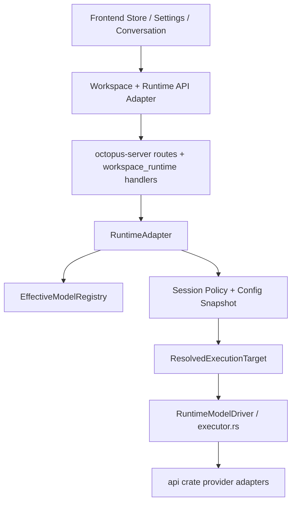

# 模型模块梳理：注册表、执行链路与当前接入能力

## 目标与范围

本文基于当前仓库实现，梳理 Octopus 模型模块的：

1. 分层架构与核心设计。
2. 配置如何被解析为可执行模型目标。
3. 当前已接入的 provider、baseline model 与声明能力。
4. 前后端如何调用、选择并实际使用模型。
5. 当前实现边界、风险与待统一项。

本文聚焦 `model catalog -> configured model -> resolved execution target -> runtime execution` 主链路，不展开各家 provider HTTP payload 细节。

## 一句话结论

Octopus 的“模型模块”不是单一 SDK 封装，而是一个 **注册表驱动、配置快照驱动、session policy 驱动** 的运行时子系统：

- `octopus-core` 定义统一 catalog / configured model / execution target 合同。
- `octopus-runtime-adapter` 用 baseline + runtime config + project 限制构建有效注册表。
- session 创建时冻结 `config_snapshot + selected_configured_model + policy`。
- turn 执行时再把 `configured model` 解析成 `ResolvedExecutionTarget`，补齐 secret/base URL/max tokens。
- 真正的 provider 调用按 `protocol_family` 分发，目前完整工具循环主要落在 `anthropic_messages` 与 `openai_chat`。

## 总体分层

对应代码位置：

- 合同定义：`crates/octopus-core/src/lib.rs`
- 注册表构建：`crates/octopus-runtime-adapter/src/registry.rs`
- baseline providers/models/defaults：`crates/octopus-runtime-adapter/src/registry_baseline.rs`
- configured model / credential 解析：`crates/octopus-runtime-adapter/src/registry_resolution.rs`
- 执行目标解析与 secret hydrate：`crates/octopus-runtime-adapter/src/execution_target.rs`
- runtime 执行器：`crates/octopus-runtime-adapter/src/executor.rs`
- turn 主循环：`crates/octopus-runtime-adapter/src/agent_runtime_core.rs`
- provider SDK 抽象：`crates/api/src/providers/mod.rs`

## 核心数据结构与设计

`crates/octopus-core/src/lib.rs` 定义了模型模块统一合同，关键对象如下：

- `ProviderRegistryRecord`
  - 描述 provider、自带 surface、协议族与 surface 级能力。
- `ModelRegistryRecord`
  - 描述 model 归属 provider、推荐用途、`surface_bindings`、能力、context window、max output。
- `ConfiguredModelRecord`
  - 描述某个“可被实际选择的模型实例”，包含 `configured_model_id`、显示名、凭据引用、base URL、quota、状态。
- `CredentialBinding`
  - 描述 provider 级 credential/base URL 绑定。
- `DefaultSelection`
  - 描述 `conversation` / `responses` / `fast` 等用途的默认模型选择。
- `ModelCatalogSnapshot`
  - 前后端交互的核心快照，包含 `providers/models/configured_models/credential_bindings/default_selections/diagnostics`。
- `ResolvedExecutionTarget`
  - runtime 真正执行时使用的目标，包含 provider、model、surface、protocol family、credential、base URL、capabilities、max output。

这套设计把“模型声明”“模型配置”“模型执行”三层隔开：

- 注册表层回答“系统知道哪些 provider/model”。
- 配置层回答“当前 workspace/user/project 真正允许并配置了哪些模型”。
- 执行层回答“本次 turn 实际要用哪个 endpoint、协议和凭据去跑”。

## 注册表如何构建

`EffectiveModelRegistry::from_effective_config()` 是模型模块的中心装配点，构建顺序如下：

1. 载入 baseline providers、baseline models、baseline default selections。
2. 应用 `providerOverrides` / `modelRegistry.providers` / `modelRegistry.models` / `defaultSelections` 覆盖。
3. 从 `credentialRefs` 解析 provider 级 `CredentialBinding`。
4. 从 `configuredModels` 解析显式 `ConfiguredModelRecord`。
5. 如果没有显式 configured model，则为所有 baseline model 自动 seed 一份 configured model。
6. 如果已有显式 configured model，则把缺失的 baseline model 继续补成 seeded configured model。
7. 归一化默认选择，并套用 `projectSettings` 对允许模型集合的限制。
8. 记录 diagnostics，并生成 `ModelCatalogSnapshot`。

几个重要设计点：

- `configuredModels` 不是“全量模型表”，而是显式配置覆盖层。
- 未显式配置的 baseline model 仍会以 seeded configured model 形式出现在有效 catalog 中。
- diagnostics 会对 provider/model/default selection 不一致、disabled、缺失 surface 等情况直接打出错误。
- `plugins.maxOutputTokens` 会在执行目标解析阶段覆盖 model 自带的 `max_output_tokens`。

## 从 configured model 到执行目标

`registry.resolve_target(configured_model_id, preferred_surface)` 的解析规则很清晰：

1. 校验该 configured model 是否在当前 project 允许范围内。
2. 找到 `ConfiguredModelRecord`，再找到对应 `ModelRegistryRecord` 与 `ProviderRegistryRecord`。
3. 优先按 `preferred_surface` 选 model 的 `surface_binding`，否则选第一个启用的 binding。
4. 在 provider surfaces 中优先匹配同 surface + 同 protocol family，否则退化到同 surface。
5. 生成 `ResolvedExecutionTarget`。

关键优先级：

- `credential_ref`
  - `configured_model.credential_ref`
  - `provider credential binding`
- `base_url`
  - `configured_model.base_url`
  - `provider credential binding.base_url`
  - `provider surface.base_url`
- `max_output_tokens`
  - `plugins.maxOutputTokens`
  - `model.max_output_tokens`

`execution_target.rs` 会在真正执行前补一层 secret hydrate：

- 如果 `credential_ref` 是 `secret-ref:*`，会先解析成真实 secret。
- hydrate 失败会直接阻断执行。
- quota 校验也在这里完成。

## Session 与执行链路

模型选择不是在每次请求时临时拼装，而是先冻结到 session policy：

1. 前端创建 session：
   - `apps/desktop/src/stores/runtime_sessions.ts`
   - `apps/desktop/src/tauri/runtime_api.ts`
2. 后端 `create_session_with_owner_ceiling()`：
   - `crates/octopus-runtime-adapter/src/session_service.rs`
   - 生成 `config_snapshot`
   - 编译 `session_policy`
   - 冻结 `selected_configured_model_id`（若显式传入，或 actor manifest 提供默认模型）
3. 用户提交 turn：
   - `apps/desktop/src/stores/runtime_actions.ts`
   - `POST /api/v1/runtime/sessions/{sessionId}/turns`
4. 后端 `submit_turn()`：
   - `crates/octopus-runtime-adapter/src/agent_runtime_core.rs`
   - 构建 run context
   - 处理 approval / auth mediation
   - 进入 `execute_runtime_turn_loop()`
5. 模型执行：
   - `RuntimeAdapter::execute_resolved_conversation()`
   - `executor.rs` 按 `protocol_family` 分发
6. 结果不是一个字符串，而是一组 `AssistantEvent`
   - text delta
   - tool use
   - usage
   - stop
7. runtime 把这些事件投影成 session/run/message 状态，再经 SSE 或轮询回到前端 UI。

这也是为什么模型模块实际属于 runtime 主链路的一部分，而不是孤立的 provider adapter。

## 当前接入的 provider 与 baseline model

### Provider 层

`registry_baseline.rs` 当前内置 provider：

| Provider | Surface / Protocol | 备注 |
| --- | --- | --- |
| `anthropic` | `conversation / anthropic_messages` | 完整 conversation 主路径 |
| `openai` | `conversation / openai_chat`，`responses / openai_responses` | 同时覆盖 chat 与 responses 两套协议 |
| `xai` | `conversation / openai_chat` | 走 OpenAI-compatible 协议 |
| `deepseek` | `conversation / openai_chat`，`conversation / anthropic_messages` | 同一 provider 暴露两套 conversation 协议 |
| `minimax` | `conversation / anthropic_messages`，`conversation / vendor_native`，`conversation / openai_chat` | 注册表声明多协议，但 runtime 并未全支持 |
| `moonshot` | `conversation / openai_chat` | OpenAI-compatible |
| `bigmodel` | `conversation / openai_chat` | OpenAI-compatible |
| `qwen` | `conversation / openai_chat`，`conversation / anthropic_messages`，`realtime / vendor_native` | 含 realtime 声明 |
| `ark` | `responses / openai_responses` | 响应式 surface |
| `google` | `conversation / gemini_native`，`realtime / gemini_native` | 含 Gemini realtime 声明 |
| `ollama` | `conversation / openai_chat` | 仅 provider 预置，无 baseline model 条目 |
| `vllm` | `conversation / openai_chat` | 仅 provider 预置，无 baseline model 条目 |

### Baseline model 层

当前 baseline model 列表如下：

| Provider | Baseline models | 主要声明能力 |
| --- | --- | --- |
| Anthropic | `claude-sonnet-4-5`, `claude-opus-4-6` | `streaming`, `tool_calling`, `structured_output`, `reasoning` |
| OpenAI | `gpt-5.4`, `gpt-5.4-mini`, `gpt-5.4-nano` | chat/responses 双 surface；`gpt-5.4` 额外声明 `vision_input`, `files`, `web_search`, `computer_use`, `mcp`, `reasoning` |
| xAI | `grok-3`, `grok-3-mini` | `streaming`, `tool_calling`, `structured_output`，`grok-3` 带 `reasoning` |
| DeepSeek | `deepseek-chat`, `deepseek-reasoner` | `streaming`, `tool_calling`, `structured_output`，`deepseek-reasoner` 带 `reasoning` |
| MiniMax | `MiniMax-M2.7`, `MiniMax-M2.5` | `streaming`, `tool_calling`, `structured_output` |
| Moonshot | `kimi-k2.5`, `kimi-k2-thinking` | `streaming`, `tool_calling`, `structured_output`, `reasoning` |
| BigModel | `glm-5`, `glm-5-turbo` | `streaming`, `tool_calling`, `structured_output`，`glm-5` 带 `reasoning` |
| Qwen | `qwen3-max`, `qwen3-coder-plus`, `qwen3-vl-plus` | `streaming`, `tool_calling`, `structured_output`；`qwen3-coder-plus` 带 `reasoning`；`qwen3-vl-plus` 带 `vision_input` |
| Ark | `doubao-seed-1.6`, `doubao-seed-1.6-thinking` | `streaming`, `tool_calling`, `structured_output`, `files`；thinking 版带 `reasoning` |
| Google | `gemini-2.5-pro`, `gemini-2.5-flash` | `streaming`, `tool_calling`, `structured_output`, `vision_input`；`gemini-2.5-pro` 额外带 `reasoning`, `web_search` |

默认选择如下：

- `conversation -> claude-sonnet-4-5`
- `responses -> gpt-5.4`
- `fast -> gpt-5.4-mini`

## 声明能力与实际执行能力的差异

这里需要明确区分两层：

- **注册表声明能力**
  - 写在 provider surface 和 model record 中，用于 catalog 展示、能力提示与选择策略。
- **runtime 实际可执行能力**
  - 由 `executor.rs` 当前已实现的 `protocol_family` 分支决定。

当前 runtime 实际支持情况：

| Protocol family | 当前状态 | 说明 |
| --- | --- | --- |
| `anthropic_messages` | 可用于 conversation + tool loop | 当前最完整路径之一 |
| `openai_chat` | 可用于 conversation + tool loop | 当前最完整路径之一 |
| `openai_responses` | 仅在 `request.tools.is_empty()` 时可跑 | 有 responses 能力声明，但 tool-enabled turn 还不支持 |
| `gemini_native` | 仅在 `request.tools.is_empty()` 时可跑 | Gemini tool loop 尚未落地 |
| `vendor_native` | 未在 runtime executor 中实现 | 注册表可声明，但实际不能执行 |
| `realtime` | 注册表可声明 | 当前 executor 不支持 realtime 执行链路 |

因此以下能力目前只能视为“catalog 元数据”或“未来接入目标”，不能默认视为已在 runtime 主链路落地：

- `computer_use`
- `mcp`
- `web_search`
- `files`
- `context_cache`
- `audio_io`
- `realtime`

这些能力在某些 provider/model 上已经被声明，但是否能在 Octopus 的 session/tool loop 中实际工作，要以 `executor.rs` 与 runtime loop 当前实现为准。

## 当前仓库内可见的工作区配置现状

仓库内 `config/runtime/workspace.json` 当前只显式声明了一个 workspace 级 configured model：

- `configuredModelId`: `minimax-minimax-m2-7-afa390ca`
- `providerId`: `minimax`
- `modelId`: `MiniMax-M2.7`
- `name`: `MiniMax2.7`
- `baseUrl`: `https://api.minimaxi.com`
- `credentialRef`: `secret-ref:workspace:ws-local:configured-model:...`
- `tokenQuota.totalTokens`: `1000000`

需要注意：

1. 这只是 **显式配置层**，不是整个有效 catalog。
2. 注册表仍会把其他 baseline model 补成 seeded configured model。
3. 当前仓库内可见的 workspace scope 文件没有看到对 `defaultSelections` 的覆盖，因此仅从该文件判断，conversation/responses/fast 仍会落回 baseline 默认选择。
4. 因此“工作区已显式配置 MiniMax”不等于“对话默认就会走 MiniMax”；如果既没有显式选中该 configured model，actor manifest 也没有默认模型，执行阶段才会回退到 registry 的 `conversation` 默认选择。

## 前后端如何调用与使用

### 1. 读取模型目录

前端：

- `apps/desktop/src/tauri/workspace_api.ts`
  - `catalog.getSnapshot()`

后端：

- `GET /api/v1/workspace/catalog/models`
- handler: `crates/octopus-server/src/workspace_runtime.rs::workspace_catalog_models`

返回值就是 `ModelCatalogSnapshot`，前端 catalog store 用它渲染 provider/model/configured model/default selection 视图。

### 2. 校验模型配置与绑定凭据

前端：

- `apps/desktop/src/tauri/runtime_api.ts`
  - `validateConfiguredModel()`
  - `upsertConfiguredModelCredential()`
  - `deleteConfiguredModelCredential()`

后端：

- `POST /api/v1/runtime/config/configured-models/probe`
- `PUT /api/v1/runtime/config/configured-models/{configuredModelId}/credential`
- `DELETE /api/v1/runtime/config/configured-models/{configuredModelId}/credential`

这些接口负责检查 configured model 是否可用、是否缺 secret、以及把 workspace 级凭据引用写回 runtime config。

### 3. 创建 session 时选择模型

前端：

- `apps/desktop/src/stores/runtime_sessions.ts`
  - `ensureSession(input)`

后端：

- `POST /api/v1/runtime/sessions`
- `crates/octopus-runtime-adapter/src/session_service.rs`

关键输入是 `selectedConfiguredModelId`：

- 传了则 session policy 冻结该模型。
- 不传则先看 actor manifest 的默认模型引用。
- 如果 session policy 最终仍未绑定模型，执行目标解析阶段才会回退到 registry 的 `conversation` 默认选择。

### 4. 提交 turn 使用模型

前端：

- `apps/desktop/src/stores/runtime_actions.ts`
  - `submitTurn()`

后端：

- `POST /api/v1/runtime/sessions/{sessionId}/turns`
- `crates/octopus-runtime-adapter/src/agent_runtime_core.rs::submit_turn`

执行时序：

1. 从 session policy 取选中的 configured model。
2. 解析为 `ResolvedExecutionTarget`。
3. hydrate secret / 校验 quota。
4. 构造 `RuntimeConversationRequest`。
5. `executor.rs` 按 `protocol_family` 发起真实模型请求。
6. 把 `AssistantEvent` 回流为 runtime events，再同步到前端。

## 已识别的限制与待统一项

### 1. protocol family 支持不对称

当前产品表面已经把多家 provider、多种能力放进 catalog，但 runtime 执行器真正完整支持的仍是：

- `anthropic_messages`
- `openai_chat`

这意味着 catalog 展示能力已经跑在实现前面，后续需要把 responses / gemini / vendor native / realtime 的 runtime 链路补齐，否则“可选”不等于“可执行”。

### 2. alias 与 runtime baseline 存在版本漂移

`crates/api/src/providers/mod.rs` 中：

- `sonnet -> claude-sonnet-4-6`

但 runtime baseline 默认选择仍是：

- `conversation -> claude-sonnet-4-5`

这会造成两个后果：

- 低层 provider alias 与 runtime catalog 默认值不一致。
- 不同入口若分别走 alias 与 registry，可能落到不同 Claude 版本。

这部分建议统一到同一 canonical model policy。

### 3. workspace 显式配置与默认选择未对齐

当前仓库可见的 workspace 显式配置是 MiniMax，但默认选择仍然是 Claude/OpenAI baseline。这意味着：

- settings 页面里“已配置模型”
- runtime 实际“默认会使用的模型”

是两套不同状态，需要在 UI 和配置策略上明确区分。

## 结论

当前模型模块已经具备比较完整的扩展骨架：

- catalog 合同稳定
- baseline provider/model 体系清晰
- configured model 与 credential 解耦
- session policy 能冻结模型选择
- runtime loop 已能稳定驱动 `anthropic_messages` / `openai_chat`

但它仍处于“**注册表能力先行，runtime 执行能力部分跟进**”的阶段。后续如果继续扩展模型面，优先级应是：

1. 统一 catalog 声明能力与 runtime 实际能力的口径。
2. 补齐 `openai_responses`、`gemini_native` 的 tool-enabled turn。
3. 明确 `vendor_native` / `realtime` 的真实接入策略。
4. 统一 alias、baseline defaults、workspace explicit config 三者的版本与默认选择策略。
