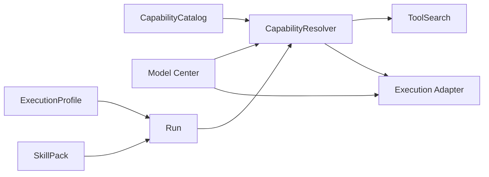

# Octopus 补充设计文档：统一模型中心与 Capability / ToolSearch / SkillPack 分层强化

- 文档类型：补充性架构设计文档
- 适用范围：对现有 `PRD.md`、`SAD.md`、`ga-implementation-blueprint.md` 的补充
- 版本：v2.0
- 日期：2026-03-27
- 基线结论：在当前 PRD / SAD 已确立的“运行时中心、治理中心、协议中心”方向上，补齐统一模型中心与能力分层硬边界，使 Octopus 从“方向正确”推进到“可持续接入多家模型厂商并可治理落地”。

> Reference status
> This file is preserved as non-normative reference input from 2026-03-27. Current tracked truth for Model Center work lives in [PRD](../product/PRD.md), [SAD](../architecture/SAD.md), [GA implementation blueprint](../architecture/ga-implementation-blueprint.md), [ADR 0007](../decisions/0007-model-center-governance-boundary-and-terminology.md), and the completed [post-ga-model-center-foundation task package](../tasks/2026/2026-03-30-post-ga-model-center-foundation/README.md). The queued next design-only candidate is [post-ga-model-governance-consumers](../tasks/2026/2026-03-30-post-ga-model-governance-consumers/README.md). Canonical overlapping terms in this retained copy follow tracked vocabulary: `ModelCatalogItem` and `TenantModelPolicy`. Candidate follow-on concepts such as `ModelFeatureSet`, `ProviderEndpointProfile`, `ModelRoutingPolicy`, and `ProviderAdapter` remain exploratory here unless later approved through owner docs or task packages.
>
> The schema sketches and slice sequencing below are historical design input, not the current tracked contract surface or implementation priority.

---

## 1. 文档目标

本文档补齐两个当前最关键的设计缺口：

1. **统一模型中心（Model Center）未闭环**
   - 需要把模型厂商、模型、接入协议、能力、限制、路由、预算、弃用、审批、评测，提升为正式治理对象。
2. **Capability / ToolSearch / SkillPack 的边界仍不够硬**
   - 当前原则已存在，但在实施层仍可能出现职责串层、事实源漂移、隐式注入和治理绕过问题。

同时，本文基于 **DeepSeek、MiniMax、MoonShot、BigModel、Qwen、豆包、OpenAI、Google** 的官方文档，整理其当前可确认的官方接入方式、模型入口与能力特征，并给出适配 Octopus 的统一模型管理设计。

---

## 2. 执行摘要

### 2.1 总体判断

Octopus 当前的大方向是合理的：

- PRD 已将模型中心列入企业治理能力面。
- SAD 已形成 Runtime / Knowledge / Governance / Interop / Execution 的平台化分层。
- GA 蓝图已明确“先做正式运行闭环，而不是先做工具聊天壳”。

这说明当前项目并不是在做“单模型聊天产品”，而是在做 **统一 Agent Runtime Platform**。

但要真正支撑多厂商模型、工具调用、内置工具、MCP、审批、预算、长时运行和企业治理，必须新增一层稳定的 **Model Center**，并进一步加固 **CapabilityCatalog / CapabilityResolver / ToolSearch / SkillPack** 的硬边界。

### 2.2 本文的核心结论

1. **模型中心必须成为 Governance Plane 内的一等子系统**，不能只作为 ExecutionProfile 的附属配置。
2. **多家模型厂商不能只按“OpenAI 兼容”统一处理**；必须区分：
   - 协议兼容层
   - 模型能力层
   - 厂商内置工具层
   - 外部 Capability 层
3. **Capability / ToolSearch / SkillPack 必须彻底拆清**
   - CapabilityCatalog：事实源
   - CapabilityResolver：上下文求值与治理判断
   - ToolSearch：只负责发现
   - SkillPack：只负责行为约束和运行增强，不得创造事实能力
4. **Model Center 与 Capability Runtime 必须联动**
   - 不是所有模型都支持相同的 tool use / structured output / search / MCP / long context / multimodal / realtime / code execution
   - 运行时必须先选模型，再解释可用能力面，再决定是否进入审批、降级或切换路由
5. **GA 不需要做“全量模型平台”，但必须做“统一接入骨架 + 模型档案治理 + 最小路由闭环”**

---

## 3. 当前项目与本文补充的关系

### 3.1 与 PRD 的关系

PRD 已把“模型中心”列为企业治理能力面的一部分，也已强调：

- 能力必须进入正式运行时
- 自治必须先有边界
- 结果与过程都可治理
- MCP / A2A 是正式互操作层

本文将其进一步细化为：

- `ModelProvider`
- `ModelCatalogItem`
- `ModelFeatureSet`
- `TenantModelPolicy`
- `ModelRoutingPolicy`
- `ProviderAdapter`
- `ModelSelectionDecision`

等正式对象与治理链路。

### 3.2 与 SAD 的关系

SAD 已给出平面分层，但尚未把模型治理对象模型写透。本文补齐：

- Governance Plane 中的 `Model Center`
- Runtime Plane 对 `ModelSelectionDecision` 的消费关系
- Execution Plane 对 provider 协议适配的承载
- Capability Management 与模型能力约束的关系

### 3.3 与 GA 蓝图的关系

GA 蓝图要求先打通：

`Task / Automation -> Run -> Capability Resolve -> Policy / Budget Check -> Optional Approval -> Execution -> Artifact -> Audit / Trace -> Knowledge Candidate -> Shared Knowledge`

本文要求把该链路扩展为：

`Task / Automation -> Run -> Intent Classify -> Model Selection -> Capability Resolve -> Policy / Budget Check -> Optional Approval -> Execution -> Artifact -> Audit / Trace -> Knowledge Candidate -> Shared Knowledge`

即：**模型选择必须成为正式运行前置步骤**，而不是临时 if/else。

---

## 4. 外部厂商调研：官方接入方式、模型入口与能力特征

> 说明  
> 1. 以下内容优先基于各厂商官方文档。  
> 2. “官方模型列表”会持续变化，因此本文只固定“官方模型入口”和“截至本文写作时可稳定确认的主要系列/代表模型”。  
> 3. 统一模型中心不应把模型名硬编码进业务逻辑；应通过同步/注册机制维护。

---

## 5. 厂商接入概览表

| 厂商 | 官方主要接入方式 | 当前可确认的官方模型入口 | 当前可确认的关键能力特征 | Octopus 接入建议 |
| --- | --- | --- | --- | --- |
| DeepSeek | OpenAI-compatible Chat Completions；`/models`；兼容 Anthropic 入口 | `GET /models`，Models & Pricing，Change Log | thinking / non-thinking、function calling、tool calls、JSON output、context caching、streaming | 作为低成本 reasoning / coding provider，按 feature flag 区分 `deepseek-chat` 与 `deepseek-reasoner` |
| MiniMax | Native API；OpenAI-compatible；Anthropic-compatible | 模型发布页、API 参考页 | tool use、interleaved thinking、文本/语音/图像/视频/音乐，多协议接入 | 既是模型 provider，也是多模态与 MCP 生态 provider；模型能力与外部 MCP 能力必须拆层 |
| MoonShot / Kimi | OpenAI-compatible API | Kimi API Docs 的 Models & Pricing / 概览页 | 256K 长上下文、thinking/non-thinking、tool calling、官方 web search、JSON mode、partial mode、多模态 | 适合长上下文、Agent、搜索型推理任务；官方工具归类为 provider-built-in tools |
| BigModel / 智谱 | Native API；官方 Python/Java SDK；OpenAI SDK compatibility | 模型概览、价格页、模型介绍页 | 文本、视觉、向量、结构化输出、工具调用、上下文缓存、联网搜索/知识库等平台能力 | 作为国产通用 provider，需支持 native 与 OpenAI-compatible 双适配 |
| Qwen / 阿里百炼 | DashScope Native API；OpenAI Chat 兼容；OpenAI Responses 兼容 | 模型列表、模型上下架页、价格页 | thinking、function calling、内置 web search / web extractor / code interpreter / knowledge search、多模态 | 需要把 Qwen 的 Responses 内置工具和普通 function calling 严格区分 |
| 豆包 / 火山方舟 | Native API；Responses API；函数调用；云部署 MCP/Remote MCP | 模型列表、工具调用页、函数调用页 | 文本/多模态、深度思考、工具调用、web search、knowledge search、image process、Remote MCP | 适合作为国产内置工具丰富的 provider；必须支持 built-in tools + remote MCP |
| OpenAI | Responses API；Chat Completions；Realtime；Batch | Models / All models / Compare / 单模型页 | web search、file search、computer use、code interpreter、MCP、tool search、skills、hosted shell、image generation | 作为 Octopus 统一模型中心的高标准参考 provider |
| Google | Gemini API；Vertex AI；Function Calling；Live API | Gemini models 页、changelog、deprecations、Vertex model lifecycle | function calling、built-in tools 组合、Maps grounding、实时语音/视频、强多模态 | 需要同时支持 Google AI Studio 路线与 Vertex 企业路线的 endpoint profile |

---

## 6. 各厂商详细调研

### 6.1 DeepSeek

#### 6.1.1 官方接入方式

官方文档可确认：

- 使用 OpenAI SDK 接入，`base_url` 为 `https://api.deepseek.com`，文档也提到兼容 `https://api.deepseek.com/v1`
- 提供 `GET /models`
- 提供兼容 Anthropic 的 API 入口
- 主接口为 `/chat/completions`

这意味着在 Octopus 中，DeepSeek 不能简单视为“某个模型名”，而应建模为：

- `protocol_family = openai_compatible`
- `secondary_protocols = [anthropic_compatible]`
- `conversation_style = stateless_messages`

#### 6.1.2 当前可确认模型入口与主要模型

官方当前可稳定确认：

- 模型入口：`GET /models`
- 价格/模型页：Models & Pricing
- 更新入口：Change Log
- 代表模型：
  - `deepseek-chat`
  - `deepseek-reasoner`
  - `DeepSeek-V3.2` 相关映射
  - `DeepSeek-R1` 系列映射

需要注意：官方文档明确说明 `deepseek-chat` / `deepseek-reasoner` 对应后台版本映射会演进，因此 **业务中不能把 alias 当作永久固定能力定义**。

#### 6.1.3 当前可确认能力

官方文档可确认：

- thinking mode
- non-thinking mode
- function calling / tool calls
- JSON output
- context caching
- streaming
- 多轮对话需要客户端自己回传历史（stateless）

#### 6.1.4 对 Octopus 的接入建议

- 归类：`ReasoningTextProvider`
- 适用：
  - 成本敏感型推理
  - 代码与工具调用
  - 需要缓存优化的长会话
- 风险：
  - alias 绑定后台版本会变
  - “OpenAI-compatible” 不能推导为“完全支持 OpenAI 全工具面”
- 统一模型中心中应记录：
  - `supports_reasoning_modes = true`
  - `supports_function_calling = true`
  - `supports_provider_builtin_tools = false`
  - `requires_client_context_replay = true`
  - `supports_context_caching = true`

---

### 6.2 MiniMax

#### 6.2.1 官方接入方式

官方文档可确认：

- Native API
- OpenAI-compatible API
- Anthropic-compatible API
- 官方还提供在 Claude Code / Cursor / OpenCode 等工具中的接入说明
- 存在官方 MCP Server 生态说明

#### 6.2.2 当前可确认模型入口与主要模型

官方可稳定确认的入口：

- 模型发布页
- 文本 API 参考页
- OpenAI 兼容文档页

当前可确认的代表文本模型：

- `MiniMax-M2.7`
- `MiniMax-M2.7-highspeed`
- `MiniMax-M2.5`
- `MiniMax-M2.5-highspeed`
- `MiniMax-M2`
- `MiniMax-M2.1`
- `MiniMax-M1`
- `M2-her`

#### 6.2.3 当前可确认能力

官方文档可确认：

- Tool Use / Function Calling
- Interleaved Thinking
- 文本生成
- 代码能力
- 多模态能力生态（语音/图像/视频/音乐等）
- 模型协议同时兼容 OpenAI 与 Anthropic
- 存在独立 MCP server 能力生态

#### 6.2.4 对 Octopus 的接入建议

MiniMax 的关键不是“又一个 OpenAI 兼容模型”，而是：

- 它既提供模型能力
- 又提供多协议接入
- 还可能通过 MCP 生态暴露外部能力

因此在 Octopus 中必须拆成三层：

1. `ModelProvider = MiniMax`
2. `ProviderBuiltInFeatures = interleaved_thinking / tool_use / multimodal`
3. `InteropProvider = MCP-capable ecosystem`

不能把 MiniMax 的 MCP server 错误登记为模型内建功能。

---

### 6.3 MoonShot / Kimi

#### 6.3.1 官方接入方式

官方 Kimi API 文档可确认：

- 建议使用 OpenAI SDK
- `base_url = https://api.moonshot.ai/v1`
- 提供 OpenAI-compatible Chat Completions
- 提供 tool calls、JSON mode、partial mode、多轮对话、文件问答
- 官方工具包括 web search

#### 6.3.2 当前可确认模型入口与主要模型

官方可稳定确认的入口：

- Welcome / Overview
- Models and Pricing
- Kimi K2.5 quickstart

当前可确认的主要模型：

- `kimi-k2.5`
- `kimi-k2`
- `kimi-k2-turbo-preview`
- `kimi-k2-thinking`
- `kimi-k2-thinking-turbo`
- 文档还提到历史/废弃 alias 如 `kimi-latest`

#### 6.3.3 当前可确认能力

官方文档可确认：

- 256K context
- thinking / non-thinking
- native multimodal（图像、视频）
- tool calling
- official web search
- JSON mode
- partial mode
- automatic context caching
- 适用于 Agent、coding、visual understanding

#### 6.3.4 对 Octopus 的接入建议

- 归类：`LongContextMultimodalAgentProvider`
- 需要单独建模：
  - `provider_builtin_tools = [web_search]`
  - thinking 与 built-in tool 的兼容矩阵
- 不能把 Kimi 的官方 web search 当成普通 CapabilityCatalog 函数能力；
  它首先是 provider built-in tool，其次才可能由平台包装为统一能力视图。

---

### 6.4 BigModel / 智谱

#### 6.4.1 官方接入方式

官方文档可确认：

- HTTP API
- 官方 Python SDK
- 官方 Java SDK
- OpenAI SDK compatibility
- LangChain 集成

#### 6.4.2 当前可确认模型入口与主要模型

官方可稳定确认的入口：

- 平台介绍 / 模型概览
- 产品价格页
- 模型介绍页

当前官方页面可确认的主要系列包括：

- `GLM-4.5`
- `GLM-4.5-Air`
- `GLM-4.7-FlashX`
- `GLM-4.6V` 系列
- 以及文本、视觉、向量、角色等分类模型

#### 6.4.3 当前可确认能力

官方文档导航与页面可确认：

- 深度思考 / 思考模式
- 流式消息
- 工具调用
- 上下文缓存
- 结构化输出
- 联网搜索
- 文件解析
- 知识库 / 对话调用知识库
- 微调、评测、部署等平台能力

#### 6.4.4 对 Octopus 的接入建议

BigModel 不是单纯模型 API，而是偏平台型 Provider。  
接入时应拆出：

- `inference_features`
- `platform_tools`
- `knowledge_features`
- `eval/fine_tune/admin capabilities`

在 GA 范围内，Octopus 只需要先接模型推理与基础 tool calling；知识库、评测、训练等作为后续 capability domain。

---

### 6.5 Qwen / 阿里百炼

#### 6.5.1 官方接入方式

阿里云官方文档可确认：

- DashScope 原生接口
- OpenAI Chat Completion 兼容接口
- OpenAI Responses 兼容接口

这说明 Qwen 是当前最典型的“三层接口并存” Provider：

1. 原生能力最全：DashScope
2. 兼容生态最佳：OpenAI Chat
3. 智能体原生功能最强：OpenAI Responses 兼容

#### 6.5.2 当前可确认模型入口与主要模型

官方可稳定确认：

- 模型列表页
- 模型上下架与更新页
- 模型调用价格页

当前模型页可确认的主要模型/系列：

- `qwen3-max`
- `qwen3.5-plus`
- `qwen3.5-flash`
- `qwen3-vl-plus`
- `qwen3-vl-flash`
- 一批 Qwen3.5 开源系列模型
- 语音 / 视觉 / 代码等系列模型

#### 6.5.3 当前可确认能力

官方文档可确认：

- thinking mode / thinking budget
- function calling
- code interpreter
- web search
- web extractor
- knowledge search
- image/video understanding
- OpenAI Responses 语义中的 `previous_response_id`
- 多模态 Agent 场景

#### 6.5.4 对 Octopus 的接入建议

Qwen 的关键设计点在于：**内置工具很强**。  
因此统一模型中心必须能够表达：

- `supports_builtin_web_search`
- `supports_builtin_web_extractor`
- `supports_builtin_code_interpreter`
- `supports_builtin_knowledge_search`
- `supports_responses_api_stateful_context = true`

否则就会把其真实优势抹平。

---

### 6.6 豆包 / 火山方舟

#### 6.6.1 官方接入方式

火山方舟官方文档可确认：

- 模型调用
- Responses API
- Function Calling
- Tool Calling
- Remote MCP / 云部署 MCP

#### 6.6.2 当前可确认模型入口与主要模型

官方可稳定确认：

- 模型列表页
- 工具调用页
- 函数调用页

模型列表页当前可确认至少包含类似：

- `doubao-seed-1-6-251015`
- 豆包 1.8 最新系列
- 以及文本、多模态、向量、图像/视频生成等分类模型

#### 6.6.3 当前可确认能力

官方文档可确认：

- 深度思考
- 工具调用
- Function Calling
- Web Search
- Knowledge Search
- Image Process
- Remote MCP
- JSON mode / strict mode
- Responses API 下的 built-in tools 组合能力

#### 6.6.4 对 Octopus 的接入建议

豆包 / 火山方舟需要被建模成：

- 有原生模型能力
- 有 built-in tools
- 有 remote MCP 互操作能力

所以在 Octopus 中不能把“豆包联网搜索”和“平台自己的 WebSearch Capability”视为一个对象。  
二者可能提供相似用户语义，但来源、计费、可观测性、权限与合规完全不同。

---

### 6.7 OpenAI

#### 6.7.1 官方接入方式

OpenAI 官方当前可确认：

- Responses API
- Chat Completions API
- Batch API
- Realtime API
- 内置工具体系
- MCP / Connectors
- Hosted shell / Code Interpreter / Computer Use

#### 6.7.2 当前可确认模型入口与主要模型

官方可稳定确认：

- Models
- All models
- Compare models
- 单模型页

当前官方模型页可确认的主要模型包括：

- `gpt-5.4`
- `gpt-5.4-pro`
- `gpt-5.4-mini`
- `gpt-5.4-nano`
- `gpt-5`
- `gpt-5-mini`
- `gpt-5-nano`
- `gpt-4.1` / `gpt-4.1-nano`
- embeddings 系列等

#### 6.7.3 当前可确认能力

官方文档可确认：

- tool search
- MCP / connectors
- web search
- file search
- computer use
- code interpreter
- hosted shell
- apply patch
- skills
- structured outputs
- distillation
- 大上下文与 compaction（特定模型）

#### 6.7.4 对 Octopus 的接入建议

OpenAI 应作为 **统一模型中心的“能力上限参考 Provider”**。  
但不应把其完整工具面硬编码为平台默认能力面，因为：

- 并非所有 provider 都有等价功能
- 也并非所有租户都允许使用这些工具
- 某些 built-in tools 的安全与审批模型和普通 function calling 完全不同

---

### 6.8 Google / Gemini

#### 6.8.1 官方接入方式

Google 官方可确认：

- Gemini API
- Vertex AI Gemini
- Function Calling
- Live API
- 模型生命周期与弃用说明

#### 6.8.2 当前可确认模型入口与主要模型

官方可稳定确认：

- Gemini models 页
- Gemini changelog
- Gemini deprecations
- Vertex model lifecycle

当前模型页可确认的主要系列包括：

- Gemini 3 / 3.1 系列
- Gemini 2.5 Flash / Flash Lite
- 历史与预览模型的弃用节奏

#### 6.8.3 当前可确认能力

官方文档可确认：

- function calling
- built-in tools 与 function calling 组合
- grounding with Google Maps
- 多模态
- 实时音视频 Live API
- 模型版本生命周期治理

#### 6.8.4 对 Octopus 的接入建议

Google 接入的核心不是“多一个模型源”，而是：

- 同时存在 AI Studio 与 Vertex 两条企业接入路径
- 生命周期管理与弃用策略比较明确
- 多模态与实时能力强

因此应将 Google 接入拆成：

- `provider_family = google`
- `endpoint_profile = ai_studio | vertex_ai`
- `supports_live = true/false`
- `supports_builtin_grounding_tools = true/false`

---

### 6.9 补充参照：Anthropic / Claude

> 虽然不在本次必须纳入统一接入的 8 家列表中，但因为你明确提到 “Claude 等”，且 Capability / ToolSearch / SkillPack 的分层补充需要参考其设计，所以这里纳入作为设计对照组。

Anthropic 官方当前可确认：

- Tool use
- Tool search
- Server tools / client tools
- MCP
- Agent SDK
- Claude Code 的 Skills、Subagents、Allowed-tools 限制机制

对 Octopus 的主要启发：

1. **Tool Search 应被视为大型工具面下的“按需发现层”，而不是授权器**
2. **Skill 不应等同于工具**
3. **Skill 可以携带 allowed-tools 等约束，说明 SkillPack 更像“受控规则包 + 行为增强包”**
4. **MCP 是外部能力标准，不应被吞并成私有工具协议**

---

## 7. 统一模型中心（Model Center）设计

### 7.1 设计目标

Model Center 的目标不是“存一张模型配置表”，而是：

1. 为所有 Run 提供正式、可审计的模型选择与模型治理能力
2. 统一管理多厂商模型的：
   - 接入
   - 能力标签
   - 生命周期
   - 成本
   - 上下文限制
   - 工具支持
   - 多模态支持
   - 区域 / 合规属性
3. 将模型选择纳入策略、预算、审批、回放、评测和观测体系
4. 为未来 routing / fallback / canary / deprecation migration 提供基础

### 7.2 Model Center 所在平面

建议放置于 **Governance Plane**，并与 Runtime Plane / Execution Plane 发生协作：

- Governance Plane：模型档案、模型策略、预算、弃用、准入、审批
- Runtime Plane：Run 需要消费模型选择结果
- Execution Plane：按 provider adapter 实际发起调用

### 7.3 核心对象模型

#### 7.3.1 `ModelProvider`

表示厂商级提供方。

建议字段：

- `provider_id`
- `display_name`
- `provider_family`  
  例：`openai`, `deepseek`, `google`, `moonshot`, `minimax`, `bigmodel`, `qwen`, `doubao`
- `protocol_families[]`
  - `openai_compatible`
  - `anthropic_compatible`
  - `responses_compatible`
  - `native_rest`
  - `realtime`
- `default_base_url`
- `supported_endpoint_profiles[]`
- `auth_schemes[]`
- `region_profiles[]`
- `status`
- `metadata_sync_strategy`

#### 7.3.2 `ProviderEndpointProfile`

描述同一厂商下可选择的 endpoint / region / product line。

例如 Google 可能区分：

- `google_ai_studio_global`
- `vertex_ai_us`
- `vertex_ai_eu`

Qwen 可能区分：

- `dashscope_mainland`
- `dashscope_sg`
- `openai_chat_compat`
- `openai_responses_compat`

#### 7.3.3 `ModelCatalogItem`

表示一个可选模型档案。

建议字段：

- `model_key`：平台内部稳定键
- `provider_id`
- `provider_model_id`
- `model_family`
- `release_channel`
  - `ga`
  - `preview`
  - `experimental`
  - `deprecated`
- `modalities`
  - `text_in`
  - `image_in`
  - `audio_in`
  - `video_in`
  - `text_out`
  - `audio_out`
  - `image_out`
  - `video_out`
- `context_window`
- `max_output_tokens`
- `reasoning_modes`
- `pricing_profile_ref`
- `lifecycle_policy_ref`
- `feature_set_ref`
- `visibility_scope`

#### 7.3.4 `ModelFeatureSet`

这是最关键的对象之一，用于描述真实能力，而不是靠模型名猜。

建议字段：

- `supports_function_calling`
- `supports_parallel_tool_calls`
- `supports_structured_output`
- `supports_json_mode`
- `supports_thinking`
- `supports_interleaved_thinking`
- `supports_builtin_web_search`
- `supports_builtin_file_search`
- `supports_builtin_code_interpreter`
- `supports_builtin_computer_use`
- `supports_builtin_web_fetch`
- `supports_builtin_grounding_maps`
- `supports_mcp`
- `supports_tool_search`
- `supports_skills`
- `supports_context_caching`
- `supports_previous_response_state`
- `supports_streaming`
- `supports_realtime`
- `supports_multimodal_input`
- `supports_multimodal_output`
- `supports_vision`
- `supports_video_understanding`
- `supports_audio_io`
- `supports_fine_tuning`
- `supports_distillation`
- `supports_batch`

#### 7.3.5 `ModelLifecyclePolicy`

建议字段：

- `introduced_at`
- `deprecation_announced_at`
- `shutdown_at`
- `recommended_replacement_model_key`
- `snapshot_policy`
- `alias_stability_level`

#### 7.3.6 `ModelPricingProfile`

建议字段：

- `input_price_per_mtok`
- `output_price_per_mtok`
- `cached_input_price_per_mtok`
- `tool_call_price_profile[]`
- `region_uplift_policy`
- `large_context_threshold_policy`

#### 7.3.7 `TenantModelPolicy`

用于租户 / 工作区 / 项目 / Agent 层面的模型准入。

建议字段：

- `allow_models[]`
- `deny_models[]`
- `allow_provider_families[]`
- `deny_release_channels[]`
- `allowed_regions[]`
- `max_unit_cost`
- `require_approval_if_preview`
- `require_approval_if_builtin_tool`
- `compliance_tags[]`

#### 7.3.8 `ModelRoutingPolicy`

用于决定默认路由、回退路由和场景路由。

建议字段：

- `policy_scope`
- `intent_routes[]`
- `fallback_routes[]`
- `latency_preference`
- `cost_preference`
- `capability_requirements[]`
- `compliance_constraints[]`

#### 7.3.9 `ModelSelectionDecision`

每次正式 Run 中实际产出的模型选择结果。

建议字段：

- `run_id`
- `decision_id`
- `requested_intent`
- `required_features[]`
- `candidate_models[]`
- `selected_model_key`
- `selected_endpoint_profile`
- `rejected_candidates[]`
- `decision_reason`
- `requires_approval`
- `fallback_plan`
- `decision_trace_ref`

这个对象必须可审计、可回放。

---

## 8. 模型接入抽象：ProviderAdapter 设计

### 8.1 设计原则

统一模型中心不等于统一 HTTP 参数。  
必须明确区分：

1. **治理层对象统一**
2. **执行层协议差异保留**

也就是说，Octopus 不应强行把所有 provider 扭成一个“最低公分母 API”，而应采用：

- 上层统一：对象、策略、能力标记、选择决策
- 下层分化：由 provider adapter 做协议适配

### 8.2 `ProviderAdapter` 建议职责

#### 负责：

- 认证组装
- endpoint 选择
- 请求参数映射
- tool schema 映射
- built-in tool 参数映射
- 返回结构标准化
- provider error 标准化
- 使用量 / cost / tool usage / reasoning usage 归一化

#### 不负责：

- 模型选择策略
- 预算决策
- 审批判断
- capability 可见性真相
- skill 注入逻辑

这些都必须留在 Governance / Runtime 层。

### 8.3 协议类型枚举建议

- `openai_chat_compatible`
- `openai_responses_compatible`
- `anthropic_messages_compatible`
- `native_rest`
- `native_streaming`
- `realtime_ws`

### 8.4 统一响应归一化对象建议

`NormalizedModelResponse`

建议字段：

- `output_blocks[]`
- `assistant_message`
- `tool_requests[]`
- `provider_builtin_tool_calls[]`
- `reasoning_summary`
- `usage`
- `finish_reason`
- `provider_response_ref`
- `raw_response_digest`

这样可以避免把不同 provider 的差异渗透到上层 Run 状态机。

---

## 9. 统一模型选择与路由设计

### 9.1 先分“任务意图”，再分“模型能力”

建议先把请求归入以下意图之一：

- `chat_general`
- `reasoning_heavy`
- `code_generation`
- `code_agent`
- `structured_extraction`
- `web_research`
- `doc_understanding`
- `image_understanding`
- `multimodal_agent`
- `realtime_voice`
- `low_cost_bulk`
- `subagent_fast_path`

### 9.2 模型选择的正式流程

1. Run 创建
2. 从 ExecutionProfile 获取默认模型偏好
3. 从 Run / Workspace / Tenant / Agent 上下文收集约束
4. 生成 `required_features`
5. 根据 `TenantModelPolicy` 过滤
6. 根据 `ModelRoutingPolicy` 评分
7. 产出 `ModelSelectionDecision`
8. 若命中高风险条件，进入审批
9. 执行层按 `ProviderAdapter` 发起调用

### 9.3 必须进入审批的典型条件

- 使用 preview / experimental 模型
- 使用 built-in web search / computer use / code interpreter / remote MCP
- 使用超预算模型
- 使用跨境 / 非允许区域 endpoint
- 自动从低风险模型升级到高成本模型
- 从文本模型切换到会执行外部动作的模型能力面

---

## 10. 与 Capability Runtime 的关系

### 10.1 核心原则

**模型能力 ≠ 平台能力 ≠ 外部能力**

必须分三类：

1. **Model-native features**  
   例如 thinking、json mode、structured output、tool search、provider built-in web search
2. **Platform capabilities**  
   例如 Octopus 注册在 `CapabilityCatalog` 的 `crm.lookup_customer`、`artifact.export_pdf`
3. **Interop capabilities**  
   例如经 MCP / Remote MCP / Connector 接入的外部能力

### 10.2 为什么必须分

因为这三类能力在以下方面都不同：

- 权限来源
- 审批方式
- 可观测粒度
- 成本归属
- 审计责任
- 恢复语义
- 供应商耦合程度

如果把 provider built-in web search 和平台自己的 `web_search` 混为一体，后续几乎一定出现：

- 审批判断错误
- 费用归因错误
- 运行回放不一致
- 多 provider 路由下的结果不一致

---

## 11. Capability / ToolSearch / SkillPack 的硬边界重构

---

### 11.1 `CapabilityCatalog`：唯一事实源

#### 职责

- 记录平台正式认可的可管理能力
- 记录能力 schema、风险等级、可见域、执行后果、fallback、观测要求
- 记录能力来源：
  - internal
  - connector
  - mcp
  - provider_builtin_proxy（可选）

#### 不负责

- 决定某次 Run 是否能用
- 决定当前模型是否支持
- 动态注入 prompt
- 搜索和排序

#### 结论

**CapabilityCatalog 是事实源，不是执行器，也不是搜索器。**

---

### 11.2 `CapabilityResolver`：唯一上下文求值器

#### 职责

给定：

- 主体（Agent / Team / Run）
- 作用域（Tenant / Workspace / Project）
- 模型选择结果
- BudgetPolicy
- CapabilityGrant
- Approval 状态
- 环境能力

输出：

- 哪些 capability 可见
- 哪些可执行
- 哪些仅可搜索
- 哪些需要审批
- 哪些当前因模型能力不足而被屏蔽
- 哪些需要 provider fallback 或 platform fallback

#### 不负责

- 搜索自然语言
- 注入 skill 文本
- 替代目录作为事实源

#### 结论

**CapabilityResolver 是上下文真相求值器。**

---

### 11.3 `ToolSearch`：只负责发现，不负责授权

#### 职责

- 在“大能力面”情况下，根据用户意图和上下文搜索候选 capability
- 结果来自 `CapabilityResolver` 的可见能力子集
- 可返回：
  - capability 摘要
  - schema 摘要
  - 风险标签
  - 是否需审批
  - 是否当前模型可用

#### 不负责

- 自己认定 capability 是否可执行
- 绕过 grant / budget / policy
- 执行 capability
- 直接修改 tool surface 真相

#### 结论

**ToolSearch 是搜索器，不是授权器，也不是执行器。**

---

### 11.4 `SkillPack`：行为增强包，不是能力注入器

#### 职责

- 为某次运行提供：
  - 规划偏好
  - 输出风格约束
  - 安全规则
  - 校验策略
  - 子任务拆解规则
  - provider/tool 使用建议
- 可绑定 allowed/denied capability hints
- 可定义 verifier / checker 流程

#### 严格禁止

- 创造未注册 capability
- 绕过 CapabilityGrant
- 绕过审批
- 暗中提升某 capability 的可见性或执行权
- 将 provider built-in tool 假装成 platform capability

#### 结论

**SkillPack 只能影响“如何做”，不能改变“能做什么”。**

---

### 11.5 `ExecutionProfile`：运行模板，不是能力真相源

#### 只允许定义

- 默认模型偏好
- 默认路由偏好
- 记忆与检索策略
- 默认 skillpacks
- 默认交互策略
- 成本/速度偏好

#### 严格禁止定义

- “这个 profile 自带某工具”
- “启用 profile 即默认拥有某 capability”
- “profile 决定 capability 真相”

#### 结论

**ExecutionProfile 只能表达默认偏好，不能改变治理真相。**

---

## 12. 新的硬边界关系图



说明：

- `CapabilityCatalog` 提供能力事实
- `Model Center` 提供模型事实与所选模型
- `ExecutionProfile` 提供默认偏好
- `SkillPack` 提供行为增强
- `CapabilityResolver` 产出当前上下文的能力真相
- `ToolSearch` 只在真相子集上做发现
- `Execution Adapter` 负责真正调用模型和工具

---

## 13. 内置工具（provider built-in tools）的建模规则

### 13.1 为什么单独建模

OpenAI、Qwen、豆包、Kimi、Google 都存在 provider built-in tools 或内置联网/解释器/检索能力。  
这些能力：

- 由 provider 直接执行
- 计费通常和普通 token / tool call 相关
- 日志与输出结构由 provider 决定
- 不等于平台 function calling

### 13.2 建议建模方式

统一建模为：

- `ProviderBuiltInToolDescriptor`
- `ProviderBuiltInToolPolicy`
- `ProviderBuiltInToolUsage`

并与平台 capability 分开。

### 13.3 是否映射进 CapabilityCatalog

建议规则：

- **原生存在但只在某 provider 内生效的 built-in tool**：不直接作为普通 CapabilityCatalog 条目
- 若平台希望向上暴露统一语义，可增加一层：
  - `UnifiedCapabilityIntent = web_search`
  - 再由 resolver 选择：
    - provider built-in web search
    - platform web_search capability
    - connector-based search
    - mcp-based search

即：统一语义可以统一，**底层执行体不要硬并表**。

---

## 14. 成本、预算与审批联动

### 14.1 预算维度要拆成三层

1. **模型预算**
   - token 成本
   - reasoning 成本
   - 长上下文 uplift
2. **工具预算**
   - provider built-in tool 成本
   - platform capability 成本
   - mcp / connector 调用成本
3. **动作预算**
   - 外部写操作次数
   - 长时运行时间
   - 环境租约占用

### 14.2 审批维度建议

- `requires_model_approval`
- `requires_builtin_tool_approval`
- `requires_external_action_approval`
- `requires_high_cost_upgrade_approval`

审批对象中应明确说明：

- 原始模型选择
- 触发审批的 feature / tool
- 预计成本区间
- fallback 是否存在

---

## 15. 观测与审计设计

### 15.1 必须新增的观测对象

- `ModelSelectionDecision`
- `ProviderCallTrace`
- `BuiltInToolUsageTrace`
- `CapabilityResolutionTrace`
- `SkillPackApplicationTrace`

### 15.2 为什么重要

否则无法回答：

- 为什么本次 Run 选了这个模型
- 为什么另一个能力没出现
- 为什么触发了 provider 内置 web search 而不是平台 search
- 为什么 skill 看起来改变了行为
- 为什么成本突然升高

---

## 16. 与 GA 实施蓝图对齐的落地切片

> Historical proposal note
> The Slice A-E ordering in this section records the original March 27 expansion proposal only. The smaller `post-ga-model-center-foundation` foundation slice is now completed as a doc/schema-only package, and the queued next design-only slice is `post-ga-model-governance-consumers`; provider adapters, built-in tools, and runtime refactors remain deferred until later approved task packages.

### 16.1 Slice A：统一模型档案最小闭环

交付目标：

- `ModelProvider`
- `ModelCatalogItem`
- `ModelFeatureSet`
- `ProviderEndpointProfile`
- `ModelSelectionDecision`

最低完成标准：

- 至少接入 2 家 provider（建议 OpenAI + Qwen 或 OpenAI + DeepSeek）
- Run 前可正式产出模型选择记录
- 可根据 feature requirement 过滤模型

### 16.2 Slice B：ProviderAdapter 最小闭环

交付目标：

- OpenAI-compatible adapter
- Native adapter（至少一种）
- usage / cost / tool usage 归一化

最低完成标准：

- 同一 Run 通过统一接口调用不同 provider
- 统一返回 normalized response

### 16.3 Slice C：CapabilityResolver 与 ToolSearch 硬边界

交付目标：

- Resolver 成为唯一能力真相求值器
- ToolSearch 只搜索 resolver 输出子集

最低完成标准：

- ExecutionProfile / SkillPack 不再能隐式决定能力真相
- ToolSearch 结果可解释“可见但不可执行”“需审批”“当前模型不支持”

### 16.4 Slice D：SkillPack 收口

交付目标：

- SkillPack schema 固定
- 限制其只能表达规则、偏好、验证器、建议路由

最低完成标准：

- SkillPack 无法创建 capability
- SkillPack 应用过程可观测、可审计

### 16.5 Slice E：provider built-in tools 建模

交付目标：

- built-in tool descriptor / policy / usage trace
- 区分 provider built-in 与 platform capability

最低完成标准：

- 至少在 OpenAI 或 Qwen 上验证 built-in web search / code interpreter 的差异建模

---

## 17. 推荐的统一 schema 草案

> Historical schema note
> The examples in this section preserve the supplement's original candidate schema direction. They are not the authoritative tracked contract shapes; the current shared-contract source of truth is the additive first-slice set under `schemas/governance/`.

### 17.1 `ModelProvider`

```json
{
  "provider_id": "openai",
  "display_name": "OpenAI",
  "protocol_families": ["openai_chat_compatible", "openai_responses_compatible"],
  "default_base_url": "https://api.openai.com/v1",
  "status": "active"
}
```

### 17.2 `ModelCatalogItem`

```json
{
  "model_key": "openai:gpt-5.4",
  "provider_id": "openai",
  "provider_model_id": "gpt-5.4",
  "release_channel": "ga",
  "modalities": ["text_in", "image_in", "text_out"],
  "context_window": 1050000,
  "max_output_tokens": 128000,
  "feature_set_ref": "openai:gpt-5.4:features:v1"
}
```

### 17.3 `ModelFeatureSet`

```json
{
  "supports_function_calling": true,
  "supports_structured_output": true,
  "supports_thinking": true,
  "supports_tool_search": true,
  "supports_mcp": true,
  "supports_builtin_web_search": true,
  "supports_builtin_file_search": true,
  "supports_builtin_code_interpreter": true,
  "supports_builtin_computer_use": true,
  "supports_multimodal_input": true
}
```

### 17.4 `ModelSelectionDecision`

```json
{
  "decision_id": "msd_001",
  "run_id": "run_001",
  "requested_intent": "web_research",
  "required_features": ["supports_builtin_web_search", "supports_structured_output"],
  "selected_model_key": "openai:gpt-5.4",
  "decision_reason": "best matching features within tenant policy",
  "requires_approval": false
}
```

---

## 18. 对当前项目的最终判断

### 18.1 当前架构是否合理

结论：**合理，但未闭环。**

合理之处：

- 运行时中心的方向正确
- 治理与审批是一等对象
- MCP / A2A 一等化是合理的
- Capability runtime 已有正确雏形
- GA 蓝图控制了范围，没有被目标态概念拖垮

未闭环之处：

- Model Center 未成体系
- Capability / ToolSearch / SkillPack 实施边界不够硬
- provider built-in tools 尚未被独立建模
- 多厂商协议与能力差异尚未进入正式对象模型

### 18.2 本文补齐后，架构会变成什么样

补齐后，Octopus 将从：

> “有统一运行时，但模型仍偏配置项”

演进为：

> “运行时、模型治理、能力治理、协议互操作共同构成正式平台骨架”

这会使当前项目更接近真正的企业级 Agent Runtime Platform，而不是多模型聊天壳。

---

## 19. 下一步建议

建议按以下顺序推进：

1. 先产出 `Model Center ADR`
2. 再产出 `schemas/model-center/*.jsonschema`
3. 再做 `ProviderAdapter SPI`
4. 再重构 `CapabilityResolver / ToolSearch / SkillPack`
5. 最后选择两家 provider 先打通最小闭环

优先试点组合建议：

- **OpenAI + Qwen**：覆盖最丰富 built-in tools 与 Responses 风格
- **OpenAI + DeepSeek**：覆盖国际高能力 + 国产低成本 reasoning
- **Qwen + 豆包**：覆盖国产 provider 的 built-in tools 与 MCP 风格差异

---

## 20. 官方参考资料

### 20.1 DeepSeek
- DeepSeek API Docs 首页：https://api-docs.deepseek.com/
- Models & Pricing：https://api-docs.deepseek.com/quick_start/pricing
- List Models：https://api-docs.deepseek.com/api/list-models
- Thinking Mode：https://api-docs.deepseek.com/guides/thinking_mode
- Function Calling：https://api-docs.deepseek.com/guides/function_calling
- Tool Calls：https://api-docs.deepseek.com/guides/tool_calls
- JSON Output：https://api-docs.deepseek.com/guides/json_mode
- Context Caching：https://api-docs.deepseek.com/guides/kv_cache

### 20.2 MiniMax
- OpenAI API 兼容：https://platform.minimaxi.com/docs/api-reference/text-openai-api
- 文本 API 参考：https://platform.minimaxi.com/docs/api-reference/text-post
- 模型发布：https://platform.minimaxi.com/docs/release-notes/models
- 工具使用与交错思维链：https://platform.minimaxi.com/docs/guides/text-m2-function-call
- AI 编程工具接入：https://platform.minimaxi.com/docs/guides/text-ai-coding-tools

### 20.3 MoonShot / Kimi
- Kimi API Docs 概览：https://platform.moonshot.ai/docs/overview
- Main Concepts：https://platform.moonshot.ai/docs/introduction
- Quickstart：https://platform.moonshot.ai/docs/guide/start-using-kimi-api
- Kimi K2.5：https://platform.moonshot.ai/docs/guide/kimi-k2-5-quickstart
- Official Tools：https://platform.moonshot.ai/docs/guide/use-official-tools
- Vision Model：https://platform.moonshot.ai/docs/guide/use-kimi-vision-model
- Pricing：https://platform.moonshot.ai/docs/pricing/chat

### 20.4 BigModel / 智谱
- 平台介绍：https://open.bigmodel.cn/dev/api
- 价格页：https://open.bigmodel.cn/pricing
- 工具调用文档入口（导航可达）：https://open.bigmodel.cn/dev/howuse/functioncall

### 20.5 Qwen / 阿里百炼
- 模型列表：https://help.aliyun.com/zh/model-studio/models
- 千问 API 参考：https://help.aliyun.com/zh/model-studio/qwen-api-reference
- DashScope API 参考：https://help.aliyun.com/zh/model-studio/qwen-api-via-dashscope
- OpenAI Chat 兼容：https://help.aliyun.com/zh/model-studio/compatibility-of-openai-with-dashscope
- OpenAI Responses 兼容：https://help.aliyun.com/zh/model-studio/compatibility-with-openai-responses-api
- Responses API 参考：https://help.aliyun.com/zh/model-studio/qwen-api-via-openai-responses
- Function Calling：https://help.aliyun.com/zh/model-studio/qwen-function-calling
- Code Interpreter：https://help.aliyun.com/zh/model-studio/qwen-code-interpreter
- Web Extractor：https://help.aliyun.com/zh/model-studio/web-extractor
- 视觉理解：https://help.aliyun.com/zh/model-studio/vision
- 深度思考：https://help.aliyun.com/zh/model-studio/deep-thinking
- 模型上下架与更新：https://help.aliyun.com/zh/model-studio/newly-released-models

### 20.6 豆包 / 火山方舟
- 火山方舟文档首页：https://www.volcengine.com/docs/82379
- 模型列表：https://www.volcengine.com/docs/82379/1330310
- 工具调用：https://www.volcengine.com/docs/82379/1958524
- 工具概述：https://www.volcengine.com/docs/82379/1827538
- Function Calling：https://www.volcengine.com/docs/82379/1262342
- 豆包助手：https://www.volcengine.com/docs/82379/1978533
- 豆包大模型 1.8：https://www.volcengine.com/docs/82379/2123228

### 20.7 OpenAI
- Models：https://developers.openai.com/api/docs/models
- All models：https://developers.openai.com/api/docs/models/all
- Compare models：https://developers.openai.com/api/docs/models/compare
- GPT-5.4：https://developers.openai.com/api/docs/models/gpt-5.4
- GPT-5.4 Pro：https://developers.openai.com/api/docs/models/gpt-5.4-pro
- GPT-5.4 Mini：https://developers.openai.com/api/docs/models/gpt-5.4-mini
- GPT-5.4 Nano：https://developers.openai.com/api/docs/models/gpt-5.4-nano
- Using tools：https://developers.openai.com/api/docs/guides/tools/
- Web search：https://developers.openai.com/api/docs/guides/tools-web-search/
- Skills：https://developers.openai.com/api/docs/guides/tools-skills/
- MCP and Connectors：https://developers.openai.com/api/docs/guides/tools-connectors-mcp/
- Computer use：https://developers.openai.com/api/docs/guides/tools-computer-use/
- Changelog：https://developers.openai.com/api/docs/changelog/
- Deprecations：https://developers.openai.com/api/docs/deprecations/

### 20.8 Google / Gemini
- Gemini Models：https://ai.google.dev/gemini-api/docs/models
- Gemini 3 Guide：https://ai.google.dev/gemini-api/docs/gemini-3
- Gemini Changelog：https://ai.google.dev/gemini-api/docs/changelog
- Gemini Deprecations：https://ai.google.dev/gemini-api/docs/deprecations
- Vertex Function Calling：https://docs.cloud.google.com/vertex-ai/generative-ai/docs/multimodal/function-calling
- Vertex Model Lifecycle：https://docs.cloud.google.com/vertex-ai/generative-ai/docs/learn/model-versions
- Vertex Live API：https://docs.cloud.google.com/vertex-ai/generative-ai/docs/live-api

### 20.9 Anthropic / Claude（设计参照）
- Tool use with Claude：https://docs.anthropic.com/en/docs/build-with-claude/tool-use
- MCP：https://docs.anthropic.com/en/docs/agents-and-tools/mcp
- Remote MCP servers：https://docs.anthropic.com/en/docs/agents-and-tools/remote-mcp-servers
- Claude API / Docs 首页：https://docs.anthropic.com/
- Agent SDK：https://docs.anthropic.com/en/docs/claude-code/sdk
- Claude Code MCP：https://docs.anthropic.com/en/docs/claude-code/mcp
- Claude Code Skills / allowed-tools：https://docs.anthropic.com/en/docs/claude-code/slash-commands
